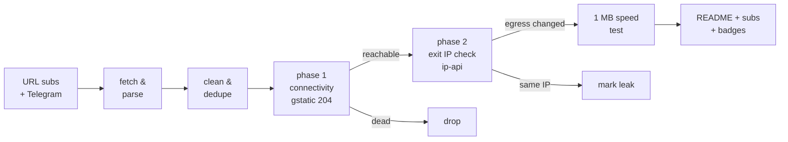

# Free Proxy Scanner

> **Really tested** free proxy aggregator. Every proxy below was fetched from public sources, tunneled through with Xray/sing-box, and verified to actually change your egress IP. No CSV-validation theater, no blind relisting.

      

## What this is

A GitHub Actions pipeline (runs every 6 hours) that fetches free proxy configs from **173 URL subscriptions** and **81 Telegram channels**, parses 9 protocols (vless / vmess / trojan / ss / hysteria2 / hysteria / tuic / socks / http), deduplicates them, and **actually connects through every single one** to separate working proxies from dead ones.

Latest run: **2026-10-07 12:09:14 UTC** — 156997 unique proxies collected from 133/133 URL sources and 47/47 Telegram channels; **4516** endpoints really tested, **858** reachable, **815** verified working (egress IP confirmed changed) across **47 exit countries**.

## How the testing works (the *really* part)



1. **Phase 1 — connectivity.** Each proxy is loaded as an outbound into a real Xray or sing-box instance (or used directly via `curl -x` for plain http/socks). An HTTPS request to `gstatic.com/generate_204` goes through the tunnel with **DNS resolved on the proxy side**. Only an HTTP 204 counts as reachable.
2. **Phase 2 — egress verification.** An ip-api request through the same tunnel must return an exit IP **different from the runner's own IP**, plus its country and AS. Proxies that pass phase 1 but keep your IP are marked as leaks and excluded from the working list. Server country vs exit country mismatches are flagged in the tables.
3. **Throughput.** Working proxies download 1 MB from `speed.cloudflare.com` through the tunnel; the measured rate is the speed you see in the tables.
4. **Engine fallback.** If a proxy fails on Xray, it is retried on sing-box (and vice versa) before being declared dead — some configs only work on one core.

## Top working proxies

All 815 working proxies are published in [`subs/all.txt`](subs/all.txt); this table shows the top 25.

| # | proxy | proto | server | exit | latency | speed | engine |
|---|-------|-------|--------|------|---------|-------|--------|
| 1 | #1 🇺🇸 US → 🇺🇸 US | `ss` | `156.146.38.169:443` | United States | 291 ms | 36.0 Mbps | xray |
| 2 | #2 🇺🇸 US → 🇺🇸 US | `ss` | `156.146.38.167:443` | United States | 297 ms | 29.1 Mbps | xray |
| 3 | #3 🇨🇦 CA → 🇨🇦 CA | `vmess` | `198.57.27.190:22324` | Canada | 114 ms | 26.0 Mbps | xray |
| 4 | #4 🇺🇸 US → 🇺🇸 US | `vless` | `69.48.201.136:30016` | United States | 135 ms | 24.1 Mbps | xray |
| 5 | #5 🇺🇸 US → 🇺🇸 US | `vless` | `169.40.42.182:443` | United States | 3410 ms | 22.9 Mbps | xray |
| 6 | #6 🇺🇸 US → 🇺🇸 US | `ss` | `37.19.198.243:443` | United States | 299 ms | 22.8 Mbps | xray |
| 7 | #7 🇺🇸 US → 🇺🇸 US | `ss` | `156.146.38.170:443` | United States | 327 ms | 22.5 Mbps | xray |
| 8 | #8 🇺🇸 US → 🇺🇸 US | `vmess` | `38.107.226.227:22324` | United States | 165 ms | 21.9 Mbps | xray |
| 9 | #9 🇺🇸 US → 🇺🇸 US | `vless` | `169.40.42.75:443` | United States | 179 ms | 21.8 Mbps | xray |
| 10 | #10 🇺🇸 US → 🇺🇸 US | `ss` | `156.146.38.168:443` | United States | 83 ms | 21.5 Mbps | xray |
| 11 | #11 ❓ ?? → 🇨🇦 CA | `ss` | `64.74.163.69:18766` | Canada | 5156 ms | 21.4 Mbps | xray |
| 12 | #12 ❓ ?? → 🇺🇸 US | `vless` | `185.95.231.156:443` | United States | 236 ms | 21.2 Mbps | xray |
| 13 | #13 ❓ ?? → 🇺🇸 US | `vless` | `38.107.232.36:80` | United States | 108 ms | 21.2 Mbps | xray |
| 14 | #14 🇨🇦 CA → 🇨🇦 CA | `vmess` | `23.162.200.198:18000` | Canada | 5479 ms | 21.2 Mbps | xray |
| 15 | #15 ❓ ?? → 🇺🇸 US | `vless` | `104.243.33.154:45299` | United States | 103 ms | 21.1 Mbps | xray |
| 16 | #16 ❓ ?? → 🇺🇸 US | `vless` | `3h-unitedstates1.09vpn.com:80` | United States | 159 ms | 20.8 Mbps | xray |
| 17 | #17 🇺🇸 US → 🇺🇸 US | `ss` | `15.204.233.41:8882` | United States | 170 ms | 20.7 Mbps | xray |
| 18 | #18 🇺🇸 US → 🇺🇸 US | `ss` | `37.19.198.160:443` | United States | 332 ms | 20.5 Mbps | xray |
| 19 | #19 🇺🇸 US → 🇺🇸 US | `ss` | `37.19.198.236:443` | United States | 104 ms | 20.3 Mbps | xray |
| 20 | #20 🇺🇸 US → 🇺🇸 US | `hysteria2` | `159.223.157.129:8443` | United States | 186 ms | 19.9 Mbps | singbox |
| 21 | #21 ❓ ?? → 🇨🇦 CA | `vless` | `45.148.103.85:443` | Canada | 131 ms | 19.8 Mbps | xray |
| 22 | #22 🇪🇸 ES → 🇨🇦 CA | `vless` | `185.218.17.127:443` | Canada | 308 ms | 18.5 Mbps | xray |
| 23 | #23 ❓ ?? → 🇺🇸 US | `vmess` | `vspeedfast.org:443` | United States | 407 ms | 18.3 Mbps | xray |
| 24 | #24 🇺🇸 US → 🇺🇸 US | `vless` | `2.24.124.64:443` | United States | 178 ms | 18.1 Mbps | xray |
| 25 | #25 🇺🇸 US → 🇺🇸 US | `ss` | `140.82.63.79:8388` | United States | 135 ms | 18.0 Mbps | xray |

## Exit locations — which countries work

Every working proxy, grouped by the country of its **verified exit IP** (phase 2), with a dedicated subscription file per country. Currently 47 countries have at least one working exit.

| country | working | avg speed | best latency | share | list |
|---------|--------:|----------:|-------------:|------:|------|
| 🇳🇱 Netherlands | 161 | 5.3 Mbps | 363 ms | 20% | [`NL.txt`](subs/by-country/NL.txt) |
| 🇺🇸 United States | 156 | 11.7 Mbps | 83 ms | 19% | [`US.txt`](subs/by-country/US.txt) |
| 🇩🇪 Germany | 86 | 4.3 Mbps | 395 ms | 11% | [`DE.txt`](subs/by-country/DE.txt) |
| 🇫🇷 France | 61 | 4.3 Mbps | 485 ms | 7% | [`FR.txt`](subs/by-country/FR.txt) |
| 🇯🇵 Japan | 46 | 3.5 Mbps | 418 ms | 6% | [`JP.txt`](subs/by-country/JP.txt) |
| 🇰🇷 South Korea | 27 | 3.0 Mbps | 583 ms | 3% | [`KR.txt`](subs/by-country/KR.txt) |
| 🇵🇱 Poland | 24 | 3.1 Mbps | 571 ms | 3% | [`PL.txt`](subs/by-country/PL.txt) |
| 🇭🇰 Hong Kong | 24 | 2.9 Mbps | 552 ms | 3% | [`HK.txt`](subs/by-country/HK.txt) |
| 🇬🇧 United Kingdom | 23 | 4.3 Mbps | 366 ms | 3% | [`GB.txt`](subs/by-country/GB.txt) |
| 🇸🇬 Singapore | 22 | 2.5 Mbps | 600 ms | 3% | [`SG.txt`](subs/by-country/SG.txt) |
| 🇨🇦 Canada | 18 | 10.1 Mbps | 114 ms | 2% | [`CA.txt`](subs/by-country/CA.txt) |
| 🇫🇮 Finland | 18 | 3.3 Mbps | 433 ms | 2% | [`FI.txt`](subs/by-country/FI.txt) |
| 🇨🇱 Chile | 11 | 4.8 Mbps | 556 ms | 1% | [`CL.txt`](subs/by-country/CL.txt) |
| 🇷🇸 Serbia | 10 | 4.1 Mbps | 770 ms | 1% | [`RS.txt`](subs/by-country/RS.txt) |
| 🇲🇩 Moldova | 10 | 2.3 Mbps | 960 ms | 1% | [`MD.txt`](subs/by-country/MD.txt) |
| 🇪🇪 Estonia | 8 | 3.7 Mbps | 531 ms | 1% | [`EE.txt`](subs/by-country/EE.txt) |
| 🇸🇪 Sweden | 8 | 3.1 Mbps | 1705 ms | 1% | [`SE.txt`](subs/by-country/SE.txt) |
| 🇧🇬 Bulgaria | 8 | 4.1 Mbps | 634 ms | 1% | [`BG.txt`](subs/by-country/BG.txt) |
| 🇮🇹 Italy | 7 | 4.6 Mbps | 394 ms | 1% | [`IT.txt`](subs/by-country/IT.txt) |
| 🇪🇸 Spain | 7 | 4.1 Mbps | 575 ms | 1% | [`ES.txt`](subs/by-country/ES.txt) |
| 🇮🇪 Ireland | 6 | 4.4 Mbps | 302 ms | 1% | [`IE.txt`](subs/by-country/IE.txt) |
| 🇷🇺 Russia | 6 | 3.9 Mbps | 503 ms | 1% | [`RU.txt`](subs/by-country/RU.txt) |
| 🇹🇷 Turkey | 6 | 3.6 Mbps | 822 ms | 1% | [`TR.txt`](subs/by-country/TR.txt) |
| 🇰🇿 Kazakhstan | 6 | 2.0 Mbps | 1499 ms | 1% | [`KZ.txt`](subs/by-country/KZ.txt) |
| 🇳🇴 Norway | 5 | 4.2 Mbps | 468 ms | 1% | [`NO.txt`](subs/by-country/NO.txt) |
| 🇷🇴 Romania | 5 | 3.2 Mbps | 706 ms | 1% | [`RO.txt`](subs/by-country/RO.txt) |
| 🇹🇼 Taiwan | 5 | 2.7 Mbps | 564 ms | 1% | [`TW.txt`](subs/by-country/TW.txt) |
| 🇧🇾 BY | 5 | 1.7 Mbps | 2903 ms | 1% | [`BY.txt`](subs/by-country/BY.txt) |
| 🇨🇭 Switzerland | 4 | 5.1 Mbps | 521 ms | 0% | [`CH.txt`](subs/by-country/CH.txt) |
| 🇦🇹 Austria | 4 | 5.7 Mbps | 417 ms | 0% | [`AT.txt`](subs/by-country/AT.txt) |
| 🇮🇳 India | 4 | 2.8 Mbps | 466 ms | 0% | [`IN.txt`](subs/by-country/IN.txt) |
| 🇦🇪 UAE | 4 | 2.5 Mbps | 885 ms | 0% | [`AE.txt`](subs/by-country/AE.txt) |
| 🇿🇦 South Africa | 3 | 2.4 Mbps | 947 ms | 0% | [`ZA.txt`](subs/by-country/ZA.txt) |
| 🇱🇰 LK | 2 | 3.4 Mbps | 1239 ms | 0% | [`LK.txt`](subs/by-country/LK.txt) |
| 🇮🇩 Indonesia | 2 | 3.2 Mbps | 932 ms | 0% | [`ID.txt`](subs/by-country/ID.txt) |
| 🇹🇭 Thailand | 2 | 1.9 Mbps | 947 ms | 0% | [`TH.txt`](subs/by-country/TH.txt) |
| 🇺🇦 Ukraine | 1 | 5.5 Mbps | 818 ms | 0% | [`UA.txt`](subs/by-country/UA.txt) |
| 🇦🇱 AL | 1 | 5.2 Mbps | 526 ms | 0% | [`AL.txt`](subs/by-country/AL.txt) |
| 🇱🇻 Latvia | 1 | 4.5 Mbps | 705 ms | 0% | [`LV.txt`](subs/by-country/LV.txt) |
| 🇬🇷 Greece | 1 | 4.4 Mbps | 739 ms | 0% | [`GR.txt`](subs/by-country/GR.txt) |
| 🇦🇺 Australia | 1 | 4.1 Mbps | 823 ms | 0% | [`AU.txt`](subs/by-country/AU.txt) |
| 🇨🇿 Czechia | 1 | 3.9 Mbps | 1068 ms | 0% | [`CZ.txt`](subs/by-country/CZ.txt) |
| 🇸🇦 Saudi Arabia | 1 | 2.6 Mbps | 1218 ms | 0% | [`SA.txt`](subs/by-country/SA.txt) |
| 🇦🇲 Armenia | 1 | 2.1 Mbps | 2008 ms | 0% | [`AM.txt`](subs/by-country/AM.txt) |
| 🇨🇳 China | 1 | - | 617 ms | 0% | [`CN.txt`](subs/by-country/CN.txt) |
| 🇮🇱 Israel | 1 | - | 1014 ms | 0% | [`IL.txt`](subs/by-country/IL.txt) |
| 🇲🇾 Malaysia | 1 | - | 6149 ms | 0% | [`MY.txt`](subs/by-country/MY.txt) |

A `??` exit means the geo lookup could not resolve the exit IP. Base64 variants of every country file sit next to them as `<CC>.base64.txt`.

## Protocol distribution

| protocol | tested | alive | working | alive rate |
|----------|-------:|------:|--------:|-----------:|
| `vless` | 2890 | 462 | 434 | 16% |
| `ss` | 437 | 191 | 185 | 44% |
| `trojan` | 191 | 102 | 100 | 53% |
| `vmess` | 950 | 80 | 73 | 8% |
| `hysteria2` | 45 | 22 | 22 | 49% |
| `tuic` | 1 | 1 | 1 | 100% |
| `http` | 2 | 0 | 0 | 0% |

Per-protocol working lists: [`subs/by-proto/`](subs/by-proto/) (one `vless.txt`, `vmess.txt`, ... per protocol, plus `.base64.txt` variants).

## Engine breakdown

Which core verified each working proxy. The engine fallback means a proxy that failed on its primary core got a second chance on the other one.

| engine | working | note |
|--------|--------:|------|
| Xray-core | 733 | [`allxray.txt`](subs/by-engine/allxray.txt) |
| sing-box | 82 | [`allsingbox.txt`](subs/by-engine/allsingbox.txt) |
| direct (curl) | 0 | plain http/socks, [`alldirect.txt`](subs/by-engine/alldirect.txt) |

## Speed & latency profile

| speed tier | proxies |
|-----------|--------:|
| >= 5 Mbps | 332 |
| 1 - 5 Mbps | 305 |
| 0.25 - 1 Mbps | 44 |
| < 0.25 Mbps | 0 |
| unmeasured | 134 |

Latency (phase-1 HTTPS round trip): median **735 ms**, p90 **4142 ms**. 43 proxies passed connectivity but failed egress verification (leaked the runner IP or broke on the exit check) and are excluded.

## Source health

180 active, 74 auto-retired (10 fetch failures / 10 all-dead runs / 10 days without anything new). Best contributors this run:

| source | kind | tested | alive | new this run |
|--------|------|-------:|------:|-------------:|
| `SK` | url | 851 | 516 | 3573 |
| `NK` | url | 763 | 432 | 0 |
| `HP` | url | 351 | 299 | 85 |
| `F0` | url | 398 | 297 | 234 |
| `RD-VL` | url | 2424 | 287 | 4148 |
| `ET` | url | 310 | 244 | 2357 |
| `Ni` | url | 326 | 233 | 108 |
| `HC` | url | 1383 | 232 | 112 |
| `EV` | url | 450 | 222 | 0 |
| `ST-VL` | url | 2401 | 211 | 794 |
| `AG-PL` | url | 348 | 192 | 1449 |
| `RD-SS` | url | 406 | 183 | 275 |
| `SB-VL` | url | 2164 | 142 | 0 |
| `KA` | url | 1585 | 138 | 4470 |
| `SB` | url | 2461 | 131 | 37 |
| `EV-SS` | url | 154 | 128 | 50 |
| `TK` | url | 138 | 87 | 4 |
| `EB2` | url | 135 | 83 | 4 |
| `EV-VL` | url | 244 | 77 | 1477 |
| `RO` | url | 88 | 77 | 1 |

## History

working per run (last 25): ▁▁▆▆▇█▇▆▇█▇▆▇▆▇▇█▇▇▇█▇▇▇▇

| date (UTC) | tested | alive | working | avg | max |
|------------|-------:|------:|--------:|----:|----:|
| 2026-10-07 12:30 | 4516 | 858 | 815 | 5.7M | 36.0M |
| 2026-10-07 03:14 | 4516 | 957 | 922 | 6.7M | 49.7M |
| 2026-10-06 22:16 | 4513 | 946 | 913 | 7.8M | 46.8M |
| 2026-10-06 12:39 | 4515 | 918 | 867 | 6.7M | 38.2M |
| 2026-10-06 03:49 | 4521 | 1046 | 1018 | 10.0M | 87.7M |
| 2026-10-05 23:43 | 4527 | 929 | 912 | 7.6M | 50.6M |
| 2026-10-05 19:47 | 4547 | 861 | 822 | 8.6M | 77.6M |
| 2026-10-03 11:04 | 4500 | 899 | 860 | 8.7M | 82.3M |
| 2026-10-03 02:52 | 4500 | 1062 | 1030 | 8.0M | 75.5M |
| 2026-10-02 21:49 | 4500 | 890 | 861 | 8.9M | 68.7M |
| 2026-10-02 17:14 | 4500 | 847 | 807 | 8.6M | 88.1M |
| 2026-10-02 11:49 | 4500 | 861 | 798 | 7.9M | 85.3M |
| 2026-10-01 22:23 | 4500 | 904 | 878 | 7.5M | 90.2M |
| 2026-10-01 17:56 | 4500 | 861 | 794 | 7.3M | 58.6M |
| 2026-10-01 12:16 | 4500 | 931 | 883 | 7.3M | 34.4M |

## Subscription files

Everything under [`subs/`](subs/) is regenerated every run. Plain lists are one proxy URI per line; `.base64.txt` variants are the same list base64-encoded for clients that need the classic sub format.

| file | contents | direct subscription URL |
|------|----------|--------------------------|
| [`all.txt`](subs/all.txt) | ALL working proxies, ranked by speed (815) | `https://raw.githubusercontent.com/G1010yzd10/proxy-scanner/main/subs/all.txt` |
| [`all.base64.txt`](subs/all.base64.txt) | same, base64 | `https://raw.githubusercontent.com/G1010yzd10/proxy-scanner/main/subs/all.base64.txt` |
| [`top150.txt`](subs/top150.txt) | top 150 ranked (150) | `https://raw.githubusercontent.com/G1010yzd10/proxy-scanner/main/subs/top150.txt` |
| [`top150.base64.txt`](subs/top150.base64.txt) | same, base64 | `https://raw.githubusercontent.com/G1010yzd10/proxy-scanner/main/subs/top150.base64.txt` |
| [`by-proto/`](subs/by-proto/) | one list per protocol (6 protocols) | ...`/subs/by-proto/<proto>.txt` |
| [`by-engine/allxray.txt`](subs/by-engine/allxray.txt) | verified on Xray (733) | `https://raw.githubusercontent.com/G1010yzd10/proxy-scanner/main/subs/by-engine/allxray.txt` |
| [`by-engine/allsingbox.txt`](subs/by-engine/allsingbox.txt) | verified on sing-box (82) | `https://raw.githubusercontent.com/G1010yzd10/proxy-scanner/main/subs/by-engine/allsingbox.txt` |
| [`by-country/`](subs/by-country/) | one list per exit country (47 countries, e.g. [`US.txt`](subs/by-country/US.txt), [`DE.txt`](subs/by-country/DE.txt)) | ...`/subs/by-country/<CC>.txt` |
| [`sing-box-client.json`](subs/sing-box-client.json) | top 150 as a ready-to-run sing-box client config | `https://raw.githubusercontent.com/G1010yzd10/proxy-scanner/main/subs/sing-box-client.json` |
| [`xray-client.json`](subs/xray-client.json) | top 150 as a ready-to-run xray client config | `https://raw.githubusercontent.com/G1010yzd10/proxy-scanner/main/subs/xray-client.json` |
| [`archive/`](archive/) | gz snapshot of every collection (30 kept) | — |

## Use the proxies

- **v2rayN / v2rayNG / Nekobox / Hiddify / Shadowrocket**: add subscription `https://raw.githubusercontent.com/G1010yzd10/proxy-scanner/main/subs/all.base64.txt` (everything working) or `https://raw.githubusercontent.com/G1010yzd10/proxy-scanner/main/subs/top150.base64.txt` (curated top 150).
- **Want a specific country?** Grab `subs/by-country/<CC>.txt` (see the Exit locations table above) — e.g. `https://raw.githubusercontent.com/G1010yzd10/proxy-scanner/main/subs/by-country/US.txt`, `https://raw.githubusercontent.com/G1010yzd10/proxy-scanner/main/subs/by-country/DE.txt`.
- **Only one protocol?** `subs/by-proto/<proto>.txt` — e.g. `https://raw.githubusercontent.com/G1010yzd10/proxy-scanner/main/subs/by-proto/vless.txt`, `https://raw.githubusercontent.com/G1010yzd10/proxy-scanner/main/subs/by-proto/hysteria2.txt`.
- **sing-box**: download [`subs/sing-box-client.json`](subs/sing-box-client.json) and run `sing-box run -c sing-box-client.json` — it listens on `127.0.0.1:2080` (mixed) with a selector + auto urltest group.
- **Xray**: download [`subs/xray-client.json`](subs/xray-client.json), socks inbound on `127.0.0.1:2080`.
- Raw snapshots of every collection: [`archive/`](archive/) (30 kept).

## Repository layout

```
sources/            url_subs.yml + telegram.yml (scannable source lists)
scripts/            collect.py, test.py, report.py + lib/
state/              source health, alive-recall pool, geo cache (committed)
data/               stats, history, compact last-run results
subs/               THE PRODUCT: verified working proxies, split by
                    proto / engine / exit country + all + top150 lists
badges/             shields.io endpoint badges
archive/            gz snapshots of every collection
```

## Why most "free proxy lists" lie

The typical aggregator relists whatever it scraped, so 80-95% of entries are dead within hours — this run found **81% unreachable** and **82% unusable** overall. Only tunnels that completed a real HTTPS handshake, returned a verifiable foreign exit IP, and pushed a 1 MB download are counted as working here.

## Disclaimers

- Free proxies are **public and untrusted**. Anything you send through them can be observed or modified by their operators. Never use them for authentication, payments, or anything sensitive.
- All configs are collected from publicly posted sources (GitHub subscriptions and public Telegram channels); no credentials are guessed or brute-forced. Removal requests: open an issue.
- Availability is transient: the working list is re-verified every 6 hours, and past performance never guarantees future availability.

