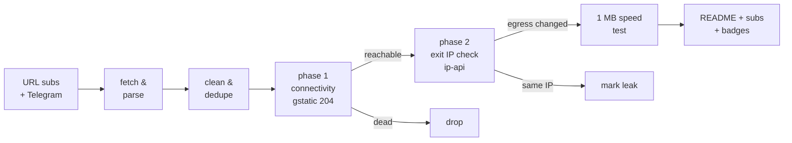

# Free Proxy Scanner

> **Really tested** free proxy aggregator. Every proxy below was fetched from public sources, tunneled through with Xray/sing-box, and verified to actually change your egress IP. No CSV-validation theater, no blind relisting.

      

## What this is

A GitHub Actions pipeline (runs every 6 hours) that fetches free proxy configs from **173 URL subscriptions** and **81 Telegram channels**, parses 9 protocols (vless / vmess / trojan / ss / hysteria2 / hysteria / tuic / socks / http), deduplicates them, and **actually connects through every single one** to separate working proxies from dead ones.

Latest run: **2026-10-08 22:33:03 UTC** — 159669 unique proxies collected from 132/132 URL sources and 47/47 Telegram channels; **4507** endpoints really tested, **873** reachable, **851** verified working (egress IP confirmed changed) across **47 exit countries**.

## How the testing works (the *really* part)



1. **Phase 1 — connectivity.** Each proxy is loaded as an outbound into a real Xray or sing-box instance (or used directly via `curl -x` for plain http/socks). An HTTPS request to `gstatic.com/generate_204` goes through the tunnel with **DNS resolved on the proxy side**. Only an HTTP 204 counts as reachable.
2. **Phase 2 — egress verification.** An ip-api request through the same tunnel must return an exit IP **different from the runner's own IP**, plus its country and AS. Proxies that pass phase 1 but keep your IP are marked as leaks and excluded from the working list. Server country vs exit country mismatches are flagged in the tables.
3. **Throughput.** Working proxies download 1 MB from `speed.cloudflare.com` through the tunnel; the measured rate is the speed you see in the tables.
4. **Engine fallback.** If a proxy fails on Xray, it is retried on sing-box (and vice versa) before being declared dead — some configs only work on one core.

## Top working proxies

All 851 working proxies are published in [`subs/all.txt`](subs/all.txt); this table shows the top 25.

| # | proxy | proto | server | exit | latency | speed | engine |
|---|-------|-------|--------|------|---------|-------|--------|
| 1 | #1 🇺🇸 US → 🇺🇸 US | `vmess` | `129.146.77.248:39495` | United States | 508 ms | 55.0 Mbps | xray |
| 2 | #2 ❓ ?? → 🇺🇸 US | `vmess` | `us16-4.998998.best:443` | United States | 540 ms | 40.8 Mbps | xray |
| 3 | #3 🇺🇸 US → 🇺🇸 US | `ss` | `108.181.0.177:8388` | United States | 501 ms | 40.1 Mbps | xray |
| 4 | #4 ❓ ?? → 🇺🇸 US | `vless` | `104.17.98.5:443` | United States | 531 ms | 39.6 Mbps | xray |
| 5 | #5 🇺🇸 US → 🇺🇸 US | `ss` | `108.181.118.10:8388` | United States | 473 ms | 39.5 Mbps | xray |
| 6 | #6 ❓ ?? → 🇺🇸 US | `vless` | `45.32.69.110:443` | United States | 83 ms | 38.8 Mbps | singbox |
| 7 | #7 ❓ ?? → 🇺🇸 US | `vless` | `144.202.126.147:443` | United States | 65 ms | 34.3 Mbps | singbox |
| 8 | #8 ❓ ?? → 🇺🇸 US | `vless` | `45.63.53.81:443` | United States | 77 ms | 34.2 Mbps | singbox |
| 9 | #9 ❓ ?? → 🇺🇸 US | `vless` | `154.12.38.202:443` | United States | 84 ms | 32.2 Mbps | singbox |
| 10 | #10 ❓ ?? → 🇺🇸 US | `vless` | `154.29.145.196:443` | United States | 92 ms | 32.1 Mbps | singbox |
| 11 | #11 ❓ ?? → 🇺🇸 US | `vless` | `154.12.38.159:443` | United States | 90 ms | 31.2 Mbps | singbox |
| 12 | #12 ❓ ?? → 🇺🇸 US | `vmess` | `guanwang.awsno.com:443` | United States | 614 ms | 30.7 Mbps | xray |
| 13 | #13 ❓ ?? → 🇺🇸 US | `vless` | `1579e6d9-6b57-4fb1-b080-9c9a6da46ae5.fly.dev:443` | United States | 917 ms | 27.6 Mbps | xray |
| 14 | #14 🇺🇸 US → 🇺🇸 US | `vless` | `47.251.108.158:443` | United States | 151 ms | 27.4 Mbps | singbox |
| 15 | #15 🇺🇸 US → 🇺🇸 US | `ss` | `156.146.38.169:443` | United States | 523 ms | 25.6 Mbps | xray |
| 16 | #16 🇺🇸 US → 🇺🇸 US | `hysteria2` | `155.248.209.237:33333` | United States | 122 ms | 25.4 Mbps | singbox |
| 17 | #17 🇺🇸 US → 🇺🇸 US | `ss` | `156.146.38.167:443` | United States | 444 ms | 25.1 Mbps | xray |
| 18 | #18 🇺🇸 US → 🇺🇸 US | `ss` | `156.146.38.170:443` | United States | 510 ms | 24.1 Mbps | xray |
| 19 | #19 🇺🇸 US → 🇺🇸 US | `ss` | `173.244.56.6:443` | United States | 405 ms | 24.0 Mbps | xray |
| 20 | #20 ❓ ?? → 🇺🇸 US | `hysteria2` | `hy2.123266.xyz:33333` | United States | 142 ms | 23.5 Mbps | singbox |
| 21 | #21 🇺🇸 US → 🇺🇸 US | `ss` | `173.244.56.9:443` | United States | 261 ms | 21.5 Mbps | xray |
| 22 | #22 🇺🇸 US → 🇺🇸 US | `vless` | `15.204.97.219:23576` | United States | 366 ms | 20.3 Mbps | xray |
| 23 | #23 ❓ ?? → 🇺🇸 US | `vless` | `ww13.levikogjgfdd.ir:23576` | United States | 360 ms | 20.1 Mbps | xray |
| 24 | #24 ❓ ?? → 🇺🇸 US | `vmess` | `www.shopify.com:443` | United States | 242 ms | 18.3 Mbps | xray |
| 25 | #25 🇺🇸 US → 🇺🇸 US | `vless` | `15.204.97.216:23576` | United States | 252 ms | 17.8 Mbps | xray |

## Exit locations — which countries work

Every working proxy, grouped by the country of its **verified exit IP** (phase 2), with a dedicated subscription file per country. Currently 47 countries have at least one working exit.

| country | working | avg speed | best latency | share | list |
|---------|--------:|----------:|-------------:|------:|------|
| 🇳🇱 Netherlands | 165 | 4.8 Mbps | 410 ms | 19% | [`NL.txt`](subs/by-country/NL.txt) |
| 🇺🇸 United States | 133 | 13.1 Mbps | 65 ms | 16% | [`US.txt`](subs/by-country/US.txt) |
| 🇩🇪 Germany | 94 | 4.0 Mbps | 414 ms | 11% | [`DE.txt`](subs/by-country/DE.txt) |
| 🇫🇷 France | 62 | 2.9 Mbps | 540 ms | 7% | [`FR.txt`](subs/by-country/FR.txt) |
| 🇯🇵 Japan | 57 | 4.0 Mbps | 369 ms | 7% | [`JP.txt`](subs/by-country/JP.txt) |
| 🇸🇬 Singapore | 34 | 2.9 Mbps | 607 ms | 4% | [`SG.txt`](subs/by-country/SG.txt) |
| 🇰🇷 South Korea | 33 | 3.9 Mbps | 491 ms | 4% | [`KR.txt`](subs/by-country/KR.txt) |
| 🇭🇰 Hong Kong | 29 | 4.0 Mbps | 498 ms | 3% | [`HK.txt`](subs/by-country/HK.txt) |
| 🇬🇧 United Kingdom | 26 | 4.4 Mbps | 413 ms | 3% | [`GB.txt`](subs/by-country/GB.txt) |
| 🇵🇱 Poland | 24 | 3.7 Mbps | 643 ms | 3% | [`PL.txt`](subs/by-country/PL.txt) |
| 🇫🇮 Finland | 18 | 3.6 Mbps | 509 ms | 2% | [`FI.txt`](subs/by-country/FI.txt) |
| 🇨🇦 Canada | 17 | 6.4 Mbps | 230 ms | 2% | [`CA.txt`](subs/by-country/CA.txt) |
| 🇦🇺 Australia | 12 | 9.8 Mbps | 110 ms | 1% | [`AU.txt`](subs/by-country/AU.txt) |
| 🇮🇳 India | 12 | 2.3 Mbps | 510 ms | 1% | [`IN.txt`](subs/by-country/IN.txt) |
| 🇧🇬 Bulgaria | 11 | 3.7 Mbps | 687 ms | 1% | [`BG.txt`](subs/by-country/BG.txt) |
| 🇷🇸 Serbia | 10 | 3.5 Mbps | 917 ms | 1% | [`RS.txt`](subs/by-country/RS.txt) |
| 🇪🇪 Estonia | 9 | 3.7 Mbps | 630 ms | 1% | [`EE.txt`](subs/by-country/EE.txt) |
| 🇮🇪 Ireland | 9 | 2.2 Mbps | 358 ms | 1% | [`IE.txt`](subs/by-country/IE.txt) |
| 🇧🇾 BY | 8 | 1.5 Mbps | 3460 ms | 1% | [`BY.txt`](subs/by-country/BY.txt) |
| 🇹🇷 Turkey | 7 | 2.7 Mbps | 666 ms | 1% | [`TR.txt`](subs/by-country/TR.txt) |
| 🇸🇪 Sweden | 6 | 5.0 Mbps | 754 ms | 1% | [`SE.txt`](subs/by-country/SE.txt) |
| 🇮🇹 Italy | 6 | 4.6 Mbps | 491 ms | 1% | [`IT.txt`](subs/by-country/IT.txt) |
| 🇲🇩 Moldova | 6 | 2.4 Mbps | 1031 ms | 1% | [`MD.txt`](subs/by-country/MD.txt) |
| 🇪🇸 Spain | 5 | 5.0 Mbps | 564 ms | 1% | [`ES.txt`](subs/by-country/ES.txt) |
| 🇹🇼 Taiwan | 5 | 3.5 Mbps | 604 ms | 1% | [`TW.txt`](subs/by-country/TW.txt) |
| 🇹🇭 Thailand | 5 | 3.4 Mbps | 720 ms | 1% | [`TH.txt`](subs/by-country/TH.txt) |
| 🇰🇿 Kazakhstan | 5 | 2.3 Mbps | 1214 ms | 1% | [`KZ.txt`](subs/by-country/KZ.txt) |
| 🇨🇭 Switzerland | 4 | 5.1 Mbps | 632 ms | 0% | [`CH.txt`](subs/by-country/CH.txt) |
| 🇷🇺 Russia | 4 | 3.2 Mbps | 589 ms | 0% | [`RU.txt`](subs/by-country/RU.txt) |
| 🇲🇾 Malaysia | 4 | 3.9 Mbps | 789 ms | 0% | [`MY.txt`](subs/by-country/MY.txt) |
| 🇷🇴 Romania | 3 | 4.1 Mbps | 607 ms | 0% | [`RO.txt`](subs/by-country/RO.txt) |
| 🇻🇳 Vietnam | 3 | 2.9 Mbps | 1693 ms | 0% | [`VN.txt`](subs/by-country/VN.txt) |
| 🇮🇩 Indonesia | 3 | 1.7 Mbps | 872 ms | 0% | [`ID.txt`](subs/by-country/ID.txt) |
| 🇿🇦 South Africa | 3 | 2.9 Mbps | 989 ms | 0% | [`ZA.txt`](subs/by-country/ZA.txt) |
| 🇳🇴 Norway | 3 | 1.7 Mbps | 687 ms | 0% | [`NO.txt`](subs/by-country/NO.txt) |
| 🇱🇻 Latvia | 2 | 2.8 Mbps | 1070 ms | 0% | [`LV.txt`](subs/by-country/LV.txt) |
| 🇦🇹 Austria | 2 | 3.7 Mbps | 495 ms | 0% | [`AT.txt`](subs/by-country/AT.txt) |
| 🇨🇿 Czechia | 2 | 2.5 Mbps | 633 ms | 0% | [`CZ.txt`](subs/by-country/CZ.txt) |
| 🇦🇪 UAE | 2 | 2.9 Mbps | 1048 ms | 0% | [`AE.txt`](subs/by-country/AE.txt) |
| 🇲🇽 Mexico | 1 | 11.4 Mbps | 264 ms | 0% | [`MX.txt`](subs/by-country/MX.txt) |
| 🇬🇷 Greece | 1 | 4.3 Mbps | 759 ms | 0% | [`GR.txt`](subs/by-country/GR.txt) |
| 🇱🇹 Lithuania | 1 | 4.2 Mbps | 791 ms | 0% | [`LT.txt`](subs/by-country/LT.txt) |
| 🇸🇦 Saudi Arabia | 1 | 2.8 Mbps | 1139 ms | 0% | [`SA.txt`](subs/by-country/SA.txt) |
| 🇦🇲 Armenia | 1 | 2.2 Mbps | 2016 ms | 0% | [`AM.txt`](subs/by-country/AM.txt) |
| 🇱🇺 Luxembourg | 1 | 1.5 Mbps | 6097 ms | 0% | [`LU.txt`](subs/by-country/LU.txt) |
| 🇨🇱 Chile | 1 | - | 950 ms | 0% | [`CL.txt`](subs/by-country/CL.txt) |
| 🇮🇱 Israel | 1 | - | 1037 ms | 0% | [`IL.txt`](subs/by-country/IL.txt) |

A `??` exit means the geo lookup could not resolve the exit IP. Base64 variants of every country file sit next to them as `<CC>.base64.txt`.

## Protocol distribution

| protocol | tested | alive | working | alive rate |
|----------|-------:|------:|--------:|-----------:|
| `vless` | 2804 | 443 | 427 | 16% |
| `ss` | 473 | 202 | 200 | 43% |
| `trojan` | 221 | 114 | 114 | 52% |
| `vmess` | 947 | 84 | 80 | 9% |
| `hysteria2` | 59 | 29 | 29 | 49% |
| `tuic` | 1 | 1 | 1 | 100% |
| `http` | 2 | 0 | 0 | 0% |

Per-protocol working lists: [`subs/by-proto/`](subs/by-proto/) (one `vless.txt`, `vmess.txt`, ... per protocol, plus `.base64.txt` variants).

## Engine breakdown

Which core verified each working proxy. The engine fallback means a proxy that failed on its primary core got a second chance on the other one.

| engine | working | note |
|--------|--------:|------|
| Xray-core | 764 | [`allxray.txt`](subs/by-engine/allxray.txt) |
| sing-box | 87 | [`allsingbox.txt`](subs/by-engine/allsingbox.txt) |
| direct (curl) | 0 | plain http/socks, [`alldirect.txt`](subs/by-engine/alldirect.txt) |

## Speed & latency profile

| speed tier | proxies |
|-----------|--------:|
| >= 5 Mbps | 286 |
| 1 - 5 Mbps | 407 |
| 0.25 - 1 Mbps | 42 |
| < 0.25 Mbps | 0 |
| unmeasured | 116 |

Latency (phase-1 HTTPS round trip): median **728 ms**, p90 **3099 ms**. 22 proxies passed connectivity but failed egress verification (leaked the runner IP or broke on the exit check) and are excluded.

## Source health

179 active, 75 auto-retired (10 fetch failures / 10 all-dead runs / 10 days without anything new). Best contributors this run:

| source | kind | tested | alive | new this run |
|--------|------|-------:|------:|-------------:|
| `SK` | url | 879 | 502 | 5243 |
| `NK` | url | 811 | 455 | 0 |
| `HP` | url | 392 | 369 | 98 |
| `Ni` | url | 416 | 332 | 117 |
| `ET` | url | 377 | 286 | 2764 |
| `F0` | url | 304 | 270 | 155 |
| `RD-VL` | url | 2417 | 262 | 4153 |
| `HC` | url | 1389 | 246 | 175 |
| `AG-PL` | url | 379 | 216 | 1208 |
| `EV` | url | 403 | 209 | 1498 |
| `RD-SS` | url | 430 | 198 | 291 |
| `ST-VL` | url | 2354 | 192 | 724 |
| `KA` | url | 1500 | 146 | 4807 |
| `EV-SS` | url | 154 | 126 | 49 |
| `SB-VL` | url | 2132 | 102 | 0 |
| `TK` | url | 136 | 94 | 0 |
| `SB` | url | 2427 | 92 | 5 |
| `WD` | url | 100 | 90 | 110 |
| `EB2` | url | 152 | 79 | 3 |
| `RD-VM` | url | 681 | 78 | 2159 |

## History

working per run (last 29): ▁▁▆▆▇█▇▆▇█▇▆▇▆▇▇█▇▇▇█▇▇▇▇▇█▆▇

| date (UTC) | tested | alive | working | avg | max |
|------------|-------:|------:|--------:|----:|----:|
| 2026-10-08 22:53 | 4507 | 873 | 851 | 5.5M | 55.0M |
| 2026-10-08 12:40 | 4504 | 827 | 775 | 6.8M | 67.7M |
| 2026-10-08 03:32 | 4506 | 1004 | 982 | 5.9M | 36.7M |
| 2026-10-07 22:39 | 4509 | 841 | 819 | 7.8M | 74.8M |
| 2026-10-07 12:30 | 4516 | 858 | 815 | 5.7M | 36.0M |
| 2026-10-07 03:14 | 4516 | 957 | 922 | 6.7M | 49.7M |
| 2026-10-06 22:16 | 4513 | 946 | 913 | 7.8M | 46.8M |
| 2026-10-06 12:39 | 4515 | 918 | 867 | 6.7M | 38.2M |
| 2026-10-06 03:49 | 4521 | 1046 | 1018 | 10.0M | 87.7M |
| 2026-10-05 23:43 | 4527 | 929 | 912 | 7.6M | 50.6M |
| 2026-10-05 19:47 | 4547 | 861 | 822 | 8.6M | 77.6M |
| 2026-10-03 11:04 | 4500 | 899 | 860 | 8.7M | 82.3M |
| 2026-10-03 02:52 | 4500 | 1062 | 1030 | 8.0M | 75.5M |
| 2026-10-02 21:49 | 4500 | 890 | 861 | 8.9M | 68.7M |
| 2026-10-02 17:14 | 4500 | 847 | 807 | 8.6M | 88.1M |

## Subscription files

Everything under [`subs/`](subs/) is regenerated every run. Plain lists are one proxy URI per line; `.base64.txt` variants are the same list base64-encoded for clients that need the classic sub format.

| file | contents | direct subscription URL |
|------|----------|--------------------------|
| [`all.txt`](subs/all.txt) | ALL working proxies, ranked by speed (851) | `https://raw.githubusercontent.com/G1010yzd10/proxy-scanner/main/subs/all.txt` |
| [`all.base64.txt`](subs/all.base64.txt) | same, base64 | `https://raw.githubusercontent.com/G1010yzd10/proxy-scanner/main/subs/all.base64.txt` |
| [`top150.txt`](subs/top150.txt) | top 150 ranked (150) | `https://raw.githubusercontent.com/G1010yzd10/proxy-scanner/main/subs/top150.txt` |
| [`top150.base64.txt`](subs/top150.base64.txt) | same, base64 | `https://raw.githubusercontent.com/G1010yzd10/proxy-scanner/main/subs/top150.base64.txt` |
| [`by-proto/`](subs/by-proto/) | one list per protocol (6 protocols) | ...`/subs/by-proto/<proto>.txt` |
| [`by-engine/allxray.txt`](subs/by-engine/allxray.txt) | verified on Xray (764) | `https://raw.githubusercontent.com/G1010yzd10/proxy-scanner/main/subs/by-engine/allxray.txt` |
| [`by-engine/allsingbox.txt`](subs/by-engine/allsingbox.txt) | verified on sing-box (87) | `https://raw.githubusercontent.com/G1010yzd10/proxy-scanner/main/subs/by-engine/allsingbox.txt` |
| [`by-country/`](subs/by-country/) | one list per exit country (47 countries, e.g. [`US.txt`](subs/by-country/US.txt), [`DE.txt`](subs/by-country/DE.txt)) | ...`/subs/by-country/<CC>.txt` |
| [`sing-box-client.json`](subs/sing-box-client.json) | top 150 as a ready-to-run sing-box client config | `https://raw.githubusercontent.com/G1010yzd10/proxy-scanner/main/subs/sing-box-client.json` |
| [`xray-client.json`](subs/xray-client.json) | top 150 as a ready-to-run xray client config | `https://raw.githubusercontent.com/G1010yzd10/proxy-scanner/main/subs/xray-client.json` |
| [`archive/`](archive/) | gz snapshot of every collection (30 kept) | — |

## Use the proxies

- **v2rayN / v2rayNG / Nekobox / Hiddify / Shadowrocket**: add subscription `https://raw.githubusercontent.com/G1010yzd10/proxy-scanner/main/subs/all.base64.txt` (everything working) or `https://raw.githubusercontent.com/G1010yzd10/proxy-scanner/main/subs/top150.base64.txt` (curated top 150).
- **Want a specific country?** Grab `subs/by-country/<CC>.txt` (see the Exit locations table above) — e.g. `https://raw.githubusercontent.com/G1010yzd10/proxy-scanner/main/subs/by-country/US.txt`, `https://raw.githubusercontent.com/G1010yzd10/proxy-scanner/main/subs/by-country/DE.txt`.
- **Only one protocol?** `subs/by-proto/<proto>.txt` — e.g. `https://raw.githubusercontent.com/G1010yzd10/proxy-scanner/main/subs/by-proto/vless.txt`, `https://raw.githubusercontent.com/G1010yzd10/proxy-scanner/main/subs/by-proto/hysteria2.txt`.
- **sing-box**: download [`subs/sing-box-client.json`](subs/sing-box-client.json) and run `sing-box run -c sing-box-client.json` — it listens on `127.0.0.1:2080` (mixed) with a selector + auto urltest group.
- **Xray**: download [`subs/xray-client.json`](subs/xray-client.json), socks inbound on `127.0.0.1:2080`.
- Raw snapshots of every collection: [`archive/`](archive/) (30 kept).

## Repository layout

```
sources/            url_subs.yml + telegram.yml (scannable source lists)
scripts/            collect.py, test.py, report.py + lib/
state/              source health, alive-recall pool, geo cache (committed)
data/               stats, history, compact last-run results
subs/               THE PRODUCT: verified working proxies, split by
                    proto / engine / exit country + all + top150 lists
badges/             shields.io endpoint badges
archive/            gz snapshots of every collection
```

## Why most "free proxy lists" lie

The typical aggregator relists whatever it scraped, so 80-95% of entries are dead within hours — this run found **81% unreachable** and **81% unusable** overall. Only tunnels that completed a real HTTPS handshake, returned a verifiable foreign exit IP, and pushed a 1 MB download are counted as working here.

## Disclaimers

- Free proxies are **public and untrusted**. Anything you send through them can be observed or modified by their operators. Never use them for authentication, payments, or anything sensitive.
- All configs are collected from publicly posted sources (GitHub subscriptions and public Telegram channels); no credentials are guessed or brute-forced. Removal requests: open an issue.
- Availability is transient: the working list is re-verified every 6 hours, and past performance never guarantees future availability.

