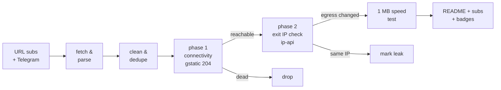

# Free Proxy Scanner

> **Really tested** free proxy aggregator. Every proxy below was fetched from public sources, tunneled through with Xray/sing-box, and verified to actually change your egress IP. No CSV-validation theater, no blind relisting.

      

## What this is

A GitHub Actions pipeline (runs every 6 hours) that fetches free proxy configs from **173 URL subscriptions** and **81 Telegram channels**, parses 9 protocols (vless / vmess / trojan / ss / hysteria2 / hysteria / tuic / socks / http), deduplicates them, and **actually connects through every single one** to separate working proxies from dead ones.

Latest run: **2026-09-30 11:27:32 UTC** — 171038 unique proxies collected from 173/173 URL sources and 81/81 Telegram channels; **4500** endpoints really tested, **860** reachable, **810** verified working (egress IP confirmed changed) across **48 exit countries**.

## How the testing works (the *really* part)



1. **Phase 1 — connectivity.** Each proxy is loaded as an outbound into a real Xray or sing-box instance (or used directly via `curl -x` for plain http/socks). An HTTPS request to `gstatic.com/generate_204` goes through the tunnel with **DNS resolved on the proxy side**. Only an HTTP 204 counts as reachable.
2. **Phase 2 — egress verification.** An ip-api request through the same tunnel must return an exit IP **different from the runner's own IP**, plus its country and AS. Proxies that pass phase 1 but keep your IP are marked as leaks and excluded from the working list. Server country vs exit country mismatches are flagged in the tables.
3. **Throughput.** Working proxies download 1 MB from `speed.cloudflare.com` through the tunnel; the measured rate is the speed you see in the tables.
4. **Engine fallback.** If a proxy fails on Xray, it is retried on sing-box (and vice versa) before being declared dead — some configs only work on one core.

## Top working proxies

All 810 working proxies are published in [`subs/all.txt`](subs/all.txt); this table shows the top 25.

| # | proxy | proto | server | exit | latency | speed | engine |
|---|-------|-------|--------|------|---------|-------|--------|
| 1 | #1 🇺🇸 US → 🇺🇸 US | `vless` | `23.95.222.127:8443` | United States | 81 ms | 64.4 Mbps | xray |
| 2 | #2 🇺🇸 US → 🇺🇸 US | `vless` | `172.235.38.85:42942` | United States | 51 ms | 60.9 Mbps | xray |
| 3 | #3 🇺🇸 US → 🇺🇸 US | `vless` | `192.3.247.109:43578` | United States | 51 ms | 60.9 Mbps | xray |
| 4 | #4 🇺🇸 US → 🇺🇸 US | `vless` | `192.3.247.109:43580` | United States | 155 ms | 59.2 Mbps | xray |
| 5 | #5 🇺🇸 US → 🇺🇸 US | `vless` | `172.235.43.210:53957` | United States | 54 ms | 59.1 Mbps | xray |
| 6 | #6 🇺🇸 US → 🇺🇸 US | `hysteria2` | `155.248.209.237:33333` | United States | 102 ms | 57.5 Mbps | singbox |
| 7 | #7 🇺🇸 US → 🇺🇸 US | `ss` | `192.3.247.109:43579` | United States | 247 ms | 56.4 Mbps | xray |
| 8 | #8 🇺🇸 US → 🇺🇸 US | `vless` | `172.233.139.46:53734` | United States | 54 ms | 55.5 Mbps | xray |
| 9 | #9 🇺🇸 US → 🇺🇸 US | `vless` | `192.3.247.109:32132` | United States | 430 ms | 54.6 Mbps | xray |
| 10 | #10 🇺🇸 US → 🇺🇸 US | `ss` | `173.234.25.90:15240` | United States | 234 ms | 54.3 Mbps | xray |
| 11 | #11 🇺🇸 US → 🇺🇸 US | `vmess` | `167.17.68.89:22324` | United States | 53 ms | 52.0 Mbps | xray |
| 12 | #12 🇺🇸 US → 🇦🇺 AU | `vmess` | `169.197.142.22:18000` | Australia | 69 ms | 51.3 Mbps | singbox |
| 13 | #13 ❓ ?? → 🇺🇸 US | `hysteria2` | `hy2.123266.xyz:33333` | United States | 119 ms | 51.1 Mbps | singbox |
| 14 | #14 🇺🇸 US → 🇺🇸 US | `vless` | `167.17.68.205:443` | United States | 61 ms | 49.8 Mbps | xray |
| 15 | #15 🇺🇸 US → 🇺🇸 US | `ss` | `108.181.118.10:8388` | United States | 355 ms | 46.9 Mbps | xray |
| 16 | #16 🇺🇸 US → 🇺🇸 US | `hysteria2` | `142.249.37.90:44356` | United States | 127 ms | 45.4 Mbps | singbox |
| 17 | #17 ❓ ?? → 🇺🇸 US | `vmess` | `vspeedfast.org:443` | United States | 610 ms | 42.7 Mbps | xray |
| 18 | #18 🇺🇸 US → 🇺🇸 US | `vless` | `195.123.240.65:443` | United States | 72 ms | 42.2 Mbps | xray |
| 19 | #19 🇺🇸 US → 🇺🇸 US | `ss` | `5.78.51.123:1080` | United States | 85 ms | 41.0 Mbps | xray |
| 20 | #20 🇨🇦 CA → 🇺🇸 US | `vless` | `104.18.39.218:2082` | United States | 435 ms | 40.7 Mbps | xray |
| 21 | #21 🇺🇸 US → 🇺🇸 US | `vless` | `15.204.97.216:23576` | United States | 85 ms | 39.4 Mbps | xray |
| 22 | #22 🇺🇸 US → 🇺🇸 US | `vless` | `15.204.97.198:23576` | United States | 84 ms | 38.9 Mbps | xray |
| 23 | #23 🇺🇸 US → 🇺🇸 US | `vless` | `15.204.97.214:23576` | United States | 87 ms | 38.3 Mbps | xray |
| 24 | #24 🇺🇸 US → 🇺🇸 US | `vless` | `15.204.97.206:23576` | United States | 86 ms | 37.9 Mbps | xray |
| 25 | #25 🇨🇦 CA → 🇺🇸 US | `vless` | `172.64.229.2:80` | United States | 428 ms | 37.6 Mbps | xray |

## Exit locations — which countries work

Every working proxy, grouped by the country of its **verified exit IP** (phase 2), with a dedicated subscription file per country. Currently 48 countries have at least one working exit.

| country | working | avg speed | best latency | share | list |
|---------|--------:|----------:|-------------:|------:|------|
| 🇺🇸 United States | 258 | 16.2 Mbps | 37 ms | 32% | [`US.txt`](subs/by-country/US.txt) |
| 🇳🇱 Netherlands | 136 | 4.4 Mbps | 467 ms | 17% | [`NL.txt`](subs/by-country/NL.txt) |
| 🇩🇪 Germany | 63 | 3.6 Mbps | 470 ms | 8% | [`DE.txt`](subs/by-country/DE.txt) |
| 🇭🇰 Hong Kong | 32 | 4.4 Mbps | 677 ms | 4% | [`HK.txt`](subs/by-country/HK.txt) |
| 🇨🇦 Canada | 28 | 8.3 Mbps | 88 ms | 3% | [`CA.txt`](subs/by-country/CA.txt) |
| 🇫🇷 France | 27 | 3.5 Mbps | 595 ms | 3% | [`FR.txt`](subs/by-country/FR.txt) |
| 🇸🇬 Singapore | 27 | 3.1 Mbps | 674 ms | 3% | [`SG.txt`](subs/by-country/SG.txt) |
| 🇬🇧 United Kingdom | 26 | 3.7 Mbps | 443 ms | 3% | [`GB.txt`](subs/by-country/GB.txt) |
| 🇯🇵 Japan | 19 | 4.8 Mbps | 325 ms | 2% | [`JP.txt`](subs/by-country/JP.txt) |
| 🇵🇱 Poland | 19 | 2.8 Mbps | 631 ms | 2% | [`PL.txt`](subs/by-country/PL.txt) |
| 🇰🇷 South Korea | 15 | 4.7 Mbps | 488 ms | 2% | [`KR.txt`](subs/by-country/KR.txt) |
| 🇮🇳 India | 14 | 2.5 Mbps | 702 ms | 2% | [`IN.txt`](subs/by-country/IN.txt) |
| 🇪🇸 Spain | 12 | 4.4 Mbps | 316 ms | 1% | [`ES.txt`](subs/by-country/ES.txt) |
| 🇫🇮 Finland | 12 | 3.1 Mbps | 676 ms | 1% | [`FI.txt`](subs/by-country/FI.txt) |
| 🇸🇪 Sweden | 12 | 2.9 Mbps | 653 ms | 1% | [`SE.txt`](subs/by-country/SE.txt) |
| 🇦🇺 Australia | 10 | 14.4 Mbps | 69 ms | 1% | [`AU.txt`](subs/by-country/AU.txt) |
| 🇮🇹 Italy | 9 | 3.6 Mbps | 507 ms | 1% | [`IT.txt`](subs/by-country/IT.txt) |
| 🇷🇸 Serbia | 9 | 3.4 Mbps | 966 ms | 1% | [`RS.txt`](subs/by-country/RS.txt) |
| 🇧🇬 Bulgaria | 8 | 3.2 Mbps | 752 ms | 1% | [`BG.txt`](subs/by-country/BG.txt) |
| 🇷🇺 Russia | 7 | 2.0 Mbps | 629 ms | 1% | [`RU.txt`](subs/by-country/RU.txt) |
| 🇹🇼 Taiwan | 5 | 3.6 Mbps | 521 ms | 1% | [`TW.txt`](subs/by-country/TW.txt) |
| 🇦🇹 Austria | 5 | 4.6 Mbps | 529 ms | 1% | [`AT.txt`](subs/by-country/AT.txt) |
| 🇳🇴 Norway | 5 | 3.1 Mbps | 879 ms | 1% | [`NO.txt`](subs/by-country/NO.txt) |
| 🇪🇪 Estonia | 4 | 3.8 Mbps | 647 ms | 0% | [`EE.txt`](subs/by-country/EE.txt) |
| 🇲🇩 Moldova | 4 | 2.5 Mbps | 1116 ms | 0% | [`MD.txt`](subs/by-country/MD.txt) |
| 🇱🇰 LK | 4 | 2.5 Mbps | 1305 ms | 0% | [`LK.txt`](subs/by-country/LK.txt) |
| 🇰🇿 Kazakhstan | 4 | 1.8 Mbps | 1833 ms | 0% | [`KZ.txt`](subs/by-country/KZ.txt) |
| 🇨🇭 Switzerland | 3 | 3.7 Mbps | 498 ms | 0% | [`CH.txt`](subs/by-country/CH.txt) |
| 🇮🇪 Ireland | 3 | 4.3 Mbps | 397 ms | 0% | [`IE.txt`](subs/by-country/IE.txt) |
| 🇷🇴 Romania | 3 | 3.2 Mbps | 876 ms | 0% | [`RO.txt`](subs/by-country/RO.txt) |
| 🇺🇦 Ukraine | 3 | 1.8 Mbps | 947 ms | 0% | [`UA.txt`](subs/by-country/UA.txt) |
| 🇹🇷 Turkey | 3 | 1.7 Mbps | 1059 ms | 0% | [`TR.txt`](subs/by-country/TR.txt) |
| 🇿🇦 South Africa | 3 | 2.7 Mbps | 983 ms | 0% | [`ZA.txt`](subs/by-country/ZA.txt) |
| 🇦🇩 AD | 2 | 4.7 Mbps | 845 ms | 0% | [`AD.txt`](subs/by-country/AD.txt) |
| 🇦🇪 UAE | 2 | 2.5 Mbps | 1096 ms | 0% | [`AE.txt`](subs/by-country/AE.txt) |
| 🇸🇰 Slovakia | 2 | - | 1058 ms | 0% | [`SK.txt`](subs/by-country/SK.txt) |
| 🇬🇹 GT | 1 | 9.3 Mbps | 536 ms | 0% | [`GT.txt`](subs/by-country/GT.txt) |
| 🇱🇻 Latvia | 1 | 4.3 Mbps | 741 ms | 0% | [`LV.txt`](subs/by-country/LV.txt) |
| 🇹🇭 Thailand | 1 | 3.7 Mbps | 873 ms | 0% | [`TH.txt`](subs/by-country/TH.txt) |
| 🇱🇹 Lithuania | 1 | 3.7 Mbps | 803 ms | 0% | [`LT.txt`](subs/by-country/LT.txt) |
| 🇬🇪 Georgia | 1 | 3.3 Mbps | 1286 ms | 0% | [`GE.txt`](subs/by-country/GE.txt) |
| 🇸🇦 Saudi Arabia | 1 | 3.0 Mbps | 1286 ms | 0% | [`SA.txt`](subs/by-country/SA.txt) |
| 🇦🇲 Armenia | 1 | 2.1 Mbps | 2321 ms | 0% | [`AM.txt`](subs/by-country/AM.txt) |
| 🇮🇩 Indonesia | 1 | 0.8 Mbps | 1333 ms | 0% | [`ID.txt`](subs/by-country/ID.txt) |
| 🇦🇷 Argentina | 1 | - | 1095 ms | 0% | [`AR.txt`](subs/by-country/AR.txt) |
| 🇧🇷 Brazil | 1 | - | 1105 ms | 0% | [`BR.txt`](subs/by-country/BR.txt) |
| 🇨🇾 Cyprus | 1 | - | 5639 ms | 0% | [`CY.txt`](subs/by-country/CY.txt) |
| 🇲🇾 Malaysia | 1 | - | 6279 ms | 0% | [`MY.txt`](subs/by-country/MY.txt) |

A `??` exit means the geo lookup could not resolve the exit IP. Base64 variants of every country file sit next to them as `<CC>.base64.txt`.

## Protocol distribution

| protocol | tested | alive | working | alive rate |
|----------|-------:|------:|--------:|-----------:|
| `vless` | 2932 | 538 | 499 | 18% |
| `ss` | 524 | 193 | 189 | 37% |
| `vmess` | 886 | 101 | 96 | 11% |
| `trojan` | 121 | 15 | 13 | 12% |
| `hysteria2` | 33 | 13 | 13 | 39% |
| `http` | 4 | 0 | 0 | 0% |

Per-protocol working lists: [`subs/by-proto/`](subs/by-proto/) (one `vless.txt`, `vmess.txt`, ... per protocol, plus `.base64.txt` variants).

## Engine breakdown

Which core verified each working proxy. The engine fallback means a proxy that failed on its primary core got a second chance on the other one.

| engine | working | note |
|--------|--------:|------|
| Xray-core | 746 | [`allxray.txt`](subs/by-engine/allxray.txt) |
| sing-box | 64 | [`allsingbox.txt`](subs/by-engine/allsingbox.txt) |
| direct (curl) | 0 | plain http/socks, [`alldirect.txt`](subs/by-engine/alldirect.txt) |

## Speed & latency profile

| speed tier | proxies |
|-----------|--------:|
| >= 5 Mbps | 216 |
| 1 - 5 Mbps | 377 |
| 0.25 - 1 Mbps | 46 |
| < 0.25 Mbps | 0 |
| unmeasured | 171 |

Latency (phase-1 HTTPS round trip): median **679 ms**, p90 **3916 ms**. 50 proxies passed connectivity but failed egress verification (leaked the runner IP or broke on the exit check) and are excluded.

## Source health

254 active, 0 auto-retired (10 fetch failures / 10 all-dead runs / 10 days without anything new). Best contributors this run:

| source | kind | tested | alive | new this run |
|--------|------|-------:|------:|-------------:|
| `RD-VL` | url | 2726 | 423 | 254 |
| `HP` | url | 530 | 409 | 0 |
| `SK` | url | 748 | 361 | 0 |
| `HC` | url | 1686 | 352 | 0 |
| `NK` | url | 728 | 341 | 39 |
| `F0` | url | 432 | 297 | 0 |
| `ST-VL` | url | 2659 | 293 | 15 |
| `EV` | url | 437 | 278 | 0 |
| `Ni` | url | 335 | 248 | 0 |
| `SB-VL` | url | 2348 | 197 | 0 |
| `RD-SS` | url | 497 | 187 | 24 |
| `SB` | url | 2566 | 178 | 0 |
| `ET` | url | 312 | 170 | 398 |
| `KA` | url | 2488 | 147 | 0 |
| `EV-SS` | url | 156 | 130 | 0 |
| `EV-VL` | url | 215 | 128 | 0 |
| `AG-PL` | url | 342 | 114 | 30 |
| `WU` | url | 170 | 103 | 44 |
| `RD-VM` | url | 604 | 93 | 5 |
| `RD` | url | 101 | 91 | 0 |

## History

working per run (last 7): ▁▁▇▇██▇

| date (UTC) | tested | alive | working | avg | max |
|------------|-------:|------:|--------:|----:|----:|
| 2026-09-30 11:48 | 4500 | 860 | 810 | 7.9M | 64.4M |
| 2026-09-30 02:56 | 4500 | 1030 | 973 | 10.3M | 92.2M |
| 2026-09-29 21:53 | 4500 | 880 | 852 | 6.5M | 61.8M |
| 2026-09-29 15:48 | 4500 | 839 | 796 | 6.7M | 51.3M |
| 2026-09-29 14:48 | 4500 | 799 | 756 | 6.9M | 52.1M |
| 2026-09-29 14:12 | 4500 | 0 | 0 | - | - |
| 2026-09-29 13:39 | 0 | 0 | 0 | - | - |

## Subscription files

Everything under [`subs/`](subs/) is regenerated every run. Plain lists are one proxy URI per line; `.base64.txt` variants are the same list base64-encoded for clients that need the classic sub format.

| file | contents | direct subscription URL |
|------|----------|--------------------------|
| [`all.txt`](subs/all.txt) | ALL working proxies, ranked by speed (810) | `https://raw.githubusercontent.com/G1010yzd10/proxy-scanner/main/subs/all.txt` |
| [`all.base64.txt`](subs/all.base64.txt) | same, base64 | `https://raw.githubusercontent.com/G1010yzd10/proxy-scanner/main/subs/all.base64.txt` |
| [`top150.txt`](subs/top150.txt) | top 150 ranked (150) | `https://raw.githubusercontent.com/G1010yzd10/proxy-scanner/main/subs/top150.txt` |
| [`top150.base64.txt`](subs/top150.base64.txt) | same, base64 | `https://raw.githubusercontent.com/G1010yzd10/proxy-scanner/main/subs/top150.base64.txt` |
| [`by-proto/`](subs/by-proto/) | one list per protocol (5 protocols) | ...`/subs/by-proto/<proto>.txt` |
| [`by-engine/allxray.txt`](subs/by-engine/allxray.txt) | verified on Xray (746) | `https://raw.githubusercontent.com/G1010yzd10/proxy-scanner/main/subs/by-engine/allxray.txt` |
| [`by-engine/allsingbox.txt`](subs/by-engine/allsingbox.txt) | verified on sing-box (64) | `https://raw.githubusercontent.com/G1010yzd10/proxy-scanner/main/subs/by-engine/allsingbox.txt` |
| [`by-country/`](subs/by-country/) | one list per exit country (48 countries, e.g. [`US.txt`](subs/by-country/US.txt), [`DE.txt`](subs/by-country/DE.txt)) | ...`/subs/by-country/<CC>.txt` |
| [`sing-box-client.json`](subs/sing-box-client.json) | top 150 as a ready-to-run sing-box client config | `https://raw.githubusercontent.com/G1010yzd10/proxy-scanner/main/subs/sing-box-client.json` |
| [`xray-client.json`](subs/xray-client.json) | top 150 as a ready-to-run xray client config | `https://raw.githubusercontent.com/G1010yzd10/proxy-scanner/main/subs/xray-client.json` |
| [`archive/`](archive/) | gz snapshot of every collection (30 kept) | — |

## Use the proxies

- **v2rayN / v2rayNG / Nekobox / Hiddify / Shadowrocket**: add subscription `https://raw.githubusercontent.com/G1010yzd10/proxy-scanner/main/subs/all.base64.txt` (everything working) or `https://raw.githubusercontent.com/G1010yzd10/proxy-scanner/main/subs/top150.base64.txt` (curated top 150).
- **Want a specific country?** Grab `subs/by-country/<CC>.txt` (see the Exit locations table above) — e.g. `https://raw.githubusercontent.com/G1010yzd10/proxy-scanner/main/subs/by-country/US.txt`, `https://raw.githubusercontent.com/G1010yzd10/proxy-scanner/main/subs/by-country/DE.txt`.
- **Only one protocol?** `subs/by-proto/<proto>.txt` — e.g. `https://raw.githubusercontent.com/G1010yzd10/proxy-scanner/main/subs/by-proto/vless.txt`, `https://raw.githubusercontent.com/G1010yzd10/proxy-scanner/main/subs/by-proto/hysteria2.txt`.
- **sing-box**: download [`subs/sing-box-client.json`](subs/sing-box-client.json) and run `sing-box run -c sing-box-client.json` — it listens on `127.0.0.1:2080` (mixed) with a selector + auto urltest group.
- **Xray**: download [`subs/xray-client.json`](subs/xray-client.json), socks inbound on `127.0.0.1:2080`.
- Raw snapshots of every collection: [`archive/`](archive/) (30 kept).

## Repository layout

```
sources/            url_subs.yml + telegram.yml (scannable source lists)
scripts/            collect.py, test.py, report.py + lib/
state/              source health, alive-recall pool, geo cache (committed)
data/               stats, history, compact last-run results
subs/               THE PRODUCT: verified working proxies, split by
                    proto / engine / exit country + all + top150 lists
badges/             shields.io endpoint badges
archive/            gz snapshots of every collection
```

## Why most "free proxy lists" lie

The typical aggregator relists whatever it scraped, so 80-95% of entries are dead within hours — this run found **81% unreachable** and **82% unusable** overall. Only tunnels that completed a real HTTPS handshake, returned a verifiable foreign exit IP, and pushed a 1 MB download are counted as working here.

## Disclaimers

- Free proxies are **public and untrusted**. Anything you send through them can be observed or modified by their operators. Never use them for authentication, payments, or anything sensitive.
- All configs are collected from publicly posted sources (GitHub subscriptions and public Telegram channels); no credentials are guessed or brute-forced. Removal requests: open an issue.
- Availability is transient: the working list is re-verified every 6 hours, and past performance never guarantees future availability.

