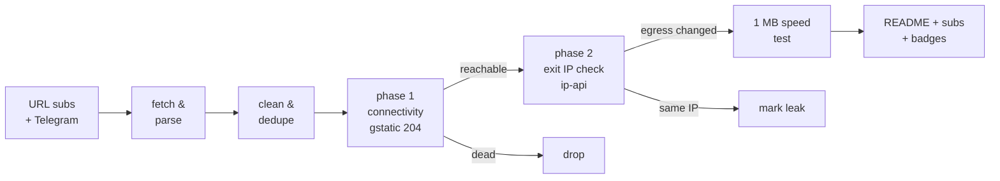

# Free Proxy Scanner

> **Really tested** free proxy aggregator. Every proxy below was fetched from public sources, tunneled through with Xray/sing-box, and verified to actually change your egress IP. No CSV-validation theater, no blind relisting.

      

## What this is

A GitHub Actions pipeline (runs every 6 hours) that fetches free proxy configs from **173 URL subscriptions** and **81 Telegram channels**, parses 9 protocols (vless / vmess / trojan / ss / hysteria2 / hysteria / tuic / socks / http), deduplicates them, and **actually connects through every single one** to separate working proxies from dead ones.

Latest run: **2026-10-08 03:11:44 UTC** — 157283 unique proxies collected from 133/133 URL sources and 47/47 Telegram channels; **4506** endpoints really tested, **1004** reachable, **982** verified working (egress IP confirmed changed) across **48 exit countries**.

## How the testing works (the *really* part)



1. **Phase 1 — connectivity.** Each proxy is loaded as an outbound into a real Xray or sing-box instance (or used directly via `curl -x` for plain http/socks). An HTTPS request to `gstatic.com/generate_204` goes through the tunnel with **DNS resolved on the proxy side**. Only an HTTP 204 counts as reachable.
2. **Phase 2 — egress verification.** An ip-api request through the same tunnel must return an exit IP **different from the runner's own IP**, plus its country and AS. Proxies that pass phase 1 but keep your IP are marked as leaks and excluded from the working list. Server country vs exit country mismatches are flagged in the tables.
3. **Throughput.** Working proxies download 1 MB from `speed.cloudflare.com` through the tunnel; the measured rate is the speed you see in the tables.
4. **Engine fallback.** If a proxy fails on Xray, it is retried on sing-box (and vice versa) before being declared dead — some configs only work on one core.

## Top working proxies

All 982 working proxies are published in [`subs/all.txt`](subs/all.txt); this table shows the top 25.

| # | proxy | proto | server | exit | latency | speed | engine |
|---|-------|-------|--------|------|---------|-------|--------|
| 1 | #1 🇺🇸 US → 🇺🇸 US | `ss` | `156.146.38.167:443` | United States | 352 ms | 36.7 Mbps | xray |
| 2 | #2 🇺🇸 US → 🇺🇸 US | `ss` | `156.146.38.168:443` | United States | 415 ms | 31.4 Mbps | xray |
| 3 | #3 🇺🇸 US → 🇺🇸 US | `ss` | `156.146.38.169:443` | United States | 438 ms | 31.0 Mbps | xray |
| 4 | #4 🇺🇸 US → 🇺🇸 US | `ss` | `156.146.38.170:443` | United States | 452 ms | 30.6 Mbps | xray |
| 5 | #5 ❓ ?? → 🇺🇸 US | `vless` | `3h-unitedstates1.09vpn.com:80` | United States | 541 ms | 26.3 Mbps | xray |
| 6 | #6 🇺🇸 US → 🇺🇸 US | `ss` | `5.78.51.123:1080` | United States | 351 ms | 23.4 Mbps | xray |
| 7 | #7 🇺🇸 US → 🇺🇸 US | `vless` | `47.251.108.158:443` | United States | 139 ms | 23.3 Mbps | singbox |
| 8 | #8 ❓ ?? → 🇺🇸 US | `vless` | `45.63.53.81:443` | United States | 207 ms | 22.9 Mbps | singbox |
| 9 | #9 ❓ ?? → 🇺🇸 US | `vless` | `144.202.126.147:443` | United States | 171 ms | 22.9 Mbps | singbox |
| 10 | #10 ❓ ?? → 🇺🇸 US | `vless` | `45.32.69.110:443` | United States | 135 ms | 22.7 Mbps | singbox |
| 11 | #11 🇺🇸 US → 🇺🇸 US | `vless` | `15.204.97.197:23576` | United States | 342 ms | 22.3 Mbps | xray |
| 12 | #12 🇺🇸 US → 🇺🇸 US | `vless` | `15.204.97.206:23576` | United States | 175 ms | 22.3 Mbps | xray |
| 13 | #13 🇺🇸 US → 🇺🇸 US | `hysteria2` | `155.248.209.237:33333` | United States | 141 ms | 22.1 Mbps | singbox |
| 14 | #14 🇺🇸 US → 🇺🇸 US | `vless` | `15.204.97.209:23576` | United States | 503 ms | 22.0 Mbps | xray |
| 15 | #15 🇺🇸 US → 🇺🇸 US | `vless` | `15.204.97.198:23576` | United States | 406 ms | 21.2 Mbps | xray |
| 16 | #16 🇺🇸 US → 🇺🇸 US | `vless` | `15.204.97.216:23576` | United States | 174 ms | 21.0 Mbps | xray |
| 17 | #17 ❓ ?? → 🇺🇸 US | `vless` | `ww13.levikogjgfdd.ir:23576` | United States | 386 ms | 20.8 Mbps | xray |
| 18 | #18 🇺🇸 US → 🇺🇸 US | `vless` | `15.204.97.195:23576` | United States | 341 ms | 20.4 Mbps | xray |
| 19 | #19 🇺🇸 US → 🇺🇸 US | `vless` | `15.204.97.214:23576` | United States | 308 ms | 20.3 Mbps | xray |
| 20 | #20 🇺🇸 US → 🇺🇸 US | `vless` | `15.204.97.219:23576` | United States | 362 ms | 20.1 Mbps | xray |
| 21 | #21 🇺🇸 US → 🇺🇸 US | `hysteria2` | `142.249.37.90:44356` | United States | 171 ms | 20.1 Mbps | singbox |
| 22 | #22 🇺🇸 US → 🇺🇸 US | `vless` | `51.81.203.63:443` | United States | 193 ms | 19.9 Mbps | xray |
| 23 | #23 🇺🇸 US → 🇺🇸 US | `ss` | `216.105.168.18:443` | United States | 8204 ms | 19.9 Mbps | xray |
| 24 | #24 ❓ ?? → 🇺🇸 US | `vless` | `38.107.232.36:80` | United States | 119 ms | 19.2 Mbps | xray |
| 25 | #25 🇺🇸 US → 🇺🇸 US | `vless` | `195.123.240.65:443` | United States | 169 ms | 18.7 Mbps | xray |

## Exit locations — which countries work

Every working proxy, grouped by the country of its **verified exit IP** (phase 2), with a dedicated subscription file per country. Currently 48 countries have at least one working exit.

| country | working | avg speed | best latency | share | list |
|---------|--------:|----------:|-------------:|------:|------|
| 🇺🇸 United States | 255 | 11.4 Mbps | 101 ms | 26% | [`US.txt`](subs/by-country/US.txt) |
| 🇳🇱 Netherlands | 165 | 5.3 Mbps | 366 ms | 17% | [`NL.txt`](subs/by-country/NL.txt) |
| 🇩🇪 Germany | 89 | 4.7 Mbps | 414 ms | 9% | [`DE.txt`](subs/by-country/DE.txt) |
| 🇫🇷 France | 61 | 5.1 Mbps | 498 ms | 6% | [`FR.txt`](subs/by-country/FR.txt) |
| 🇯🇵 Japan | 52 | 3.5 Mbps | 488 ms | 5% | [`JP.txt`](subs/by-country/JP.txt) |
| 🇰🇷 South Korea | 33 | 3.6 Mbps | 516 ms | 3% | [`KR.txt`](subs/by-country/KR.txt) |
| 🇸🇬 Singapore | 31 | 2.4 Mbps | 644 ms | 3% | [`SG.txt`](subs/by-country/SG.txt) |
| 🇭🇰 Hong Kong | 29 | 3.6 Mbps | 507 ms | 3% | [`HK.txt`](subs/by-country/HK.txt) |
| 🇬🇧 United Kingdom | 28 | 5.0 Mbps | 365 ms | 3% | [`GB.txt`](subs/by-country/GB.txt) |
| 🇫🇮 Finland | 22 | 3.7 Mbps | 442 ms | 2% | [`FI.txt`](subs/by-country/FI.txt) |
| 🇨🇦 Canada | 16 | 9.2 Mbps | 216 ms | 2% | [`CA.txt`](subs/by-country/CA.txt) |
| 🇵🇱 Poland | 16 | 4.6 Mbps | 568 ms | 2% | [`PL.txt`](subs/by-country/PL.txt) |
| 🇦🇺 Australia | 13 | 9.1 Mbps | 198 ms | 1% | [`AU.txt`](subs/by-country/AU.txt) |
| 🇮🇳 India | 12 | 2.3 Mbps | 893 ms | 1% | [`IN.txt`](subs/by-country/IN.txt) |
| 🇨🇱 Chile | 12 | 5.1 Mbps | 560 ms | 1% | [`CL.txt`](subs/by-country/CL.txt) |
| 🇪🇸 Spain | 10 | 4.6 Mbps | 117 ms | 1% | [`ES.txt`](subs/by-country/ES.txt) |
| 🇹🇷 Turkey | 10 | 4.0 Mbps | 604 ms | 1% | [`TR.txt`](subs/by-country/TR.txt) |
| 🇷🇸 Serbia | 10 | 3.7 Mbps | 859 ms | 1% | [`RS.txt`](subs/by-country/RS.txt) |
| 🇲🇩 Moldova | 10 | 3.0 Mbps | 962 ms | 1% | [`MD.txt`](subs/by-country/MD.txt) |
| 🇪🇪 Estonia | 9 | 4.6 Mbps | 583 ms | 1% | [`EE.txt`](subs/by-country/EE.txt) |
| 🇧🇬 Bulgaria | 9 | 3.8 Mbps | 833 ms | 1% | [`BG.txt`](subs/by-country/BG.txt) |
| 🇸🇪 Sweden | 8 | 4.7 Mbps | 542 ms | 1% | [`SE.txt`](subs/by-country/SE.txt) |
| 🇧🇾 BY | 8 | 1.8 Mbps | 896 ms | 1% | [`BY.txt`](subs/by-country/BY.txt) |
| 🇮🇪 Ireland | 6 | 4.4 Mbps | 310 ms | 1% | [`IE.txt`](subs/by-country/IE.txt) |
| 🇮🇹 Italy | 6 | 5.0 Mbps | 478 ms | 1% | [`IT.txt`](subs/by-country/IT.txt) |
| 🇰🇿 Kazakhstan | 6 | 1.9 Mbps | 1400 ms | 1% | [`KZ.txt`](subs/by-country/KZ.txt) |
| 🇲🇦 MA | 5 | 4.0 Mbps | 115 ms | 1% | [`MA.txt`](subs/by-country/MA.txt) |
| 🇷🇺 Russia | 5 | 3.1 Mbps | 521 ms | 1% | [`RU.txt`](subs/by-country/RU.txt) |
| 🇹🇼 Taiwan | 5 | 3.4 Mbps | 619 ms | 1% | [`TW.txt`](subs/by-country/TW.txt) |
| 🇨🇭 Switzerland | 4 | 5.4 Mbps | 601 ms | 0% | [`CH.txt`](subs/by-country/CH.txt) |
| 🇳🇴 Norway | 4 | 3.5 Mbps | 547 ms | 0% | [`NO.txt`](subs/by-country/NO.txt) |
| 🇦🇹 Austria | 4 | 4.2 Mbps | 477 ms | 0% | [`AT.txt`](subs/by-country/AT.txt) |
| 🇷🇴 Romania | 4 | 3.3 Mbps | 605 ms | 0% | [`RO.txt`](subs/by-country/RO.txt) |
| 🇹🇭 Thailand | 4 | 2.8 Mbps | 877 ms | 0% | [`TH.txt`](subs/by-country/TH.txt) |
| 🇿🇦 South Africa | 4 | 2.6 Mbps | 948 ms | 0% | [`ZA.txt`](subs/by-country/ZA.txt) |
| 🇮🇩 Indonesia | 3 | 2.1 Mbps | 864 ms | 0% | [`ID.txt`](subs/by-country/ID.txt) |
| 🇱🇻 Latvia | 2 | 5.1 Mbps | 633 ms | 0% | [`LV.txt`](subs/by-country/LV.txt) |
| 🇦🇪 UAE | 2 | 3.1 Mbps | 1162 ms | 0% | [`AE.txt`](subs/by-country/AE.txt) |
| 🇲🇽 Mexico | 1 | 9.2 Mbps | 499 ms | 0% | [`MX.txt`](subs/by-country/MX.txt) |
| 🇺🇦 Ukraine | 1 | 5.3 Mbps | 781 ms | 0% | [`UA.txt`](subs/by-country/UA.txt) |
| 🇦🇱 AL | 1 | 5.3 Mbps | 575 ms | 0% | [`AL.txt`](subs/by-country/AL.txt) |
| 🇬🇷 Greece | 1 | 4.3 Mbps | 757 ms | 0% | [`GR.txt`](subs/by-country/GR.txt) |
| 🇨🇿 Czechia | 1 | 3.6 Mbps | 1148 ms | 0% | [`CZ.txt`](subs/by-country/CZ.txt) |
| 🇸🇦 Saudi Arabia | 1 | 2.5 Mbps | 1079 ms | 0% | [`SA.txt`](subs/by-country/SA.txt) |
| 🇦🇲 Armenia | 1 | 2.3 Mbps | 2030 ms | 0% | [`AM.txt`](subs/by-country/AM.txt) |
| 🇱🇺 Luxembourg | 1 | 1.4 Mbps | 852 ms | 0% | [`LU.txt`](subs/by-country/LU.txt) |
| 🇲🇾 Malaysia | 1 | - | 1052 ms | 0% | [`MY.txt`](subs/by-country/MY.txt) |
| 🇮🇱 Israel | 1 | - | 1083 ms | 0% | [`IL.txt`](subs/by-country/IL.txt) |

A `??` exit means the geo lookup could not resolve the exit IP. Base64 variants of every country file sit next to them as `<CC>.base64.txt`.

## Protocol distribution

| protocol | tested | alive | working | alive rate |
|----------|-------:|------:|--------:|-----------:|
| `vless` | 2875 | 586 | 566 | 20% |
| `ss` | 463 | 214 | 212 | 46% |
| `trojan` | 202 | 109 | 109 | 54% |
| `vmess` | 908 | 65 | 65 | 7% |
| `hysteria2` | 54 | 29 | 29 | 54% |
| `tuic` | 1 | 1 | 1 | 100% |
| `http` | 3 | 0 | 0 | 0% |

Per-protocol working lists: [`subs/by-proto/`](subs/by-proto/) (one `vless.txt`, `vmess.txt`, ... per protocol, plus `.base64.txt` variants).

## Engine breakdown

Which core verified each working proxy. The engine fallback means a proxy that failed on its primary core got a second chance on the other one.

| engine | working | note |
|--------|--------:|------|
| Xray-core | 904 | [`allxray.txt`](subs/by-engine/allxray.txt) |
| sing-box | 78 | [`allsingbox.txt`](subs/by-engine/allsingbox.txt) |
| direct (curl) | 0 | plain http/socks, [`alldirect.txt`](subs/by-engine/alldirect.txt) |

## Speed & latency profile

| speed tier | proxies |
|-----------|--------:|
| >= 5 Mbps | 426 |
| 1 - 5 Mbps | 335 |
| 0.25 - 1 Mbps | 24 |
| < 0.25 Mbps | 0 |
| unmeasured | 197 |

Latency (phase-1 HTTPS round trip): median **609 ms**, p90 **1714 ms**. 22 proxies passed connectivity but failed egress verification (leaked the runner IP or broke on the exit check) and are excluded.

## Source health

180 active, 74 auto-retired (10 fetch failures / 10 all-dead runs / 10 days without anything new). Best contributors this run:

| source | kind | tested | alive | new this run |
|--------|------|-------:|------:|-------------:|
| `NK` | url | 889 | 594 | 4042 |
| `SK` | url | 863 | 570 | 530 |
| `Ni` | url | 467 | 373 | 186 |
| `RD-VL` | url | 2445 | 356 | 4229 |
| `HP` | url | 337 | 315 | 56 |
| `F0` | url | 337 | 311 | 122 |
| `ET` | url | 351 | 307 | 1148 |
| `HC` | url | 1307 | 288 | 172 |
| `ST-VL` | url | 2385 | 270 | 686 |
| `EV` | url | 451 | 243 | 1493 |
| `RD-SS` | url | 434 | 207 | 299 |
| `AG-PL` | url | 355 | 200 | 1185 |
| `KA` | url | 1800 | 197 | 6457 |
| `SB-VL` | url | 2148 | 148 | 0 |
| `SB` | url | 2374 | 133 | 0 |
| `AN` | url | 133 | 130 | 11 |
| `EV-SS` | url | 155 | 127 | 56 |
| `WD` | url | 113 | 103 | 179 |
| `EV-VL` | url | 243 | 99 | 0 |
| `WU` | url | 112 | 96 | 263 |

## History

working per run (last 27): ▁▁▆▆▇█▇▆▇█▇▆▇▆▇▇█▇▇▇█▇▇▇▇▇█

| date (UTC) | tested | alive | working | avg | max |
|------------|-------:|------:|--------:|----:|----:|
| 2026-10-08 03:32 | 4506 | 1004 | 982 | 5.9M | 36.7M |
| 2026-10-07 22:39 | 4509 | 841 | 819 | 7.8M | 74.8M |
| 2026-10-07 12:30 | 4516 | 858 | 815 | 5.7M | 36.0M |
| 2026-10-07 03:14 | 4516 | 957 | 922 | 6.7M | 49.7M |
| 2026-10-06 22:16 | 4513 | 946 | 913 | 7.8M | 46.8M |
| 2026-10-06 12:39 | 4515 | 918 | 867 | 6.7M | 38.2M |
| 2026-10-06 03:49 | 4521 | 1046 | 1018 | 10.0M | 87.7M |
| 2026-10-05 23:43 | 4527 | 929 | 912 | 7.6M | 50.6M |
| 2026-10-05 19:47 | 4547 | 861 | 822 | 8.6M | 77.6M |
| 2026-10-03 11:04 | 4500 | 899 | 860 | 8.7M | 82.3M |
| 2026-10-03 02:52 | 4500 | 1062 | 1030 | 8.0M | 75.5M |
| 2026-10-02 21:49 | 4500 | 890 | 861 | 8.9M | 68.7M |
| 2026-10-02 17:14 | 4500 | 847 | 807 | 8.6M | 88.1M |
| 2026-10-02 11:49 | 4500 | 861 | 798 | 7.9M | 85.3M |
| 2026-10-01 22:23 | 4500 | 904 | 878 | 7.5M | 90.2M |

## Subscription files

Everything under [`subs/`](subs/) is regenerated every run. Plain lists are one proxy URI per line; `.base64.txt` variants are the same list base64-encoded for clients that need the classic sub format.

| file | contents | direct subscription URL |
|------|----------|--------------------------|
| [`all.txt`](subs/all.txt) | ALL working proxies, ranked by speed (982) | `https://raw.githubusercontent.com/G1010yzd10/proxy-scanner/main/subs/all.txt` |
| [`all.base64.txt`](subs/all.base64.txt) | same, base64 | `https://raw.githubusercontent.com/G1010yzd10/proxy-scanner/main/subs/all.base64.txt` |
| [`top150.txt`](subs/top150.txt) | top 150 ranked (150) | `https://raw.githubusercontent.com/G1010yzd10/proxy-scanner/main/subs/top150.txt` |
| [`top150.base64.txt`](subs/top150.base64.txt) | same, base64 | `https://raw.githubusercontent.com/G1010yzd10/proxy-scanner/main/subs/top150.base64.txt` |
| [`by-proto/`](subs/by-proto/) | one list per protocol (6 protocols) | ...`/subs/by-proto/<proto>.txt` |
| [`by-engine/allxray.txt`](subs/by-engine/allxray.txt) | verified on Xray (904) | `https://raw.githubusercontent.com/G1010yzd10/proxy-scanner/main/subs/by-engine/allxray.txt` |
| [`by-engine/allsingbox.txt`](subs/by-engine/allsingbox.txt) | verified on sing-box (78) | `https://raw.githubusercontent.com/G1010yzd10/proxy-scanner/main/subs/by-engine/allsingbox.txt` |
| [`by-country/`](subs/by-country/) | one list per exit country (48 countries, e.g. [`US.txt`](subs/by-country/US.txt), [`DE.txt`](subs/by-country/DE.txt)) | ...`/subs/by-country/<CC>.txt` |
| [`sing-box-client.json`](subs/sing-box-client.json) | top 150 as a ready-to-run sing-box client config | `https://raw.githubusercontent.com/G1010yzd10/proxy-scanner/main/subs/sing-box-client.json` |
| [`xray-client.json`](subs/xray-client.json) | top 150 as a ready-to-run xray client config | `https://raw.githubusercontent.com/G1010yzd10/proxy-scanner/main/subs/xray-client.json` |
| [`archive/`](archive/) | gz snapshot of every collection (30 kept) | — |

## Use the proxies

- **v2rayN / v2rayNG / Nekobox / Hiddify / Shadowrocket**: add subscription `https://raw.githubusercontent.com/G1010yzd10/proxy-scanner/main/subs/all.base64.txt` (everything working) or `https://raw.githubusercontent.com/G1010yzd10/proxy-scanner/main/subs/top150.base64.txt` (curated top 150).
- **Want a specific country?** Grab `subs/by-country/<CC>.txt` (see the Exit locations table above) — e.g. `https://raw.githubusercontent.com/G1010yzd10/proxy-scanner/main/subs/by-country/US.txt`, `https://raw.githubusercontent.com/G1010yzd10/proxy-scanner/main/subs/by-country/DE.txt`.
- **Only one protocol?** `subs/by-proto/<proto>.txt` — e.g. `https://raw.githubusercontent.com/G1010yzd10/proxy-scanner/main/subs/by-proto/vless.txt`, `https://raw.githubusercontent.com/G1010yzd10/proxy-scanner/main/subs/by-proto/hysteria2.txt`.
- **sing-box**: download [`subs/sing-box-client.json`](subs/sing-box-client.json) and run `sing-box run -c sing-box-client.json` — it listens on `127.0.0.1:2080` (mixed) with a selector + auto urltest group.
- **Xray**: download [`subs/xray-client.json`](subs/xray-client.json), socks inbound on `127.0.0.1:2080`.
- Raw snapshots of every collection: [`archive/`](archive/) (30 kept).

## Repository layout

```
sources/            url_subs.yml + telegram.yml (scannable source lists)
scripts/            collect.py, test.py, report.py + lib/
state/              source health, alive-recall pool, geo cache (committed)
data/               stats, history, compact last-run results
subs/               THE PRODUCT: verified working proxies, split by
                    proto / engine / exit country + all + top150 lists
badges/             shields.io endpoint badges
archive/            gz snapshots of every collection
```

## Why most "free proxy lists" lie

The typical aggregator relists whatever it scraped, so 80-95% of entries are dead within hours — this run found **78% unreachable** and **78% unusable** overall. Only tunnels that completed a real HTTPS handshake, returned a verifiable foreign exit IP, and pushed a 1 MB download are counted as working here.

## Disclaimers

- Free proxies are **public and untrusted**. Anything you send through them can be observed or modified by their operators. Never use them for authentication, payments, or anything sensitive.
- All configs are collected from publicly posted sources (GitHub subscriptions and public Telegram channels); no credentials are guessed or brute-forced. Removal requests: open an issue.
- Availability is transient: the working list is re-verified every 6 hours, and past performance never guarantees future availability.

