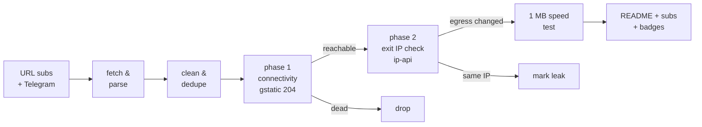

# Free Proxy Scanner

> **Really tested** free proxy aggregator. Collects configs from ~180 public URL
> subscriptions and ~90 Telegram channels, then **actually connects through every
> single one** with Xray/sing-box and verifies the egress IP really changed.
> No CSV-validation theater, no blind relisting.

🚀 **First run in progress** — this README is auto-generated by the pipeline and
will be replaced by the live report (top proxies, protocol distribution, exit
countries, source health, history) as soon as
[the first Actions run](../../actions) completes.

## Pipeline

- **Collect** — 9 protocols parsed (vless / vmess / trojan / ss / hysteria2 /
  hysteria / tuic / socks / http), including base64 blobs, clash YAML, xray JSON
  and nekobox JSON sources. Private IPs, bad ports and malformed UUIDs dropped;
  exact-duplicate and same-endpoint dedupe with a canonical config hash.
- **Really test** — every candidate is loaded as an outbound into a real
  Xray or sing-box process (or used via `curl -x` for plain http/socks). A
  `generate_204` HTTPS check must pass **with DNS resolved on the proxy side**,
  then the exit IP (via ip-api through the tunnel) must differ from the runner's
  own IP, then 1 MB of throughput is measured. Failed configs are retried once
  on the other engine before being declared dead.
- **Report** — this README, `subs/` subscription files (plain + base64 +
  per-protocol + ready-to-run sing-box/Xray client configs), shields.io badges
  and a run history. Runs every 6 hours; recently-alive proxies are re-tested
  from a recall pool, and sources that stop producing are auto-retired.

## Outputs

| path | what |
|------|------|
| [`subs/all.txt`](subs/all.txt) | top working proxies, ranked (plain URI list) |
| [`subs/base64.txt`](subs/base64.txt) | same, classic base64 subscription |
| [`subs/by-proto/`](subs/by-proto/) | per-protocol lists |
| [`subs/sing-box-client.json`](subs/sing-box-client.json) | ready-to-run sing-box client config |
| [`subs/xray-client.json`](subs/xray-client.json) | ready-to-run Xray client config |
| [`archive/`](archive/) | gz snapshots of every collection (30 kept) |
| [`state/`](state/) | source health, alive-recall pool, geo cache |

## Disclaimers

- Free proxies are **public and untrusted** — anything you send through them can
  be observed or modified by their operators. Never use them for authentication,
  payments, or anything sensitive.
- All configs come from publicly posted sources; no credentials are guessed or
  brute-forced. Removal requests: open an issue.
