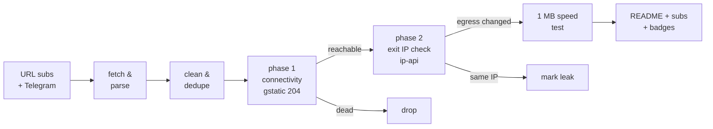

# Free Proxy Scanner

> **Really tested** free proxy aggregator. Every proxy below was fetched from public sources, tunneled through with Xray/sing-box, and verified to actually change your egress IP. No CSV-validation theater, no blind relisting.

      

## What this is

A GitHub Actions pipeline (runs every 6 hours) that fetches free proxy configs from **173 URL subscriptions** and **81 Telegram channels**, parses 9 protocols (vless / vmess / trojan / ss / hysteria2 / hysteria / tuic / socks / http), deduplicates them, and **actually connects through every single one** to separate working proxies from dead ones.

Latest run: **2026-10-10 16:27:10 UTC** — 160437 unique proxies collected from 115/115 URL sources and 13/13 Telegram channels; **4503** endpoints really tested, **939** reachable, **884** verified working (egress IP confirmed changed) across **47 exit countries**.

## How the testing works (the *really* part)



1. **Phase 1 — connectivity.** Each proxy is loaded as an outbound into a real Xray or sing-box instance (or used directly via `curl -x` for plain http/socks). An HTTPS request to `gstatic.com/generate_204` goes through the tunnel with **DNS resolved on the proxy side**. Only an HTTP 204 counts as reachable.
2. **Phase 2 — egress verification.** An ip-api request through the same tunnel must return an exit IP **different from the runner's own IP**, plus its country and AS. Proxies that pass phase 1 but keep your IP are marked as leaks and excluded from the working list. Server country vs exit country mismatches are flagged in the tables.
3. **Throughput.** Working proxies download 1 MB from `speed.cloudflare.com` through the tunnel; the measured rate is the speed you see in the tables.
4. **Engine fallback.** If a proxy fails on Xray, it is retried on sing-box (and vice versa) before being declared dead — some configs only work on one core.

## Top working proxies

All 884 working proxies are published in [`subs/all.txt`](subs/all.txt); this table shows the top 25.

| # | proxy | proto | server | exit | latency | speed | engine |
|---|-------|-------|--------|------|---------|-------|--------|
| 1 | #1 ❓ ?? → 🇺🇸 US | `ss` | `144.48.107.10:19142` | United States | 56 ms | 42.8 Mbps | xray |
| 2 | #2 ❓ ?? → 🇺🇸 US | `vless` | `162.159.135.234:443` | United States | 197 ms | 40.6 Mbps | xray |
| 3 | #3 🇺🇸 US → 🇺🇸 US | `vmess` | `84.17.41.2:18000` | United States | 160 ms | 39.7 Mbps | xray |
| 4 | #4 🇺🇸 US → 🇺🇸 US | `vless` | `15.204.97.197:23576` | United States | 64 ms | 35.7 Mbps | xray |
| 5 | #5 🇺🇸 US → 🇺🇸 US | `vless` | `15.204.97.195:23576` | United States | 61 ms | 35.5 Mbps | xray |
| 6 | #6 🇨🇦 CA → 🇨🇦 CA | `ss` | `149.22.95.183:443` | Canada | 50 ms | 34.4 Mbps | xray |
| 7 | #7 🇺🇸 US → 🇺🇸 US | `vless` | `15.204.97.198:23576` | United States | 58 ms | 34.0 Mbps | xray |
| 8 | #8 🇺🇸 US → 🇺🇸 US | `vless` | `15.204.97.219:23576` | United States | 63 ms | 33.6 Mbps | xray |
| 9 | #9 🇺🇸 US → 🇺🇸 US | `ss` | `5.78.51.123:1080` | United States | 51 ms | 33.5 Mbps | xray |
| 10 | #10 🇺🇸 US → 🇺🇸 US | `vless` | `15.204.97.214:23576` | United States | 80 ms | 33.3 Mbps | xray |
| 11 | #11 🇺🇸 US → 🇺🇸 US | `vless` | `15.204.97.206:23576` | United States | 67 ms | 32.7 Mbps | xray |
| 12 | #12 🇺🇸 US → 🇺🇸 US | `vless` | `15.204.97.216:23576` | United States | 64 ms | 30.7 Mbps | xray |
| 13 | #13 ❓ ?? → 🇺🇸 US | `vless` | `ww13.levikogjgfdd.ir:23576` | United States | 252 ms | 27.6 Mbps | xray |
| 14 | #14 ❓ ?? → 🇺🇸 US | `hysteria2` | `163.192.14.135:50160` | United States | 124 ms | 27.2 Mbps | singbox |
| 15 | #15 ❓ ?? → 🇺🇸 US | `trojan` | `alert-titmouse.rooster465.autos:443` | United States | 117 ms | 25.6 Mbps | xray |
| 16 | #16 ❓ ?? → 🇺🇸 US | `trojan` | `pro-mako.rooster465.autos:443` | United States | 125 ms | 24.4 Mbps | xray |
| 17 | #17 🇺🇸 US → 🇺🇸 US | `vless` | `47.251.25.74:443` | United States | 134 ms | 24.0 Mbps | singbox |
| 18 | #18 🇺🇸 US → 🇺🇸 US | `vless` | `15.204.97.209:23576` | United States | 73 ms | 23.1 Mbps | xray |
| 19 | #19 🇺🇸 US → 🇺🇸 US | `hysteria2` | `142.249.37.90:44356` | United States | 144 ms | 22.5 Mbps | singbox |
| 20 | #20 🇺🇸 US → 🇺🇸 US | `vless` | `47.251.108.158:443` | United States | 136 ms | 22.1 Mbps | xray |
| 21 | #21 🇺🇸 US → 🇺🇸 US | `hysteria2` | `155.248.209.237:33333` | United States | 118 ms | 21.4 Mbps | singbox |
| 22 | #22 ❓ ?? → 🇺🇸 US | `vless` | `144.202.126.147:443` | United States | 164 ms | 20.4 Mbps | singbox |
| 23 | #23 ❓ ?? → 🇺🇸 US | `hysteria2` | `hy2.123266.xyz:33333` | United States | 175 ms | 19.6 Mbps | singbox |
| 24 | #24 ❓ ?? → 🇺🇸 US | `vless` | `45.32.69.110:443` | United States | 167 ms | 19.5 Mbps | singbox |
| 25 | #25 ❓ ?? → 🇺🇸 US | `vless` | `45.63.53.81:443` | United States | 169 ms | 19.4 Mbps | singbox |

## Exit locations — which countries work

Every working proxy, grouped by the country of its **verified exit IP** (phase 2), with a dedicated subscription file per country. Currently 47 countries have at least one working exit.

| country | working | avg speed | best latency | share | list |
|---------|--------:|----------:|-------------:|------:|------|
| 🇳🇱 Netherlands | 171 | 4.2 Mbps | 435 ms | 19% | [`NL.txt`](subs/by-country/NL.txt) |
| 🇺🇸 United States | 148 | 11.6 Mbps | 51 ms | 17% | [`US.txt`](subs/by-country/US.txt) |
| 🇩🇪 Germany | 103 | 3.3 Mbps | 449 ms | 12% | [`DE.txt`](subs/by-country/DE.txt) |
| 🇯🇵 Japan | 71 | 4.6 Mbps | 304 ms | 8% | [`JP.txt`](subs/by-country/JP.txt) |
| 🇸🇬 Singapore | 45 | 3.5 Mbps | 503 ms | 5% | [`SG.txt`](subs/by-country/SG.txt) |
| 🇫🇷 France | 37 | 3.5 Mbps | 603 ms | 4% | [`FR.txt`](subs/by-country/FR.txt) |
| 🇰🇷 South Korea | 36 | 4.1 Mbps | 463 ms | 4% | [`KR.txt`](subs/by-country/KR.txt) |
| 🇫🇮 Finland | 28 | 2.8 Mbps | 528 ms | 3% | [`FI.txt`](subs/by-country/FI.txt) |
| 🇬🇧 United Kingdom | 26 | 4.0 Mbps | 440 ms | 3% | [`GB.txt`](subs/by-country/GB.txt) |
| 🇵🇱 Poland | 26 | 2.7 Mbps | 695 ms | 3% | [`PL.txt`](subs/by-country/PL.txt) |
| 🇭🇰 Hong Kong | 25 | 4.1 Mbps | 577 ms | 3% | [`HK.txt`](subs/by-country/HK.txt) |
| 🇨🇦 Canada | 18 | 6.7 Mbps | 50 ms | 2% | [`CA.txt`](subs/by-country/CA.txt) |
| 🇪🇪 Estonia | 12 | 2.6 Mbps | 649 ms | 1% | [`EE.txt`](subs/by-country/EE.txt) |
| 🇧🇬 Bulgaria | 12 | 3.3 Mbps | 808 ms | 1% | [`BG.txt`](subs/by-country/BG.txt) |
| 🇷🇸 Serbia | 11 | 3.2 Mbps | 825 ms | 1% | [`RS.txt`](subs/by-country/RS.txt) |
| 🇮🇪 Ireland | 10 | 2.6 Mbps | 546 ms | 1% | [`IE.txt`](subs/by-country/IE.txt) |
| 🇧🇾 BY | 9 | 1.7 Mbps | 1020 ms | 1% | [`BY.txt`](subs/by-country/BY.txt) |
| 🇸🇪 Sweden | 8 | 2.1 Mbps | 649 ms | 1% | [`SE.txt`](subs/by-country/SE.txt) |
| 🇷🇺 Russia | 7 | 2.0 Mbps | 1828 ms | 1% | [`RU.txt`](subs/by-country/RU.txt) |
| 🇮🇹 Italy | 6 | 4.3 Mbps | 504 ms | 1% | [`IT.txt`](subs/by-country/IT.txt) |
| 🇪🇸 Spain | 6 | 3.0 Mbps | 721 ms | 1% | [`ES.txt`](subs/by-country/ES.txt) |
| 🇮🇳 India | 6 | 2.2 Mbps | 868 ms | 1% | [`IN.txt`](subs/by-country/IN.txt) |
| 🇲🇩 Moldova | 6 | 1.5 Mbps | 1348 ms | 1% | [`MD.txt`](subs/by-country/MD.txt) |
| 🇹🇷 Turkey | 5 | 2.2 Mbps | 990 ms | 1% | [`TR.txt`](subs/by-country/TR.txt) |
| 🇰🇿 Kazakhstan | 5 | 0.9 Mbps | 1356 ms | 1% | [`KZ.txt`](subs/by-country/KZ.txt) |
| 🇨🇭 Switzerland | 4 | 3.8 Mbps | 716 ms | 0% | [`CH.txt`](subs/by-country/CH.txt) |
| 🇹🇼 Taiwan | 4 | 4.0 Mbps | 558 ms | 0% | [`TW.txt`](subs/by-country/TW.txt) |
| 🇷🇴 Romania | 4 | 2.8 Mbps | 893 ms | 0% | [`RO.txt`](subs/by-country/RO.txt) |
| 🇹🇭 Thailand | 4 | 2.9 Mbps | 696 ms | 0% | [`TH.txt`](subs/by-country/TH.txt) |
| 🇦🇹 Austria | 3 | 4.9 Mbps | 570 ms | 0% | [`AT.txt`](subs/by-country/AT.txt) |
| 🇱🇻 Latvia | 3 | 2.8 Mbps | 753 ms | 0% | [`LV.txt`](subs/by-country/LV.txt) |
| 🇿🇦 South Africa | 3 | 2.6 Mbps | 1009 ms | 0% | [`ZA.txt`](subs/by-country/ZA.txt) |
| 🇦🇪 UAE | 3 | 2.2 Mbps | 1094 ms | 0% | [`AE.txt`](subs/by-country/AE.txt) |
| 🇳🇴 Norway | 3 | 1.0 Mbps | 4576 ms | 0% | [`NO.txt`](subs/by-country/NO.txt) |
| 🇮🇩 Indonesia | 3 | 0.9 Mbps | 799 ms | 0% | [`ID.txt`](subs/by-country/ID.txt) |
| 🇨🇿 Czechia | 2 | 2.0 Mbps | 1170 ms | 0% | [`CZ.txt`](subs/by-country/CZ.txt) |
| 🇩🇰 Denmark | 1 | 4.8 Mbps | 653 ms | 0% | [`DK.txt`](subs/by-country/DK.txt) |
| 🇲🇾 Malaysia | 1 | 4.6 Mbps | 714 ms | 0% | [`MY.txt`](subs/by-country/MY.txt) |
| 🇦🇱 AL | 1 | 4.1 Mbps | 675 ms | 0% | [`AL.txt`](subs/by-country/AL.txt) |
| 🇬🇷 Greece | 1 | 3.9 Mbps | 814 ms | 0% | [`GR.txt`](subs/by-country/GR.txt) |
| 🇸🇦 Saudi Arabia | 1 | 2.9 Mbps | 1224 ms | 0% | [`SA.txt`](subs/by-country/SA.txt) |
| 🇦🇲 Armenia | 1 | 2.4 Mbps | 2138 ms | 0% | [`AM.txt`](subs/by-country/AM.txt) |
| 🇱🇰 LK | 1 | 1.9 Mbps | 1722 ms | 0% | [`LK.txt`](subs/by-country/LK.txt) |
| 🇨🇱 Chile | 1 | - | 1088 ms | 0% | [`CL.txt`](subs/by-country/CL.txt) |
| 🇮🇱 Israel | 1 | - | 1116 ms | 0% | [`IL.txt`](subs/by-country/IL.txt) |
| 🇻🇳 Vietnam | 1 | - | 1420 ms | 0% | [`VN.txt`](subs/by-country/VN.txt) |
| 🇨🇳 China | 1 | - | 5364 ms | 0% | [`CN.txt`](subs/by-country/CN.txt) |

A `??` exit means the geo lookup could not resolve the exit IP. Base64 variants of every country file sit next to them as `<CC>.base64.txt`.

## Protocol distribution

| protocol | tested | alive | working | alive rate |
|----------|-------:|------:|--------:|-----------:|
| `vless` | 2732 | 488 | 455 | 18% |
| `ss` | 442 | 198 | 191 | 45% |
| `trojan` | 272 | 129 | 116 | 47% |
| `vmess` | 963 | 72 | 70 | 7% |
| `hysteria2` | 90 | 50 | 50 | 56% |
| `tuic` | 2 | 2 | 2 | 100% |
| `http` | 2 | 0 | 0 | 0% |

Per-protocol working lists: [`subs/by-proto/`](subs/by-proto/) (one `vless.txt`, `vmess.txt`, ... per protocol, plus `.base64.txt` variants).

## Engine breakdown

Which core verified each working proxy. The engine fallback means a proxy that failed on its primary core got a second chance on the other one.

| engine | working | note |
|--------|--------:|------|
| Xray-core | 780 | [`allxray.txt`](subs/by-engine/allxray.txt) |
| sing-box | 104 | [`allsingbox.txt`](subs/by-engine/allsingbox.txt) |
| direct (curl) | 0 | plain http/socks, [`alldirect.txt`](subs/by-engine/alldirect.txt) |

## Speed & latency profile

| speed tier | proxies |
|-----------|--------:|
| >= 5 Mbps | 167 |
| 1 - 5 Mbps | 508 |
| 0.25 - 1 Mbps | 45 |
| < 0.25 Mbps | 0 |
| unmeasured | 164 |

Latency (phase-1 HTTPS round trip): median **800 ms**, p90 **3809 ms**. 55 proxies passed connectivity but failed egress verification (leaked the runner IP or broke on the exit check) and are excluded.

## Source health

128 active, 126 auto-retired (10 fetch failures / 10 all-dead runs / 10 days without anything new). Best contributors this run:

| source | kind | tested | alive | new this run |
|--------|------|-------:|------:|-------------:|
| `SK` | url | 1070 | 601 | 7492 |
| `NK` | url | 1020 | 553 | 60 |
| `HP` | url | 505 | 420 | 268 |
| `F0` | url | 345 | 299 | 120 |
| `ET` | url | 383 | 293 | 2723 |
| `RD-VL` | url | 2362 | 280 | 4253 |
| `HC` | url | 1465 | 253 | 160 |
| `AG-PL` | url | 627 | 237 | 1380 |
| `KA` | url | 3160 | 223 | 4992 |
| `EV` | url | 399 | 200 | 1499 |
| `RD-SS` | url | 417 | 189 | 277 |
| `ST-VL` | url | 2271 | 183 | 706 |
| `Ni` | url | 248 | 154 | 11 |
| `SB-VL` | url | 2077 | 140 | 1 |
| `SB` | url | 2424 | 123 | 1 |
| `EV-SS` | url | 153 | 121 | 52 |
| `WD` | url | 109 | 97 | 158 |
| `AQ` | url | 169 | 85 | 563 |
| `TK` | url | 143 | 84 | 1 |
| `YA-VL` | url | 488 | 83 | 1466 |

## History

working per run (last 30): ▇▆▆▇█▇▆▇▆▆▇█▇▆▇█▇▇▇▆▆▇▆▇█▇▇█▇▇

| date (UTC) | tested | alive | working | avg | max |
|------------|-------:|------:|--------:|----:|----:|
| 2026-10-10 16:48 | 4503 | 939 | 884 | 5.0M | 42.8M |
| 2026-10-10 11:49 | 4506 | 967 | 933 | 5.2M | 63.8M |
| 2026-10-10 03:18 | 4504 | 1154 | 1128 | 6.1M | 47.7M |
| 2026-10-09 22:15 | 4506 | 966 | 935 | 6.8M | 51.9M |
| 2026-10-09 12:32 | 4508 | 904 | 853 | 5.2M | 37.6M |
| 2026-10-09 03:37 | 4504 | 1042 | 1006 | 8.3M | 72.4M |
| 2026-10-08 22:53 | 4507 | 873 | 851 | 5.5M | 55.0M |
| 2026-10-08 12:40 | 4504 | 827 | 775 | 6.8M | 67.7M |
| 2026-10-08 03:32 | 4506 | 1004 | 982 | 5.9M | 36.7M |
| 2026-10-07 22:39 | 4509 | 841 | 819 | 7.8M | 74.8M |
| 2026-10-07 12:30 | 4516 | 858 | 815 | 5.7M | 36.0M |
| 2026-10-07 03:14 | 4516 | 957 | 922 | 6.7M | 49.7M |
| 2026-10-06 22:16 | 4513 | 946 | 913 | 7.8M | 46.8M |
| 2026-10-06 12:39 | 4515 | 918 | 867 | 6.7M | 38.2M |
| 2026-10-06 03:49 | 4521 | 1046 | 1018 | 10.0M | 87.7M |

## Subscription files

Everything under [`subs/`](subs/) is regenerated every run. Plain lists are one proxy URI per line; `.base64.txt` variants are the same list base64-encoded for clients that need the classic sub format.

| file | contents | direct subscription URL |
|------|----------|--------------------------|
| [`all.txt`](subs/all.txt) | ALL working proxies, ranked by speed (884) | `https://raw.githubusercontent.com/G1010yzd10/proxy-scanner/main/subs/all.txt` |
| [`all.base64.txt`](subs/all.base64.txt) | same, base64 | `https://raw.githubusercontent.com/G1010yzd10/proxy-scanner/main/subs/all.base64.txt` |
| [`top150.txt`](subs/top150.txt) | top 150 ranked (150) | `https://raw.githubusercontent.com/G1010yzd10/proxy-scanner/main/subs/top150.txt` |
| [`top150.base64.txt`](subs/top150.base64.txt) | same, base64 | `https://raw.githubusercontent.com/G1010yzd10/proxy-scanner/main/subs/top150.base64.txt` |
| [`by-proto/`](subs/by-proto/) | one list per protocol (6 protocols) | ...`/subs/by-proto/<proto>.txt` |
| [`by-engine/allxray.txt`](subs/by-engine/allxray.txt) | verified on Xray (780) | `https://raw.githubusercontent.com/G1010yzd10/proxy-scanner/main/subs/by-engine/allxray.txt` |
| [`by-engine/allsingbox.txt`](subs/by-engine/allsingbox.txt) | verified on sing-box (104) | `https://raw.githubusercontent.com/G1010yzd10/proxy-scanner/main/subs/by-engine/allsingbox.txt` |
| [`by-country/`](subs/by-country/) | one list per exit country (47 countries, e.g. [`US.txt`](subs/by-country/US.txt), [`DE.txt`](subs/by-country/DE.txt)) | ...`/subs/by-country/<CC>.txt` |
| [`sing-box-client.json`](subs/sing-box-client.json) | top 150 as a ready-to-run sing-box client config | `https://raw.githubusercontent.com/G1010yzd10/proxy-scanner/main/subs/sing-box-client.json` |
| [`xray-client.json`](subs/xray-client.json) | top 150 as a ready-to-run xray client config | `https://raw.githubusercontent.com/G1010yzd10/proxy-scanner/main/subs/xray-client.json` |
| [`archive/`](archive/) | gz snapshot of every collection (30 kept) | — |

## Use the proxies

- **v2rayN / v2rayNG / Nekobox / Hiddify / Shadowrocket**: add subscription `https://raw.githubusercontent.com/G1010yzd10/proxy-scanner/main/subs/all.base64.txt` (everything working) or `https://raw.githubusercontent.com/G1010yzd10/proxy-scanner/main/subs/top150.base64.txt` (curated top 150).
- **Want a specific country?** Grab `subs/by-country/<CC>.txt` (see the Exit locations table above) — e.g. `https://raw.githubusercontent.com/G1010yzd10/proxy-scanner/main/subs/by-country/US.txt`, `https://raw.githubusercontent.com/G1010yzd10/proxy-scanner/main/subs/by-country/DE.txt`.
- **Only one protocol?** `subs/by-proto/<proto>.txt` — e.g. `https://raw.githubusercontent.com/G1010yzd10/proxy-scanner/main/subs/by-proto/vless.txt`, `https://raw.githubusercontent.com/G1010yzd10/proxy-scanner/main/subs/by-proto/hysteria2.txt`.
- **sing-box**: download [`subs/sing-box-client.json`](subs/sing-box-client.json) and run `sing-box run -c sing-box-client.json` — it listens on `127.0.0.1:2080` (mixed) with a selector + auto urltest group.
- **Xray**: download [`subs/xray-client.json`](subs/xray-client.json), socks inbound on `127.0.0.1:2080`.
- Raw snapshots of every collection: [`archive/`](archive/) (30 kept).

## Repository layout

```
sources/            url_subs.yml + telegram.yml (scannable source lists)
scripts/            collect.py, test.py, report.py + lib/
state/              source health, alive-recall pool, geo cache (committed)
data/               stats, history, compact last-run results
subs/               THE PRODUCT: verified working proxies, split by
                    proto / engine / exit country + all + top150 lists
badges/             shields.io endpoint badges
archive/            gz snapshots of every collection
```

## Why most "free proxy lists" lie

The typical aggregator relists whatever it scraped, so 80-95% of entries are dead within hours — this run found **79% unreachable** and **80% unusable** overall. Only tunnels that completed a real HTTPS handshake, returned a verifiable foreign exit IP, and pushed a 1 MB download are counted as working here.

## Disclaimers

- Free proxies are **public and untrusted**. Anything you send through them can be observed or modified by their operators. Never use them for authentication, payments, or anything sensitive.
- All configs are collected from publicly posted sources (GitHub subscriptions and public Telegram channels); no credentials are guessed or brute-forced. Removal requests: open an issue.
- Availability is transient: the working list is re-verified every 6 hours, and past performance never guarantees future availability.

