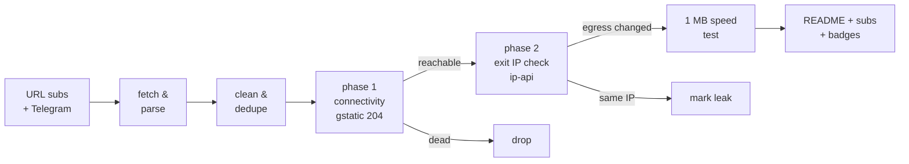

# Free Proxy Scanner

> **Really tested** free proxy aggregator. Every proxy below was fetched from public sources, tunneled through with Xray/sing-box, and verified to actually change your egress IP. No CSV-validation theater, no blind relisting.

     

## What this is

A GitHub Actions pipeline (runs every 6 hours) that fetches free proxy configs from **173 URL subscriptions** and **81 Telegram channels**, parses 9 protocols (vless / vmess / trojan / ss / hysteria2 / hysteria / tuic / socks / http), deduplicates them, and **actually connects through every single one** to separate working proxies from dead ones.

Latest run: **2026-09-29 13:49:34 UTC UTC** — 163009 unique proxies collected from 173/173 URL sources and 81/81 Telegram channels; **4500** endpoints really tested, **0** reachable, **0** verified working (egress IP confirmed changed).

## How the testing works (the *really* part)



1. **Phase 1 — connectivity.** Each proxy is loaded as an outbound into a real Xray or sing-box instance (or used directly via `curl -x` for plain http/socks). An HTTPS request to `gstatic.com/generate_204` goes through the tunnel with **DNS resolved on the proxy side**. Only an HTTP 204 counts as reachable.
2. **Phase 2 — egress verification.** An ip-api request through the same tunnel must return an exit IP **different from the runner's own IP**, plus its country and AS. Proxies that pass phase 1 but keep your IP are marked as leaks and excluded from the working list. Server country vs exit country mismatches are flagged in the tables.
3. **Throughput.** Working proxies download 1 MB from `speed.cloudflare.com` through the tunnel; the measured rate is the speed you see in the tables.
4. **Engine fallback.** If a proxy fails on Xray, it is retried on sing-box (and vice versa) before being declared dead — some configs only work on one core.

## Top working proxies

| # | proxy | proto | server | exit | latency | speed | engine |
|---|-------|-------|--------|------|---------|-------|--------|

Full ranked list with credentials: [`subs/all.txt`](subs/all.txt) (top 150, updated every run). Server addresses are shown above; UUIDs/passwords live only in the subscription files.

## Protocol distribution

| protocol | tested | alive | working | alive rate |
|----------|-------:|------:|--------:|-----------:|
| `http` | 4 | 0 | 0 | 0% |
| `ss` | 482 | 0 | 0 | 0% |
| `vmess` | 1052 | 0 | 0 | 0% |
| `vless` | 2823 | 0 | 0 | 0% |
| `trojan` | 103 | 0 | 0 | 0% |
| `hysteria2` | 36 | 0 | 0 | 0% |

## Exit countries (working proxies)

| country | proxies | avg speed |
|---------|--------:|----------:|

## Source health

254 active, 0 auto-retired (10 fetch failures / 10 all-dead runs / 10 days without anything new). Best contributors this run:

| source | kind | tested | alive | new this run |
|--------|------|-------:|------:|-------------:|
| `SV-TR` | url | 22 | 0 | 47808 |
| `SV-VL` | url | 119 | 0 | 23283 |
| `LK2` | url | 219 | 0 | 13897 |
| `KA` | url | 2757 | 0 | 13096 |
| `SV-VM` | url | 539 | 0 | 10382 |
| `SV-SS` | url | 44 | 0 | 7696 |
| `NK` | url | 604 | 0 | 6254 |
| `RD-VL` | url | 2633 | 0 | 4387 |
| `EB` | url | 271 | 0 | 3496 |
| `ET` | url | 308 | 0 | 2909 |
| `RD-VM` | url | 766 | 0 | 1854 |
| `EV` | url | 448 | 0 | 1601 |
| `YA-VL` | url | 496 | 0 | 1488 |
| `AG-PL` | url | 440 | 0 | 1373 |
| `LA` | url | 110 | 0 | 1083 |
| `VO` | url | 43 | 0 | 1006 |
| `10i-SC-VL` | url | 528 | 0 | 958 |
| `MZ` | url | 0 | 0 | 856 |
| `HC-VM` | url | 336 | 0 | 807 |
| `ST-VL` | url | 2584 | 0 | 781 |

## History

working per run (last 2): ▁▁

| date (UTC) | tested | alive | working | avg | max |
|------------|-------:|------:|--------:|----:|----:|
| 2026-09-29 14:12 | 4500 | 0 | 0 | - | - |
| 2026-09-29 13:39 | 0 | 0 | 0 | - | - |

## Use the proxies

- **v2rayN / v2rayNG / Nekobox / Hiddify**: add subscription `https://raw.githubusercontent.com/G1010yzd10/proxy-scanner/main/subs/base64.txt` (or the plain list `subs/all.txt`).
- **sing-box**: download [`subs/sing-box-client.json`](subs/sing-box-client.json) and run `sing-box run -c sing-box-client.json` — it listens on `127.0.0.1:2080` (mixed) with a selector + auto urltest group.
- **Xray**: download [`subs/xray-client.json`](subs/xray-client.json), socks inbound on `127.0.0.1:2080`.
- Per-protocol lists: [`subs/by-proto/`](subs/by-proto/).
- Raw snapshots of every collection: [`archive/`](archive/) (30 kept).

## Repository layout

```
sources/            url_subs.yml + telegram.yml (scannable source lists)
scripts/            collect.py, test.py, report.py + lib/
state/              source health, alive-recall pool, geo cache (committed)
data/               stats, history, compact last-run results
subs/               THE PRODUCT: verified working proxies
badges/             shields.io endpoint badges
archive/            gz snapshots of every collection
```

## Why most "free proxy lists" lie

The typical aggregator relists whatever it scraped, so 80-95% of entries are dead within hours — this run found **100% unreachable** and **100% unusable** overall. Only tunnels that completed a real HTTPS handshake, returned a verifiable foreign exit IP, and pushed a 1 MB download are counted as working here.

## Disclaimers

- Free proxies are **public and untrusted**. Anything you send through them can be observed or modified by their operators. Never use them for authentication, payments, or anything sensitive.
- All configs are collected from publicly posted sources (GitHub subscriptions and public Telegram channels); no credentials are guessed or brute-forced. Removal requests: open an issue.
- Availability is transient: the working list is re-verified every 6 hours, and past performance never guarantees future availability.

