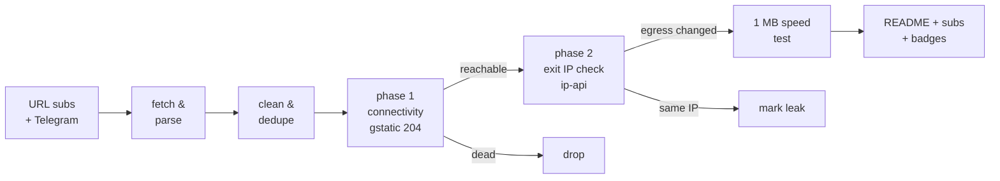

# Free Proxy Scanner

> **Really tested** free proxy aggregator. Every proxy below was fetched from public sources, tunneled through with Xray/sing-box, and verified to actually change your egress IP. No CSV-validation theater, no blind relisting.

      

## What this is

A GitHub Actions pipeline (runs every 6 hours) that fetches free proxy configs from **173 URL subscriptions** and **81 Telegram channels**, parses 9 protocols (vless / vmess / trojan / ss / hysteria2 / hysteria / tuic / socks / http), deduplicates them, and **actually connects through every single one** to separate working proxies from dead ones.

Latest run: **2026-10-02 11:27:15 UTC** — 251251 unique proxies collected from 136/136 URL sources and 48/48 Telegram channels; **4500** endpoints really tested, **861** reachable, **798** verified working (egress IP confirmed changed) across **51 exit countries**.

## How the testing works (the *really* part)



1. **Phase 1 — connectivity.** Each proxy is loaded as an outbound into a real Xray or sing-box instance (or used directly via `curl -x` for plain http/socks). An HTTPS request to `gstatic.com/generate_204` goes through the tunnel with **DNS resolved on the proxy side**. Only an HTTP 204 counts as reachable.
2. **Phase 2 — egress verification.** An ip-api request through the same tunnel must return an exit IP **different from the runner's own IP**, plus its country and AS. Proxies that pass phase 1 but keep your IP are marked as leaks and excluded from the working list. Server country vs exit country mismatches are flagged in the tables.
3. **Throughput.** Working proxies download 1 MB from `speed.cloudflare.com` through the tunnel; the measured rate is the speed you see in the tables.
4. **Engine fallback.** If a proxy fails on Xray, it is retried on sing-box (and vice versa) before being declared dead — some configs only work on one core.

## Top working proxies

All 798 working proxies are published in [`subs/all.txt`](subs/all.txt); this table shows the top 25.

| # | proxy | proto | server | exit | latency | speed | engine |
|---|-------|-------|--------|------|---------|-------|--------|
| 1 | #1 🇺🇸 US → 🇺🇸 US | `vless` | `47.251.108.158:443` | United States | 50 ms | 85.3 Mbps | xray |
| 2 | #2 🇺🇸 US → 🇺🇸 US | `hysteria2` | `155.248.209.237:33333` | United States | 69 ms | 62.9 Mbps | singbox |
| 3 | #3 🇺🇸 US → 🇺🇸 US | `vless` | `172.235.43.210:53957` | United States | 52 ms | 61.1 Mbps | xray |
| 4 | #4 🇨🇦 CA → 🇺🇸 US | `vless` | `172.64.154.8:2082` | United States | 406 ms | 59.2 Mbps | xray |
| 5 | #5 🇨🇦 CA → 🇺🇸 US | `vless` | `162.159.0.169:8880` | United States | 435 ms | 55.2 Mbps | xray |
| 6 | #6 🇺🇸 US → 🇺🇸 US | `ss` | `74.201.177.54:14680` | United States | 50 ms | 53.7 Mbps | xray |
| 7 | #7 🇺🇸 US → 🇺🇸 US | `vless` | `167.17.68.205:443` | United States | 57 ms | 52.6 Mbps | xray |
| 8 | #8 🇺🇸 US → 🇺🇸 US | `vless` | `2.27.160.4:443` | United States | 55 ms | 52.0 Mbps | xray |
| 9 | #9 🇺🇸 US → 🇺🇸 US | `vless` | `23.95.222.127:8443` | United States | 63 ms | 51.3 Mbps | xray |
| 10 | #10 🇺🇸 US → 🇺🇸 US | `ss` | `173.234.25.90:15240` | United States | 46 ms | 50.1 Mbps | xray |
| 11 | #11 🇺🇸 US → 🇦🇺 AU | `vmess` | `169.197.142.22:18000` | Australia | 70 ms | 50.1 Mbps | xray |
| 12 | #12 🇺🇸 US → 🇺🇸 US | `trojan` | `43.173.90.202:443` | United States | 39 ms | 45.4 Mbps | singbox |
| 13 | #13 ❓ ?? → 🇺🇸 US | `hysteria2` | `hy2.123266.xyz:33333` | United States | 82 ms | 45.4 Mbps | singbox |
| 14 | #14 🇺🇸 US → 🇺🇸 US | `ss` | `108.181.118.10:8388` | United States | 372 ms | 45.1 Mbps | xray |
| 15 | #15 🇺🇸 US → 🇺🇸 US | `vless` | `172.233.139.46:53734` | United States | 52 ms | 44.0 Mbps | xray |
| 16 | #16 ❓ ?? → 🇺🇸 US | `vless` | `3h-unitedstates3.09vpn.com:8443` | United States | 115 ms | 43.2 Mbps | singbox |
| 17 | #17 ❓ ?? → 🇺🇸 US | `vmess` | `vspeedfast.org:443` | United States | 730 ms | 43.1 Mbps | xray |
| 18 | #18 🇺🇸 US → 🇺🇸 US | `vless` | `172.235.38.85:42942` | United States | 417 ms | 42.1 Mbps | xray |
| 19 | #19 🇨🇦 CA → 🇺🇸 US | `vless` | `172.64.229.2:2086` | United States | 357 ms | 41.9 Mbps | xray |
| 20 | #20 🇺🇸 US → 🇺🇸 US | `hysteria2` | `142.249.37.90:44356` | United States | 81 ms | 39.9 Mbps | singbox |
| 21 | #21 🇨🇦 CA → 🇺🇸 US | `vless` | `104.18.34.14:8080` | United States | 44 ms | 39.5 Mbps | xray |
| 22 | #22 🇺🇸 US → 🇺🇸 US | `vmess` | `167.17.68.89:443` | United States | 79 ms | 39.4 Mbps | xray |
| 23 | #23 🇨🇦 CA → 🇺🇸 US | `vless` | `104.18.39.218:2052` | United States | 507 ms | 38.2 Mbps | xray |
| 24 | #24 🇺🇸 US → 🇺🇸 US | `vless` | `15.204.97.209:23576` | United States | 87 ms | 38.0 Mbps | xray |
| 25 | #25 🇺🇸 US → 🇺🇸 US | `vless` | `195.123.240.65:443` | United States | 74 ms | 37.8 Mbps | xray |

## Exit locations — which countries work

Every working proxy, grouped by the country of its **verified exit IP** (phase 2), with a dedicated subscription file per country. Currently 51 countries have at least one working exit.

| country | working | avg speed | best latency | share | list |
|---------|--------:|----------:|-------------:|------:|------|
| 🇺🇸 United States | 243 | 17.5 Mbps | 38 ms | 30% | [`US.txt`](subs/by-country/US.txt) |
| 🇳🇱 Netherlands | 142 | 4.1 Mbps | 443 ms | 18% | [`NL.txt`](subs/by-country/NL.txt) |
| 🇩🇪 Germany | 60 | 3.5 Mbps | 484 ms | 8% | [`DE.txt`](subs/by-country/DE.txt) |
| 🇫🇷 France | 42 | 2.6 Mbps | 607 ms | 5% | [`FR.txt`](subs/by-country/FR.txt) |
| 🇵🇱 Poland | 25 | 3.1 Mbps | 669 ms | 3% | [`PL.txt`](subs/by-country/PL.txt) |
| 🇨🇦 Canada | 23 | 7.1 Mbps | 93 ms | 3% | [`CA.txt`](subs/by-country/CA.txt) |
| 🇬🇧 United Kingdom | 22 | 3.9 Mbps | 425 ms | 3% | [`GB.txt`](subs/by-country/GB.txt) |
| 🇭🇰 Hong Kong | 22 | 4.3 Mbps | 544 ms | 3% | [`HK.txt`](subs/by-country/HK.txt) |
| 🇯🇵 Japan | 19 | 4.3 Mbps | 325 ms | 2% | [`JP.txt`](subs/by-country/JP.txt) |
| 🇰🇷 South Korea | 16 | 4.0 Mbps | 483 ms | 2% | [`KR.txt`](subs/by-country/KR.txt) |
| 🇸🇬 Singapore | 14 | 3.4 Mbps | 678 ms | 2% | [`SG.txt`](subs/by-country/SG.txt) |
| 🇦🇺 Australia | 11 | 15.3 Mbps | 70 ms | 1% | [`AU.txt`](subs/by-country/AU.txt) |
| 🇪🇸 Spain | 11 | 4.2 Mbps | 656 ms | 1% | [`ES.txt`](subs/by-country/ES.txt) |
| 🇸🇪 Sweden | 11 | 2.6 Mbps | 674 ms | 1% | [`SE.txt`](subs/by-country/SE.txt) |
| 🇫🇮 Finland | 11 | 3.1 Mbps | 559 ms | 1% | [`FI.txt`](subs/by-country/FI.txt) |
| 🇮🇳 India | 11 | 1.6 Mbps | 1577 ms | 1% | [`IN.txt`](subs/by-country/IN.txt) |
| 🇷🇸 Serbia | 10 | 3.1 Mbps | 962 ms | 1% | [`RS.txt`](subs/by-country/RS.txt) |
| 🇮🇹 Italy | 8 | 3.2 Mbps | 534 ms | 1% | [`IT.txt`](subs/by-country/IT.txt) |
| 🇧🇬 Bulgaria | 8 | 3.2 Mbps | 751 ms | 1% | [`BG.txt`](subs/by-country/BG.txt) |
| 🇷🇺 Russia | 8 | 2.4 Mbps | 794 ms | 1% | [`RU.txt`](subs/by-country/RU.txt) |
| 🇲🇩 Moldova | 7 | 1.8 Mbps | 1146 ms | 1% | [`MD.txt`](subs/by-country/MD.txt) |
| 🇷🇴 Romania | 6 | 3.4 Mbps | 883 ms | 1% | [`RO.txt`](subs/by-country/RO.txt) |
| 🇦🇹 Austria | 5 | 4.4 Mbps | 528 ms | 1% | [`AT.txt`](subs/by-country/AT.txt) |
| 🇨🇭 Switzerland | 5 | 4.0 Mbps | 671 ms | 1% | [`CH.txt`](subs/by-country/CH.txt) |
| 🇪🇪 Estonia | 5 | 3.5 Mbps | 667 ms | 1% | [`EE.txt`](subs/by-country/EE.txt) |
| 🇹🇷 Turkey | 5 | 1.8 Mbps | 1045 ms | 1% | [`TR.txt`](subs/by-country/TR.txt) |
| 🇹🇼 Taiwan | 4 | 2.8 Mbps | 575 ms | 1% | [`TW.txt`](subs/by-country/TW.txt) |
| 🇱🇰 LK | 4 | 1.7 Mbps | 1266 ms | 1% | [`LK.txt`](subs/by-country/LK.txt) |
| 🇰🇿 Kazakhstan | 4 | 1.4 Mbps | 1884 ms | 1% | [`KZ.txt`](subs/by-country/KZ.txt) |
| 🇳🇴 Norway | 4 | 1.5 Mbps | 1153 ms | 1% | [`NO.txt`](subs/by-country/NO.txt) |
| 🇧🇾 BY | 4 | 1.5 Mbps | 2044 ms | 1% | [`BY.txt`](subs/by-country/BY.txt) |
| 🇿🇦 South Africa | 3 | 2.7 Mbps | 1006 ms | 0% | [`ZA.txt`](subs/by-country/ZA.txt) |
| 🇲🇽 Mexico | 2 | 5.3 Mbps | 946 ms | 0% | [`MX.txt`](subs/by-country/MX.txt) |
| 🇮🇪 Ireland | 2 | 4.3 Mbps | 543 ms | 0% | [`IE.txt`](subs/by-country/IE.txt) |
| 🇲🇾 Malaysia | 2 | 4.3 Mbps | 715 ms | 0% | [`MY.txt`](subs/by-country/MY.txt) |
| 🇬🇷 Greece | 2 | 3.7 Mbps | 816 ms | 0% | [`GR.txt`](subs/by-country/GR.txt) |
| 🇧🇷 Brazil | 2 | 3.2 Mbps | 913 ms | 0% | [`BR.txt`](subs/by-country/BR.txt) |
| 🇦🇪 UAE | 2 | 3.0 Mbps | 1102 ms | 0% | [`AE.txt`](subs/by-country/AE.txt) |
| 🇬🇹 GT | 1 | 8.0 Mbps | 379 ms | 0% | [`GT.txt`](subs/by-country/GT.txt) |
| 🇨🇴 Colombia | 1 | 7.0 Mbps | 479 ms | 0% | [`CO.txt`](subs/by-country/CO.txt) |
| 🇭🇺 Hungary | 1 | 4.3 Mbps | 746 ms | 0% | [`HU.txt`](subs/by-country/HU.txt) |
| 🇱🇻 Latvia | 1 | 3.7 Mbps | 745 ms | 0% | [`LV.txt`](subs/by-country/LV.txt) |
| 🇨🇿 Czechia | 1 | 3.5 Mbps | 1049 ms | 0% | [`CZ.txt`](subs/by-country/CZ.txt) |
| 🇹🇭 Thailand | 1 | 2.9 Mbps | 721 ms | 0% | [`TH.txt`](subs/by-country/TH.txt) |
| 🇶🇦 Qatar | 1 | 2.9 Mbps | 1166 ms | 0% | [`QA.txt`](subs/by-country/QA.txt) |
| 🇸🇦 Saudi Arabia | 1 | 2.6 Mbps | 1386 ms | 0% | [`SA.txt`](subs/by-country/SA.txt) |
| 🇵🇭 Philippines | 1 | 2.2 Mbps | 892 ms | 0% | [`PH.txt`](subs/by-country/PH.txt) |
| 🇦🇲 Armenia | 1 | 2.2 Mbps | 2094 ms | 0% | [`AM.txt`](subs/by-country/AM.txt) |
| 🇱🇹 Lithuania | 1 | 2.1 Mbps | 1461 ms | 0% | [`LT.txt`](subs/by-country/LT.txt) |
| 🇩🇰 Denmark | 1 | 1.4 Mbps | 2125 ms | 0% | [`DK.txt`](subs/by-country/DK.txt) |
| 🇮🇩 Indonesia | 1 | - | 1141 ms | 0% | [`ID.txt`](subs/by-country/ID.txt) |

A `??` exit means the geo lookup could not resolve the exit IP. Base64 variants of every country file sit next to them as `<CC>.base64.txt`.

## Protocol distribution

| protocol | tested | alive | working | alive rate |
|----------|-------:|------:|--------:|-----------:|
| `vless` | 3157 | 528 | 482 | 17% |
| `ss` | 578 | 189 | 183 | 33% |
| `vmess` | 607 | 94 | 89 | 15% |
| `trojan` | 132 | 36 | 30 | 27% |
| `hysteria2` | 22 | 14 | 14 | 64% |
| `http` | 4 | 0 | 0 | 0% |

Per-protocol working lists: [`subs/by-proto/`](subs/by-proto/) (one `vless.txt`, `vmess.txt`, ... per protocol, plus `.base64.txt` variants).

## Engine breakdown

Which core verified each working proxy. The engine fallback means a proxy that failed on its primary core got a second chance on the other one.

| engine | working | note |
|--------|--------:|------|
| Xray-core | 729 | [`allxray.txt`](subs/by-engine/allxray.txt) |
| sing-box | 69 | [`allsingbox.txt`](subs/by-engine/allsingbox.txt) |
| direct (curl) | 0 | plain http/socks, [`alldirect.txt`](subs/by-engine/alldirect.txt) |

## Speed & latency profile

| speed tier | proxies |
|-----------|--------:|
| >= 5 Mbps | 225 |
| 1 - 5 Mbps | 393 |
| 0.25 - 1 Mbps | 53 |
| < 0.25 Mbps | 0 |
| unmeasured | 127 |

Latency (phase-1 HTTPS round trip): median **707 ms**, p90 **3748 ms**. 63 proxies passed connectivity but failed egress verification (leaked the runner IP or broke on the exit check) and are excluded.

## Source health

183 active, 71 auto-retired (10 fetch failures / 10 all-dead runs / 10 days without anything new). Best contributors this run:

| source | kind | tested | alive | new this run |
|--------|------|-------:|------:|-------------:|
| `RD-VL` | url | 2926 | 397 | 352 |
| `HP` | url | 580 | 374 | 2 |
| `SK` | url | 952 | 344 | 0 |
| `HC` | url | 1769 | 336 | 8 |
| `NK` | url | 911 | 316 | 222 |
| `ST-VL` | url | 2831 | 288 | 14 |
| `F0` | url | 498 | 287 | 11 |
| `EV` | url | 433 | 275 | 0 |
| `Ni` | url | 412 | 232 | 0 |
| `SB-VL` | url | 2446 | 204 | 0 |
| `SB` | url | 2697 | 187 | 0 |
| `RD-SS` | url | 553 | 183 | 12 |
| `ET` | url | 402 | 177 | 974 |
| `KA` | url | 1954 | 158 | 0 |
| `EV-SS` | url | 157 | 132 | 0 |
| `EV-VL` | url | 219 | 124 | 0 |
| `AG-PL` | url | 365 | 121 | 35 |
| `WU` | url | 236 | 112 | 18 |
| `EP-ALL` | url | 1286 | 96 | 0 |
| `RD` | url | 129 | 87 | 3 |

## History

working per run (last 14): ▁▁▆▆▇█▇▆▇█▇▆▇▆

| date (UTC) | tested | alive | working | avg | max |
|------------|-------:|------:|--------:|----:|----:|
| 2026-10-02 11:49 | 4500 | 861 | 798 | 7.9M | 85.3M |
| 2026-10-01 22:23 | 4500 | 904 | 878 | 7.5M | 90.2M |
| 2026-10-01 17:56 | 4500 | 861 | 794 | 7.3M | 58.6M |
| 2026-10-01 12:16 | 4500 | 931 | 883 | 7.3M | 34.4M |
| 2026-10-01 03:00 | 4500 | 1112 | 1075 | 8.1M | 45.4M |
| 2026-09-30 21:54 | 4500 | 899 | 866 | 9.3M | 69.4M |
| 2026-09-30 17:26 | 4500 | 838 | 795 | 7.3M | 57.9M |
| 2026-09-30 11:48 | 4500 | 860 | 810 | 7.9M | 64.4M |
| 2026-09-30 02:56 | 4500 | 1030 | 973 | 10.3M | 92.2M |
| 2026-09-29 21:53 | 4500 | 880 | 852 | 6.5M | 61.8M |
| 2026-09-29 15:48 | 4500 | 839 | 796 | 6.7M | 51.3M |
| 2026-09-29 14:48 | 4500 | 799 | 756 | 6.9M | 52.1M |
| 2026-09-29 14:12 | 4500 | 0 | 0 | - | - |
| 2026-09-29 13:39 | 0 | 0 | 0 | - | - |

## Subscription files

Everything under [`subs/`](subs/) is regenerated every run. Plain lists are one proxy URI per line; `.base64.txt` variants are the same list base64-encoded for clients that need the classic sub format.

| file | contents | direct subscription URL |
|------|----------|--------------------------|
| [`all.txt`](subs/all.txt) | ALL working proxies, ranked by speed (798) | `https://raw.githubusercontent.com/G1010yzd10/proxy-scanner/main/subs/all.txt` |
| [`all.base64.txt`](subs/all.base64.txt) | same, base64 | `https://raw.githubusercontent.com/G1010yzd10/proxy-scanner/main/subs/all.base64.txt` |
| [`top150.txt`](subs/top150.txt) | top 150 ranked (150) | `https://raw.githubusercontent.com/G1010yzd10/proxy-scanner/main/subs/top150.txt` |
| [`top150.base64.txt`](subs/top150.base64.txt) | same, base64 | `https://raw.githubusercontent.com/G1010yzd10/proxy-scanner/main/subs/top150.base64.txt` |
| [`by-proto/`](subs/by-proto/) | one list per protocol (5 protocols) | ...`/subs/by-proto/<proto>.txt` |
| [`by-engine/allxray.txt`](subs/by-engine/allxray.txt) | verified on Xray (729) | `https://raw.githubusercontent.com/G1010yzd10/proxy-scanner/main/subs/by-engine/allxray.txt` |
| [`by-engine/allsingbox.txt`](subs/by-engine/allsingbox.txt) | verified on sing-box (69) | `https://raw.githubusercontent.com/G1010yzd10/proxy-scanner/main/subs/by-engine/allsingbox.txt` |
| [`by-country/`](subs/by-country/) | one list per exit country (51 countries, e.g. [`US.txt`](subs/by-country/US.txt), [`DE.txt`](subs/by-country/DE.txt)) | ...`/subs/by-country/<CC>.txt` |
| [`sing-box-client.json`](subs/sing-box-client.json) | top 150 as a ready-to-run sing-box client config | `https://raw.githubusercontent.com/G1010yzd10/proxy-scanner/main/subs/sing-box-client.json` |
| [`xray-client.json`](subs/xray-client.json) | top 150 as a ready-to-run xray client config | `https://raw.githubusercontent.com/G1010yzd10/proxy-scanner/main/subs/xray-client.json` |
| [`archive/`](archive/) | gz snapshot of every collection (30 kept) | — |

## Use the proxies

- **v2rayN / v2rayNG / Nekobox / Hiddify / Shadowrocket**: add subscription `https://raw.githubusercontent.com/G1010yzd10/proxy-scanner/main/subs/all.base64.txt` (everything working) or `https://raw.githubusercontent.com/G1010yzd10/proxy-scanner/main/subs/top150.base64.txt` (curated top 150).
- **Want a specific country?** Grab `subs/by-country/<CC>.txt` (see the Exit locations table above) — e.g. `https://raw.githubusercontent.com/G1010yzd10/proxy-scanner/main/subs/by-country/US.txt`, `https://raw.githubusercontent.com/G1010yzd10/proxy-scanner/main/subs/by-country/DE.txt`.
- **Only one protocol?** `subs/by-proto/<proto>.txt` — e.g. `https://raw.githubusercontent.com/G1010yzd10/proxy-scanner/main/subs/by-proto/vless.txt`, `https://raw.githubusercontent.com/G1010yzd10/proxy-scanner/main/subs/by-proto/hysteria2.txt`.
- **sing-box**: download [`subs/sing-box-client.json`](subs/sing-box-client.json) and run `sing-box run -c sing-box-client.json` — it listens on `127.0.0.1:2080` (mixed) with a selector + auto urltest group.
- **Xray**: download [`subs/xray-client.json`](subs/xray-client.json), socks inbound on `127.0.0.1:2080`.
- Raw snapshots of every collection: [`archive/`](archive/) (30 kept).

## Repository layout

```
sources/            url_subs.yml + telegram.yml (scannable source lists)
scripts/            collect.py, test.py, report.py + lib/
state/              source health, alive-recall pool, geo cache (committed)
data/               stats, history, compact last-run results
subs/               THE PRODUCT: verified working proxies, split by
                    proto / engine / exit country + all + top150 lists
badges/             shields.io endpoint badges
archive/            gz snapshots of every collection
```

## Why most "free proxy lists" lie

The typical aggregator relists whatever it scraped, so 80-95% of entries are dead within hours — this run found **81% unreachable** and **82% unusable** overall. Only tunnels that completed a real HTTPS handshake, returned a verifiable foreign exit IP, and pushed a 1 MB download are counted as working here.

## Disclaimers

- Free proxies are **public and untrusted**. Anything you send through them can be observed or modified by their operators. Never use them for authentication, payments, or anything sensitive.
- All configs are collected from publicly posted sources (GitHub subscriptions and public Telegram channels); no credentials are guessed or brute-forced. Removal requests: open an issue.
- Availability is transient: the working list is re-verified every 6 hours, and past performance never guarantees future availability.

