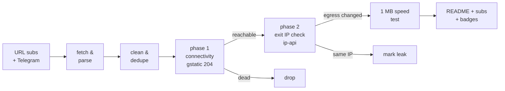

# Free Proxy Scanner

> **Really tested** free proxy aggregator. Every proxy below was fetched from public sources, tunneled through with Xray/sing-box, and verified to actually change your egress IP. No CSV-validation theater, no blind relisting.

      

## What this is

A GitHub Actions pipeline (runs every 6 hours) that fetches free proxy configs from **173 URL subscriptions** and **81 Telegram channels**, parses 9 protocols (vless / vmess / trojan / ss / hysteria2 / hysteria / tuic / socks / http), deduplicates them, and **actually connects through every single one** to separate working proxies from dead ones.

Latest run: **2026-10-06 03:29:40 UTC** — 157221 unique proxies collected from 133/133 URL sources and 47/47 Telegram channels; **4521** endpoints really tested, **1046** reachable, **1018** verified working (egress IP confirmed changed) across **47 exit countries**.

## How the testing works (the *really* part)



1. **Phase 1 — connectivity.** Each proxy is loaded as an outbound into a real Xray or sing-box instance (or used directly via `curl -x` for plain http/socks). An HTTPS request to `gstatic.com/generate_204` goes through the tunnel with **DNS resolved on the proxy side**. Only an HTTP 204 counts as reachable.
2. **Phase 2 — egress verification.** An ip-api request through the same tunnel must return an exit IP **different from the runner's own IP**, plus its country and AS. Proxies that pass phase 1 but keep your IP are marked as leaks and excluded from the working list. Server country vs exit country mismatches are flagged in the tables.
3. **Throughput.** Working proxies download 1 MB from `speed.cloudflare.com` through the tunnel; the measured rate is the speed you see in the tables.
4. **Engine fallback.** If a proxy fails on Xray, it is retried on sing-box (and vice versa) before being declared dead — some configs only work on one core.

## Top working proxies

All 1018 working proxies are published in [`subs/all.txt`](subs/all.txt); this table shows the top 25.

| # | proxy | proto | server | exit | latency | speed | engine |
|---|-------|-------|--------|------|---------|-------|--------|
| 1 | #1 🇺🇸 US → 🇺🇸 US | `vmess` | `38.107.226.227:443` | United States | 68 ms | 87.7 Mbps | xray |
| 2 | #2 🇺🇸 US → 🇺🇸 US | `vless` | `47.253.226.114:443` | United States | 373 ms | 82.4 Mbps | xray |
| 3 | #3 🇺🇸 US → 🇺🇸 US | `ss` | `37.19.198.160:443` | United States | 313 ms | 68.5 Mbps | xray |
| 4 | #4 🇺🇸 US → 🇺🇸 US | `ss` | `37.19.198.243:443` | United States | 295 ms | 66.9 Mbps | xray |
| 5 | #5 🇺🇸 US → 🇺🇸 US | `vmess` | `38.107.226.227:22324` | United States | 313 ms | 65.9 Mbps | xray |
| 6 | #6 🇨🇦 CA → 🇺🇸 US | `vless` | `172.64.42.85:2052` | United States | 161 ms | 64.3 Mbps | xray |
| 7 | #7 🇨🇦 CA → 🇺🇸 US | `vless` | `162.159.24.131:80` | United States | 209 ms | 59.4 Mbps | xray |
| 8 | #8 🇺🇸 US → 🇺🇸 US | `ss` | `37.19.198.236:443` | United States | 271 ms | 58.1 Mbps | xray |
| 9 | #9 🇺🇸 US → 🇺🇸 US | `vless` | `159.89.87.21:28190` | United States | 85 ms | 57.7 Mbps | xray |
| 10 | #10 🇺🇸 US → 🇺🇸 US | `ss` | `198.98.53.130:443` | United States | 300 ms | 56.4 Mbps | xray |
| 11 | #11 🇺🇸 US → 🇺🇸 US | `vless` | `169.40.42.232:443` | United States | 185 ms | 56.4 Mbps | xray |
| 12 | #12 🇺🇸 US → 🇺🇸 US | `vless` | `137.184.218.169:36925` | United States | 56 ms | 55.8 Mbps | xray |
| 13 | #13 🇺🇸 US → 🇺🇸 US | `vless` | `169.40.42.35:443` | United States | 116 ms | 55.3 Mbps | xray |
| 14 | #14 🇺🇸 US → 🇺🇸 US | `vless` | `169.40.42.224:443` | United States | 123 ms | 53.8 Mbps | xray |
| 15 | #15 🇨🇦 CA → 🇺🇸 US | `vless` | `162.159.0.53:80` | United States | 41 ms | 53.7 Mbps | xray |
| 16 | #16 🇺🇸 US → 🇺🇸 US | `vless` | `169.40.42.133:443` | United States | 77 ms | 53.6 Mbps | xray |
| 17 | #17 🇺🇸 US → 🇺🇸 US | `vless` | `108.162.198.178:2086` | United States | 201 ms | 52.4 Mbps | xray |
| 18 | #18 ❓ ?? → 🇺🇸 US | `vmess` | `ushsfs1.povrak.ir:37387` | United States | 181 ms | 52.4 Mbps | xray |
| 19 | #19 ❓ ?? → 🇺🇸 US | `vless` | `us-2.srv.dvzh.net:443` | United States | 342 ms | 52.3 Mbps | xray |
| 20 | #20 🇺🇸 US → 🇺🇸 US | `ss` | `140.82.63.79:8388` | United States | 276 ms | 51.0 Mbps | xray |
| 21 | #21 🇨🇦 CA → 🇺🇸 US | `vless` | `172.64.154.8:2052` | United States | 62 ms | 49.4 Mbps | xray |
| 22 | #22 ❓ ?? → 🇺🇸 US | `vless` | `104.243.33.154:45299` | United States | 47 ms | 47.7 Mbps | xray |
| 23 | #23 🇨🇦 CA → 🇺🇸 US | `vless` | `172.64.42.85:2095` | United States | 61 ms | 46.6 Mbps | xray |
| 24 | #24 🇨🇦 CA → 🇺🇸 US | `vless` | `172.64.53.55:8080` | United States | 40 ms | 45.9 Mbps | xray |
| 25 | #25 🇨🇦 CA → 🇺🇸 US | `vless` | `172.64.158.146:2052` | United States | 293 ms | 45.9 Mbps | xray |

## Exit locations — which countries work

Every working proxy, grouped by the country of its **verified exit IP** (phase 2), with a dedicated subscription file per country. Currently 47 countries have at least one working exit.

| country | working | avg speed | best latency | share | list |
|---------|--------:|----------:|-------------:|------:|------|
| 🇺🇸 United States | 350 | 18.6 Mbps | 28 ms | 34% | [`US.txt`](subs/by-country/US.txt) |
| 🇳🇱 Netherlands | 158 | 7.3 Mbps | 300 ms | 16% | [`NL.txt`](subs/by-country/NL.txt) |
| 🇩🇪 Germany | 91 | 6.1 Mbps | 286 ms | 9% | [`DE.txt`](subs/by-country/DE.txt) |
| 🇫🇷 France | 49 | 6.9 Mbps | 352 ms | 5% | [`FR.txt`](subs/by-country/FR.txt) |
| 🇯🇵 Japan | 41 | 3.8 Mbps | 511 ms | 4% | [`JP.txt`](subs/by-country/JP.txt) |
| 🇭🇰 Hong Kong | 31 | 3.0 Mbps | 630 ms | 3% | [`HK.txt`](subs/by-country/HK.txt) |
| 🇰🇷 South Korea | 28 | 3.5 Mbps | 655 ms | 3% | [`KR.txt`](subs/by-country/KR.txt) |
| 🇨🇦 Canada | 22 | 15.2 Mbps | 80 ms | 2% | [`CA.txt`](subs/by-country/CA.txt) |
| 🇬🇧 United Kingdom | 22 | 6.1 Mbps | 254 ms | 2% | [`GB.txt`](subs/by-country/GB.txt) |
| 🇸🇬 Singapore | 22 | 2.2 Mbps | 719 ms | 2% | [`SG.txt`](subs/by-country/SG.txt) |
| 🇫🇮 Finland | 17 | 4.3 Mbps | 401 ms | 2% | [`FI.txt`](subs/by-country/FI.txt) |
| 🇵🇱 Poland | 16 | 5.2 Mbps | 415 ms | 2% | [`PL.txt`](subs/by-country/PL.txt) |
| 🇮🇳 India | 12 | 2.3 Mbps | 382 ms | 1% | [`IN.txt`](subs/by-country/IN.txt) |
| 🇦🇺 Australia | 11 | 15.4 Mbps | 38 ms | 1% | [`AU.txt`](subs/by-country/AU.txt) |
| 🇨🇱 Chile | 11 | 5.2 Mbps | 464 ms | 1% | [`CL.txt`](subs/by-country/CL.txt) |
| 🇸🇪 Sweden | 10 | 5.9 Mbps | 408 ms | 1% | [`SE.txt`](subs/by-country/SE.txt) |
| 🇪🇪 Estonia | 10 | 5.4 Mbps | 410 ms | 1% | [`EE.txt`](subs/by-country/EE.txt) |
| 🇷🇸 Serbia | 10 | 5.1 Mbps | 645 ms | 1% | [`RS.txt`](subs/by-country/RS.txt) |
| 🇲🇩 Moldova | 10 | 2.9 Mbps | 782 ms | 1% | [`MD.txt`](subs/by-country/MD.txt) |
| 🇹🇷 Turkey | 9 | 4.7 Mbps | 428 ms | 1% | [`TR.txt`](subs/by-country/TR.txt) |
| 🇷🇴 Romania | 8 | 4.3 Mbps | 469 ms | 1% | [`RO.txt`](subs/by-country/RO.txt) |
| 🇧🇬 Bulgaria | 8 | 4.5 Mbps | 616 ms | 1% | [`BG.txt`](subs/by-country/BG.txt) |
| 🇮🇹 Italy | 7 | 5.2 Mbps | 324 ms | 1% | [`IT.txt`](subs/by-country/IT.txt) |
| 🇮🇪 Ireland | 6 | 7.7 Mbps | 218 ms | 1% | [`IE.txt`](subs/by-country/IE.txt) |
| 🇪🇸 Spain | 6 | 6.4 Mbps | 385 ms | 1% | [`ES.txt`](subs/by-country/ES.txt) |
| 🇰🇿 Kazakhstan | 6 | 2.5 Mbps | 1647 ms | 1% | [`KZ.txt`](subs/by-country/KZ.txt) |
| 🇹🇼 Taiwan | 5 | 2.5 Mbps | 663 ms | 0% | [`TW.txt`](subs/by-country/TW.txt) |
| 🇳🇴 Norway | 4 | 7.0 Mbps | 449 ms | 0% | [`NO.txt`](subs/by-country/NO.txt) |
| 🇷🇺 Russia | 4 | 4.2 Mbps | 563 ms | 0% | [`RU.txt`](subs/by-country/RU.txt) |
| 🇧🇾 BY | 4 | 1.2 Mbps | 3648 ms | 0% | [`BY.txt`](subs/by-country/BY.txt) |
| 🇦🇹 Austria | 3 | 7.2 Mbps | 361 ms | 0% | [`AT.txt`](subs/by-country/AT.txt) |
| 🇨🇭 Switzerland | 3 | 6.5 Mbps | 545 ms | 0% | [`CH.txt`](subs/by-country/CH.txt) |
| 🇿🇦 South Africa | 3 | 3.4 Mbps | 864 ms | 0% | [`ZA.txt`](subs/by-country/ZA.txt) |
| 🇹🇭 Thailand | 3 | 3.0 Mbps | 832 ms | 0% | [`TH.txt`](subs/by-country/TH.txt) |
| 🇱🇻 Latvia | 2 | 5.9 Mbps | 472 ms | 0% | [`LV.txt`](subs/by-country/LV.txt) |
| 🇱🇹 Lithuania | 2 | 6.2 Mbps | 558 ms | 0% | [`LT.txt`](subs/by-country/LT.txt) |
| 🇦🇪 UAE | 2 | 3.9 Mbps | 842 ms | 0% | [`AE.txt`](subs/by-country/AE.txt) |
| 🇮🇩 Indonesia | 2 | 1.8 Mbps | 1051 ms | 0% | [`ID.txt`](subs/by-country/ID.txt) |
| 🇱🇰 LK | 2 | 0.7 Mbps | 1110 ms | 0% | [`LK.txt`](subs/by-country/LK.txt) |
| 🇬🇷 Greece | 1 | 5.7 Mbps | 577 ms | 0% | [`GR.txt`](subs/by-country/GR.txt) |
| 🇧🇷 Brazil | 1 | 5.2 Mbps | 641 ms | 0% | [`BR.txt`](subs/by-country/BR.txt) |
| 🇨🇿 Czechia | 1 | 4.4 Mbps | 1057 ms | 0% | [`CZ.txt`](subs/by-country/CZ.txt) |
| 🇬🇪 Georgia | 1 | 3.8 Mbps | 1057 ms | 0% | [`GE.txt`](subs/by-country/GE.txt) |
| 🇲🇾 Malaysia | 1 | 3.6 Mbps | 974 ms | 0% | [`MY.txt`](subs/by-country/MY.txt) |
| 🇸🇦 Saudi Arabia | 1 | 3.5 Mbps | 1079 ms | 0% | [`SA.txt`](subs/by-country/SA.txt) |
| 🇲🇽 Mexico | 1 | 2.8 Mbps | 1586 ms | 0% | [`MX.txt`](subs/by-country/MX.txt) |
| 🇦🇲 Armenia | 1 | 2.3 Mbps | 1899 ms | 0% | [`AM.txt`](subs/by-country/AM.txt) |

A `??` exit means the geo lookup could not resolve the exit IP. Base64 variants of every country file sit next to them as `<CC>.base64.txt`.

## Protocol distribution

| protocol | tested | alive | working | alive rate |
|----------|-------:|------:|--------:|-----------:|
| `vless` | 2967 | 636 | 616 | 21% |
| `ss` | 420 | 198 | 193 | 47% |
| `vmess` | 956 | 103 | 100 | 11% |
| `trojan` | 137 | 94 | 94 | 69% |
| `hysteria2` | 38 | 14 | 14 | 37% |
| `tuic` | 1 | 1 | 1 | 100% |
| `http` | 2 | 0 | 0 | 0% |

Per-protocol working lists: [`subs/by-proto/`](subs/by-proto/) (one `vless.txt`, `vmess.txt`, ... per protocol, plus `.base64.txt` variants).

## Engine breakdown

Which core verified each working proxy. The engine fallback means a proxy that failed on its primary core got a second chance on the other one.

| engine | working | note |
|--------|--------:|------|
| Xray-core | 948 | [`allxray.txt`](subs/by-engine/allxray.txt) |
| sing-box | 70 | [`allsingbox.txt`](subs/by-engine/allsingbox.txt) |
| direct (curl) | 0 | plain http/socks, [`alldirect.txt`](subs/by-engine/alldirect.txt) |

## Speed & latency profile

| speed tier | proxies |
|-----------|--------:|
| >= 5 Mbps | 616 |
| 1 - 5 Mbps | 234 |
| 0.25 - 1 Mbps | 25 |
| < 0.25 Mbps | 0 |
| unmeasured | 143 |

Latency (phase-1 HTTPS round trip): median **474 ms**, p90 **1610 ms**. 28 proxies passed connectivity but failed egress verification (leaked the runner IP or broke on the exit check) and are excluded.

## Source health

180 active, 74 auto-retired (10 fetch failures / 10 all-dead runs / 10 days without anything new). Best contributors this run:

| source | kind | tested | alive | new this run |
|--------|------|-------:|------:|-------------:|
| `NK` | url | 809 | 570 | 4526 |
| `SK` | url | 678 | 441 | 0 |
| `HP` | url | 468 | 425 | 57 |
| `RD-VL` | url | 2620 | 416 | 4311 |
| `F0` | url | 353 | 318 | 164 |
| `HC` | url | 1483 | 305 | 131 |
| `Ni` | url | 365 | 302 | 145 |
| `EV` | url | 427 | 292 | 1490 |
| `ST-VL` | url | 2485 | 256 | 642 |
| `ET` | url | 226 | 199 | 2396 |
| `SB` | url | 2626 | 193 | 0 |
| `RD-SS` | url | 392 | 189 | 249 |
| `AG-PL` | url | 314 | 182 | 1444 |
| `KA` | url | 1409 | 180 | 10679 |
| `SB-VL` | url | 2308 | 174 | 2 |
| `EV-VL` | url | 222 | 144 | 0 |
| `EV-SS` | url | 155 | 130 | 64 |
| `AN` | url | 121 | 117 | 13 |
| `AQ` | url | 169 | 108 | 577 |
| `TK` | url | 130 | 101 | 0 |

## History

working per run (last 21): ▁▁▆▆▇█▇▆▇█▇▆▇▆▇▇█▇▇▇█

| date (UTC) | tested | alive | working | avg | max |
|------------|-------:|------:|--------:|----:|----:|
| 2026-10-06 03:49 | 4521 | 1046 | 1018 | 10.0M | 87.7M |
| 2026-10-05 23:43 | 4527 | 929 | 912 | 7.6M | 50.6M |
| 2026-10-05 19:47 | 4547 | 861 | 822 | 8.6M | 77.6M |
| 2026-10-03 11:04 | 4500 | 899 | 860 | 8.7M | 82.3M |
| 2026-10-03 02:52 | 4500 | 1062 | 1030 | 8.0M | 75.5M |
| 2026-10-02 21:49 | 4500 | 890 | 861 | 8.9M | 68.7M |
| 2026-10-02 17:14 | 4500 | 847 | 807 | 8.6M | 88.1M |
| 2026-10-02 11:49 | 4500 | 861 | 798 | 7.9M | 85.3M |
| 2026-10-01 22:23 | 4500 | 904 | 878 | 7.5M | 90.2M |
| 2026-10-01 17:56 | 4500 | 861 | 794 | 7.3M | 58.6M |
| 2026-10-01 12:16 | 4500 | 931 | 883 | 7.3M | 34.4M |
| 2026-10-01 03:00 | 4500 | 1112 | 1075 | 8.1M | 45.4M |
| 2026-09-30 21:54 | 4500 | 899 | 866 | 9.3M | 69.4M |
| 2026-09-30 17:26 | 4500 | 838 | 795 | 7.3M | 57.9M |
| 2026-09-30 11:48 | 4500 | 860 | 810 | 7.9M | 64.4M |

## Subscription files

Everything under [`subs/`](subs/) is regenerated every run. Plain lists are one proxy URI per line; `.base64.txt` variants are the same list base64-encoded for clients that need the classic sub format.

| file | contents | direct subscription URL |
|------|----------|--------------------------|
| [`all.txt`](subs/all.txt) | ALL working proxies, ranked by speed (1018) | `https://raw.githubusercontent.com/G1010yzd10/proxy-scanner/main/subs/all.txt` |
| [`all.base64.txt`](subs/all.base64.txt) | same, base64 | `https://raw.githubusercontent.com/G1010yzd10/proxy-scanner/main/subs/all.base64.txt` |
| [`top150.txt`](subs/top150.txt) | top 150 ranked (150) | `https://raw.githubusercontent.com/G1010yzd10/proxy-scanner/main/subs/top150.txt` |
| [`top150.base64.txt`](subs/top150.base64.txt) | same, base64 | `https://raw.githubusercontent.com/G1010yzd10/proxy-scanner/main/subs/top150.base64.txt` |
| [`by-proto/`](subs/by-proto/) | one list per protocol (6 protocols) | ...`/subs/by-proto/<proto>.txt` |
| [`by-engine/allxray.txt`](subs/by-engine/allxray.txt) | verified on Xray (948) | `https://raw.githubusercontent.com/G1010yzd10/proxy-scanner/main/subs/by-engine/allxray.txt` |
| [`by-engine/allsingbox.txt`](subs/by-engine/allsingbox.txt) | verified on sing-box (70) | `https://raw.githubusercontent.com/G1010yzd10/proxy-scanner/main/subs/by-engine/allsingbox.txt` |
| [`by-country/`](subs/by-country/) | one list per exit country (47 countries, e.g. [`US.txt`](subs/by-country/US.txt), [`DE.txt`](subs/by-country/DE.txt)) | ...`/subs/by-country/<CC>.txt` |
| [`sing-box-client.json`](subs/sing-box-client.json) | top 150 as a ready-to-run sing-box client config | `https://raw.githubusercontent.com/G1010yzd10/proxy-scanner/main/subs/sing-box-client.json` |
| [`xray-client.json`](subs/xray-client.json) | top 150 as a ready-to-run xray client config | `https://raw.githubusercontent.com/G1010yzd10/proxy-scanner/main/subs/xray-client.json` |
| [`archive/`](archive/) | gz snapshot of every collection (30 kept) | — |

## Use the proxies

- **v2rayN / v2rayNG / Nekobox / Hiddify / Shadowrocket**: add subscription `https://raw.githubusercontent.com/G1010yzd10/proxy-scanner/main/subs/all.base64.txt` (everything working) or `https://raw.githubusercontent.com/G1010yzd10/proxy-scanner/main/subs/top150.base64.txt` (curated top 150).
- **Want a specific country?** Grab `subs/by-country/<CC>.txt` (see the Exit locations table above) — e.g. `https://raw.githubusercontent.com/G1010yzd10/proxy-scanner/main/subs/by-country/US.txt`, `https://raw.githubusercontent.com/G1010yzd10/proxy-scanner/main/subs/by-country/DE.txt`.
- **Only one protocol?** `subs/by-proto/<proto>.txt` — e.g. `https://raw.githubusercontent.com/G1010yzd10/proxy-scanner/main/subs/by-proto/vless.txt`, `https://raw.githubusercontent.com/G1010yzd10/proxy-scanner/main/subs/by-proto/hysteria2.txt`.
- **sing-box**: download [`subs/sing-box-client.json`](subs/sing-box-client.json) and run `sing-box run -c sing-box-client.json` — it listens on `127.0.0.1:2080` (mixed) with a selector + auto urltest group.
- **Xray**: download [`subs/xray-client.json`](subs/xray-client.json), socks inbound on `127.0.0.1:2080`.
- Raw snapshots of every collection: [`archive/`](archive/) (30 kept).

## Repository layout

```
sources/            url_subs.yml + telegram.yml (scannable source lists)
scripts/            collect.py, test.py, report.py + lib/
state/              source health, alive-recall pool, geo cache (committed)
data/               stats, history, compact last-run results
subs/               THE PRODUCT: verified working proxies, split by
                    proto / engine / exit country + all + top150 lists
badges/             shields.io endpoint badges
archive/            gz snapshots of every collection
```

## Why most "free proxy lists" lie

The typical aggregator relists whatever it scraped, so 80-95% of entries are dead within hours — this run found **77% unreachable** and **77% unusable** overall. Only tunnels that completed a real HTTPS handshake, returned a verifiable foreign exit IP, and pushed a 1 MB download are counted as working here.

## Disclaimers

- Free proxies are **public and untrusted**. Anything you send through them can be observed or modified by their operators. Never use them for authentication, payments, or anything sensitive.
- All configs are collected from publicly posted sources (GitHub subscriptions and public Telegram channels); no credentials are guessed or brute-forced. Removal requests: open an issue.
- Availability is transient: the working list is re-verified every 6 hours, and past performance never guarantees future availability.

