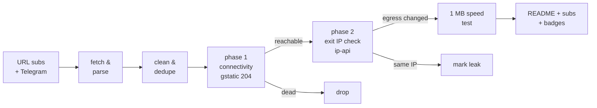

# Free Proxy Scanner

> **Really tested** free proxy aggregator. Every proxy below was fetched from public sources, tunneled through with Xray/sing-box, and verified to actually change your egress IP. No CSV-validation theater, no blind relisting.

     

## What this is

A GitHub Actions pipeline (runs every 6 hours) that fetches free proxy configs from **173 URL subscriptions** and **81 Telegram channels**, parses 9 protocols (vless / vmess / trojan / ss / hysteria2 / hysteria / tuic / socks / http), deduplicates them, and **actually connects through every single one** to separate working proxies from dead ones.

Latest run: **2026-09-29 14:27:09 UTC UTC** — 163092 unique proxies collected from 173/173 URL sources and 81/81 Telegram channels; **4500** endpoints really tested, **799** reachable, **756** verified working (egress IP confirmed changed).

## How the testing works (the *really* part)



1. **Phase 1 — connectivity.** Each proxy is loaded as an outbound into a real Xray or sing-box instance (or used directly via `curl -x` for plain http/socks). An HTTPS request to `gstatic.com/generate_204` goes through the tunnel with **DNS resolved on the proxy side**. Only an HTTP 204 counts as reachable.
2. **Phase 2 — egress verification.** An ip-api request through the same tunnel must return an exit IP **different from the runner's own IP**, plus its country and AS. Proxies that pass phase 1 but keep your IP are marked as leaks and excluded from the working list. Server country vs exit country mismatches are flagged in the tables.
3. **Throughput.** Working proxies download 1 MB from `speed.cloudflare.com` through the tunnel; the measured rate is the speed you see in the tables.
4. **Engine fallback.** If a proxy fails on Xray, it is retried on sing-box (and vice versa) before being declared dead — some configs only work on one core.

## Top working proxies

| # | proxy | proto | server | exit | latency | speed | engine |
|---|-------|-------|--------|------|---------|-------|--------|
| 1 | #1 🇺🇸 US → 🇺🇸 US | `vless` | `172.235.38.85:42942` | United States | 329 ms | 52.1 Mbps | xray |
| 2 | #2 ❓ ?? → 🇺🇸 US | `hysteria2` | `hy2.561891.xyz:44356` | United States | 75 ms | 47.4 Mbps | singbox |
| 3 | #3 🇺🇸 US → 🇺🇸 US | `hysteria2` | `142.249.37.90:44356` | United States | 68 ms | 47.4 Mbps | singbox |
| 4 | #4 🇨🇦 CA → 🇺🇸 US | `vless` | `162.159.48.32:8080` | United States | 97 ms | 45.4 Mbps | xray |
| 5 | #5 🇺🇸 US → 🇺🇸 US | `ss` | `108.181.0.177:8388` | United States | 330 ms | 42.1 Mbps | xray |
| 6 | #6 🇨🇦 CA → 🇺🇸 US | `vless` | `162.159.48.32:8880` | United States | 316 ms | 41.7 Mbps | xray |
| 7 | #7 ❓ ?? → 🇺🇸 US | `vmess` | `vspeedfast.org:443` | United States | 331 ms | 39.9 Mbps | xray |
| 8 | #8 🇨🇦 CA → 🇺🇸 US | `vless` | `162.159.24.131:80` | United States | 76 ms | 39.3 Mbps | xray |
| 9 | #9 🇨🇦 CA → 🇺🇸 US | `vless` | `162.159.43.187:8080` | United States | 256 ms | 38.4 Mbps | xray |
| 10 | #10 🇨🇦 CA → 🇺🇸 US | `vless` | `104.18.46.46:8080` | United States | 336 ms | 38.4 Mbps | xray |
| 11 | #11 🇨🇦 CA → 🇺🇸 US | `vless` | `104.18.46.234:2082` | United States | 123 ms | 36.6 Mbps | xray |
| 12 | #12 🇺🇸 US → 🇺🇸 US | `vless` | `192.3.247.109:43578` | United States | 51 ms | 36.5 Mbps | xray |
| 13 | #13 🇺🇸 US → 🇺🇸 US | `vless` | `172.235.43.210:53957` | United States | 59 ms | 33.9 Mbps | xray |
| 14 | #14 🇺🇸 US → 🇺🇸 US | `vless` | `167.17.68.205:443` | United States | 71 ms | 33.4 Mbps | xray |
| 15 | #15 🇺🇸 US → 🇺🇸 US | `ss` | `173.244.56.9:443` | United States | 72 ms | 33.1 Mbps | xray |
| 16 | #16 🇺🇸 US → 🇺🇸 US | `vless` | `192.3.247.109:43580` | United States | 60 ms | 31.9 Mbps | xray |
| 17 | #17 🇺🇸 US → 🇺🇸 US | `vless` | `172.233.139.46:53734` | United States | 54 ms | 31.7 Mbps | xray |
| 18 | #18 🇺🇸 US → 🇺🇸 US | `vmess` | `129.146.77.248:39495` | United States | 26 ms | 31.4 Mbps | xray |
| 19 | #19 🇺🇸 US → 🇺🇸 US | `vmess` | `167.17.68.89:22324` | United States | 45 ms | 31.2 Mbps | xray |
| 20 | #20 🇺🇸 US → 🇺🇸 US | `ss` | `192.3.247.109:43579` | United States | 48 ms | 30.1 Mbps | xray |
| 21 | #21 🇺🇸 US → 🇺🇸 US | `vless` | `192.3.247.109:32132` | United States | 61 ms | 29.8 Mbps | xray |
| 22 | #22 🇺🇸 US → 🇺🇸 US | `hysteria2` | `155.248.209.237:33333` | United States | 95 ms | 28.8 Mbps | singbox |
| 23 | #23 🇨🇦 CA → 🇺🇸 US | `vless` | `188.114.97.6:2086` | United States | 148 ms | 28.5 Mbps | xray |
| 24 | #24 🇺🇸 US → 🇺🇸 US | `ss` | `108.181.118.10:8388` | United States | 74 ms | 28.4 Mbps | xray |
| 25 | #25 🇺🇸 US → 🇺🇸 US | `vless` | `47.251.108.158:443` | United States | 110 ms | 27.7 Mbps | singbox |

Full ranked list with credentials: [`subs/all.txt`](subs/all.txt) (top 150, updated every run). Server addresses are shown above; UUIDs/passwords live only in the subscription files.

## Protocol distribution

| protocol | tested | alive | working | alive rate |
|----------|-------:|------:|--------:|-----------:|
| `vless` | 2817 | 453 | 420 | 16% |
| `ss` | 468 | 192 | 188 | 41% |
| `vmess` | 1077 | 97 | 94 | 9% |
| `trojan` | 98 | 44 | 41 | 45% |
| `hysteria2` | 36 | 13 | 13 | 36% |
| `http` | 4 | 0 | 0 | 0% |

## Exit countries (working proxies)

| country | proxies | avg speed |
|---------|--------:|----------:|
| United States | 205 | 14.8 Mbps |
| Netherlands | 138 | 4.7 Mbps |
| France | 59 | 2.7 Mbps |
| Germany | 57 | 3.7 Mbps |
| United Kingdom | 32 | 4.8 Mbps |
| Singapore | 28 | 3.2 Mbps |
| Canada | 25 | 7.5 Mbps |
| Hong Kong | 24 | 3.3 Mbps |
| Japan | 22 | 4.2 Mbps |
| Sweden | 18 | 3.1 Mbps |
| Poland | 14 | 2.6 Mbps |
| South Korea | 10 | 4.5 Mbps |
| Finland | 10 | 3.6 Mbps |
| Australia | 9 | 8.3 Mbps |
| Spain | 9 | 4.8 Mbps |

## Source health

254 active, 0 auto-retired (10 fetch failures / 10 all-dead runs / 10 days without anything new). Best contributors this run:

| source | kind | tested | alive | new this run |
|--------|------|-------:|------:|-------------:|
| `HP` | url | 505 | 424 | 33 |
| `RD-VL` | url | 2640 | 353 | 4752 |
| `F0` | url | 387 | 331 | 18 |
| `KA` | url | 3692 | 327 | 19562 |
| `NK` | url | 607 | 321 | 6222 |
| `EV` | url | 451 | 287 | 2000 |
| `ST-VL` | url | 2586 | 260 | 796 |
| `SK` | url | 536 | 257 | 12 |
| `HC` | url | 1506 | 253 | 60 |
| `Ni` | url | 297 | 225 | 66 |
| `RD-SS` | url | 432 | 187 | 279 |
| `ET` | url | 236 | 164 | 2898 |
| `EV-SS` | url | 156 | 126 | 44 |
| `EV-VL` | url | 232 | 122 | 0 |
| `AG-PL` | url | 242 | 118 | 1183 |
| `SB` | url | 2446 | 115 | 1 |
| `AQ` | url | 189 | 112 | 555 |
| `SB-VL` | url | 2184 | 106 | 0 |
| `WU` | url | 138 | 104 | 84 |
| `RD-VM` | url | 791 | 92 | 1867 |

## History

working per run (last 3): ▁▁█

| date (UTC) | tested | alive | working | avg | max |
|------------|-------:|------:|--------:|----:|----:|
| 2026-09-29 14:48 | 4500 | 799 | 756 | 6.9M | 52.1M |
| 2026-09-29 14:12 | 4500 | 0 | 0 | - | - |
| 2026-09-29 13:39 | 0 | 0 | 0 | - | - |

## Use the proxies

- **v2rayN / v2rayNG / Nekobox / Hiddify**: add subscription `https://raw.githubusercontent.com/G1010yzd10/proxy-scanner/main/subs/base64.txt` (or the plain list `subs/all.txt`).
- **sing-box**: download [`subs/sing-box-client.json`](subs/sing-box-client.json) and run `sing-box run -c sing-box-client.json` — it listens on `127.0.0.1:2080` (mixed) with a selector + auto urltest group.
- **Xray**: download [`subs/xray-client.json`](subs/xray-client.json), socks inbound on `127.0.0.1:2080`.
- Per-protocol lists: [`subs/by-proto/`](subs/by-proto/).
- Raw snapshots of every collection: [`archive/`](archive/) (30 kept).

## Repository layout

```
sources/            url_subs.yml + telegram.yml (scannable source lists)
scripts/            collect.py, test.py, report.py + lib/
state/              source health, alive-recall pool, geo cache (committed)
data/               stats, history, compact last-run results
subs/               THE PRODUCT: verified working proxies
badges/             shields.io endpoint badges
archive/            gz snapshots of every collection
```

## Why most "free proxy lists" lie

The typical aggregator relists whatever it scraped, so 80-95% of entries are dead within hours — this run found **82% unreachable** and **83% unusable** overall. Only tunnels that completed a real HTTPS handshake, returned a verifiable foreign exit IP, and pushed a 1 MB download are counted as working here.

## Disclaimers

- Free proxies are **public and untrusted**. Anything you send through them can be observed or modified by their operators. Never use them for authentication, payments, or anything sensitive.
- All configs are collected from publicly posted sources (GitHub subscriptions and public Telegram channels); no credentials are guessed or brute-forced. Removal requests: open an issue.
- Availability is transient: the working list is re-verified every 6 hours, and past performance never guarantees future availability.

