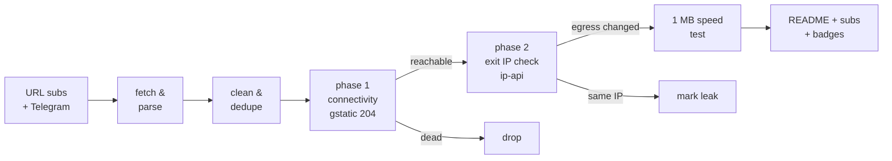

# Free Proxy Scanner

> **Really tested** free proxy aggregator. Every proxy below was fetched from public sources, tunneled through with Xray/sing-box, and verified to actually change your egress IP. No CSV-validation theater, no blind relisting.

      

## What this is

A GitHub Actions pipeline (runs every 6 hours) that fetches free proxy configs from **173 URL subscriptions** and **81 Telegram channels**, parses 9 protocols (vless / vmess / trojan / ss / hysteria2 / hysteria / tuic / socks / http), deduplicates them, and **actually connects through every single one** to separate working proxies from dead ones.

Latest run: **2026-10-01 11:55:44 UTC** — 179650 unique proxies collected from 151/151 URL sources and 60/60 Telegram channels; **4500** endpoints really tested, **931** reachable, **883** verified working (egress IP confirmed changed) across **51 exit countries**.

## How the testing works (the *really* part)



1. **Phase 1 — connectivity.** Each proxy is loaded as an outbound into a real Xray or sing-box instance (or used directly via `curl -x` for plain http/socks). An HTTPS request to `gstatic.com/generate_204` goes through the tunnel with **DNS resolved on the proxy side**. Only an HTTP 204 counts as reachable.
2. **Phase 2 — egress verification.** An ip-api request through the same tunnel must return an exit IP **different from the runner's own IP**, plus its country and AS. Proxies that pass phase 1 but keep your IP are marked as leaks and excluded from the working list. Server country vs exit country mismatches are flagged in the tables.
3. **Throughput.** Working proxies download 1 MB from `speed.cloudflare.com` through the tunnel; the measured rate is the speed you see in the tables.
4. **Engine fallback.** If a proxy fails on Xray, it is retried on sing-box (and vice versa) before being declared dead — some configs only work on one core.

## Top working proxies

All 883 working proxies are published in [`subs/all.txt`](subs/all.txt); this table shows the top 25.

| # | proxy | proto | server | exit | latency | speed | engine |
|---|-------|-------|--------|------|---------|-------|--------|
| 1 | #1 🇨🇦 CA → 🇺🇸 US | `vless` | `172.64.154.8:2052` | United States | 147 ms | 34.4 Mbps | xray |
| 2 | #2 🇺🇸 US → 🇺🇸 US | `vless` | `69.48.201.136:30016` | United States | 135 ms | 31.1 Mbps | xray |
| 3 | #3 🇨🇦 CA → 🇺🇸 US | `vless` | `172.64.32.103:2082` | United States | 107 ms | 31.1 Mbps | xray |
| 4 | #4 🇨🇦 CA → 🇨🇦 CA | `vmess` | `198.57.27.190:22324` | Canada | 97 ms | 29.9 Mbps | xray |
| 5 | #5 🇺🇸 US → 🇺🇸 US | `ss` | `156.146.38.170:443` | United States | 439 ms | 29.4 Mbps | xray |
| 6 | #6 🇺🇸 US → 🇺🇸 US | `ss` | `156.146.38.168:443` | United States | 258 ms | 28.9 Mbps | xray |
| 7 | #7 ❓ ?? → 🇺🇸 US | `vless` | `uspanel.unixzone.us:30016` | United States | 401 ms | 27.3 Mbps | xray |
| 8 | #8 🇨🇦 CA → 🇺🇸 US | `vless` | `162.159.0.53:8880` | United States | 96 ms | 26.8 Mbps | xray |
| 9 | #9 🇺🇸 US → 🇺🇸 US | `vless` | `195.211.98.43:443` | United States | 7376 ms | 26.5 Mbps | singbox |
| 10 | #10 🇺🇸 US → 🇺🇸 US | `vless` | `198.46.215.223:8443` | United States | 125 ms | 26.3 Mbps | xray |
| 11 | #11 🇺🇸 US → 🇺🇸 US | `vless` | `198.251.78.29:2053` | United States | 185 ms | 25.3 Mbps | xray |
| 12 | #12 🇺🇸 US → 🇺🇸 US | `ss` | `37.19.198.243:443` | United States | 115 ms | 25.2 Mbps | xray |
| 13 | #13 🇺🇸 US → 🇺🇸 US | `vmess` | `167.88.62.124:22324` | United States | 78 ms | 24.6 Mbps | xray |
| 14 | #14 🇨🇦 CA → 🇺🇸 US | `vless` | `172.64.32.108:2086` | United States | 449 ms | 24.3 Mbps | xray |
| 15 | #15 ❓ ?? → 🇺🇸 US | `vless` | `xray1-direct-mci1-fs-ce.freesocks.work:443` | United States | 271 ms | 23.8 Mbps | xray |
| 16 | #16 🇨🇦 CA → 🇨🇦 CA | `vless` | `130.107.73.148:41373` | Canada | 216 ms | 23.6 Mbps | xray |
| 17 | #17 🇺🇸 US → 🇺🇸 US | `ss` | `161.129.71.149:17915` | United States | 114 ms | 23.6 Mbps | xray |
| 18 | #18 🇺🇸 US → 🇺🇸 US | `vless` | `23.191.200.207:443` | United States | 236 ms | 23.5 Mbps | xray |
| 19 | #19 🇨🇦 CA → 🇺🇸 US | `vless` | `104.18.46.234:8080` | United States | 70 ms | 23.5 Mbps | xray |
| 20 | #20 🇺🇸 US → 🇺🇸 US | `vless` | `108.162.198.178:80` | United States | 102 ms | 23.3 Mbps | xray |
| 21 | #21 🇺🇸 US → 🇺🇸 US | `ss` | `15.204.247.206:4444` | United States | 1363 ms | 22.8 Mbps | xray |
| 22 | #22 🇨🇦 CA → 🇺🇸 US | `vless` | `162.159.0.169:80` | United States | 107 ms | 22.8 Mbps | xray |
| 23 | #23 🇺🇸 US → 🇺🇸 US | `ss` | `199.60.101.12:19693` | United States | 40 ms | 22.8 Mbps | xray |
| 24 | #24 🇨🇦 CA → 🇺🇸 US | `vless` | `162.159.24.131:2095` | United States | 95 ms | 22.6 Mbps | xray |
| 25 | #25 🇺🇸 US → 🇺🇸 US | `ss` | `103.214.111.162:16469` | United States | 42 ms | 22.4 Mbps | xray |

## Exit locations — which countries work

Every working proxy, grouped by the country of its **verified exit IP** (phase 2), with a dedicated subscription file per country. Currently 51 countries have at least one working exit.

| country | working | avg speed | best latency | share | list |
|---------|--------:|----------:|-------------:|------:|------|
| 🇺🇸 United States | 276 | 12.9 Mbps | 40 ms | 31% | [`US.txt`](subs/by-country/US.txt) |
| 🇳🇱 Netherlands | 142 | 5.3 Mbps | 359 ms | 16% | [`NL.txt`](subs/by-country/NL.txt) |
| 🇩🇪 Germany | 62 | 4.5 Mbps | 362 ms | 7% | [`DE.txt`](subs/by-country/DE.txt) |
| 🇫🇷 France | 52 | 3.1 Mbps | 467 ms | 6% | [`FR.txt`](subs/by-country/FR.txt) |
| 🇸🇬 Singapore | 38 | 2.2 Mbps | 600 ms | 4% | [`SG.txt`](subs/by-country/SG.txt) |
| 🇬🇧 United Kingdom | 30 | 4.8 Mbps | 316 ms | 3% | [`GB.txt`](subs/by-country/GB.txt) |
| 🇨🇦 Canada | 26 | 11.8 Mbps | 97 ms | 3% | [`CA.txt`](subs/by-country/CA.txt) |
| 🇯🇵 Japan | 23 | 3.7 Mbps | 421 ms | 3% | [`JP.txt`](subs/by-country/JP.txt) |
| 🇰🇷 South Korea | 23 | 3.5 Mbps | 647 ms | 3% | [`KR.txt`](subs/by-country/KR.txt) |
| 🇵🇱 Poland | 20 | 4.2 Mbps | 554 ms | 2% | [`PL.txt`](subs/by-country/PL.txt) |
| 🇭🇰 Hong Kong | 17 | 3.3 Mbps | 381 ms | 2% | [`HK.txt`](subs/by-country/HK.txt) |
| 🇮🇳 India | 15 | 2.2 Mbps | 675 ms | 2% | [`IN.txt`](subs/by-country/IN.txt) |
| 🇪🇸 Spain | 14 | 5.6 Mbps | 171 ms | 2% | [`ES.txt`](subs/by-country/ES.txt) |
| 🇫🇮 Finland | 14 | 4.1 Mbps | 420 ms | 2% | [`FI.txt`](subs/by-country/FI.txt) |
| 🇦🇺 Australia | 11 | 11.4 Mbps | 150 ms | 1% | [`AU.txt`](subs/by-country/AU.txt) |
| 🇸🇪 Sweden | 11 | 4.0 Mbps | 534 ms | 1% | [`SE.txt`](subs/by-country/SE.txt) |
| 🇷🇸 Serbia | 10 | 4.2 Mbps | 754 ms | 1% | [`RS.txt`](subs/by-country/RS.txt) |
| 🇮🇹 Italy | 8 | 4.1 Mbps | 424 ms | 1% | [`IT.txt`](subs/by-country/IT.txt) |
| 🇧🇬 Bulgaria | 8 | 3.9 Mbps | 746 ms | 1% | [`BG.txt`](subs/by-country/BG.txt) |
| 🇰🇿 Kazakhstan | 7 | 2.0 Mbps | 1168 ms | 1% | [`KZ.txt`](subs/by-country/KZ.txt) |
| 🇷🇺 Russia | 6 | 1.9 Mbps | 691 ms | 1% | [`RU.txt`](subs/by-country/RU.txt) |
| 🇹🇷 Turkey | 6 | 2.3 Mbps | 915 ms | 1% | [`TR.txt`](subs/by-country/TR.txt) |
| 🇲🇩 Moldova | 6 | 1.7 Mbps | 969 ms | 1% | [`MD.txt`](subs/by-country/MD.txt) |
| 🇮🇪 Ireland | 4 | 6.1 Mbps | 289 ms | 0% | [`IE.txt`](subs/by-country/IE.txt) |
| 🇦🇹 Austria | 4 | 5.8 Mbps | 412 ms | 0% | [`AT.txt`](subs/by-country/AT.txt) |
| 🇺🇦 Ukraine | 4 | 3.9 Mbps | 859 ms | 0% | [`UA.txt`](subs/by-country/UA.txt) |
| 🇹🇼 Taiwan | 4 | 3.5 Mbps | 613 ms | 0% | [`TW.txt`](subs/by-country/TW.txt) |
| 🇱🇰 LK | 4 | 3.3 Mbps | 1141 ms | 0% | [`LK.txt`](subs/by-country/LK.txt) |
| 🇪🇪 Estonia | 3 | 5.1 Mbps | 595 ms | 0% | [`EE.txt`](subs/by-country/EE.txt) |
| 🇷🇴 Romania | 3 | 4.5 Mbps | 815 ms | 0% | [`RO.txt`](subs/by-country/RO.txt) |
| 🇿🇦 South Africa | 3 | 3.2 Mbps | 905 ms | 0% | [`ZA.txt`](subs/by-country/ZA.txt) |
| 🇦🇪 UAE | 3 | 1.4 Mbps | 928 ms | 0% | [`AE.txt`](subs/by-country/AE.txt) |
| 🇳🇴 Norway | 3 | 1.9 Mbps | 1160 ms | 0% | [`NO.txt`](subs/by-country/NO.txt) |
| 🇦🇩 AD | 2 | 5.7 Mbps | 574 ms | 0% | [`AD.txt`](subs/by-country/AD.txt) |
| 🇨🇭 Switzerland | 2 | 5.7 Mbps | 525 ms | 0% | [`CH.txt`](subs/by-country/CH.txt) |
| 🇬🇷 Greece | 2 | 4.2 Mbps | 719 ms | 0% | [`GR.txt`](subs/by-country/GR.txt) |
| 🇸🇰 Slovakia | 2 | - | 865 ms | 0% | [`SK.txt`](subs/by-country/SK.txt) |
| 🇲🇾 Malaysia | 2 | - | 2181 ms | 0% | [`MY.txt`](subs/by-country/MY.txt) |
| 🇬🇹 GT | 1 | 12.4 Mbps | 445 ms | 0% | [`GT.txt`](subs/by-country/GT.txt) |
| 🇭🇺 Hungary | 1 | 5.7 Mbps | 517 ms | 0% | [`HU.txt`](subs/by-country/HU.txt) |
| 🇵🇹 Portugal | 1 | 5.5 Mbps | 451 ms | 0% | [`PT.txt`](subs/by-country/PT.txt) |
| 🇱🇻 Latvia | 1 | 5.0 Mbps | 667 ms | 0% | [`LV.txt`](subs/by-country/LV.txt) |
| 🇧🇾 BY | 1 | 4.5 Mbps | 865 ms | 0% | [`BY.txt`](subs/by-country/BY.txt) |
| 🇵🇭 Philippines | 1 | 3.4 Mbps | 1025 ms | 0% | [`PH.txt`](subs/by-country/PH.txt) |
| 🇹🇭 Thailand | 1 | 3.3 Mbps | 765 ms | 0% | [`TH.txt`](subs/by-country/TH.txt) |
| 🇲🇽 Mexico | 1 | 3.1 Mbps | 7518 ms | 0% | [`MX.txt`](subs/by-country/MX.txt) |
| 🇸🇦 Saudi Arabia | 1 | 3.0 Mbps | 1250 ms | 0% | [`SA.txt`](subs/by-country/SA.txt) |
| 🇦🇲 Armenia | 1 | 2.3 Mbps | 2143 ms | 0% | [`AM.txt`](subs/by-country/AM.txt) |
| 🇧🇷 Brazil | 1 | - | 1002 ms | 0% | [`BR.txt`](subs/by-country/BR.txt) |
| 🇦🇷 Argentina | 1 | - | 1027 ms | 0% | [`AR.txt`](subs/by-country/AR.txt) |
| 🇩🇰 Denmark | 1 | - | 1539 ms | 0% | [`DK.txt`](subs/by-country/DK.txt) |

A `??` exit means the geo lookup could not resolve the exit IP. Base64 variants of every country file sit next to them as `<CC>.base64.txt`.

## Protocol distribution

| protocol | tested | alive | working | alive rate |
|----------|-------:|------:|--------:|-----------:|
| `vless` | 3102 | 573 | 538 | 18% |
| `ss` | 551 | 200 | 197 | 36% |
| `vmess` | 701 | 98 | 93 | 14% |
| `trojan` | 117 | 47 | 42 | 40% |
| `hysteria2` | 25 | 13 | 13 | 52% |
| `http` | 4 | 0 | 0 | 0% |

Per-protocol working lists: [`subs/by-proto/`](subs/by-proto/) (one `vless.txt`, `vmess.txt`, ... per protocol, plus `.base64.txt` variants).

## Engine breakdown

Which core verified each working proxy. The engine fallback means a proxy that failed on its primary core got a second chance on the other one.

| engine | working | note |
|--------|--------:|------|
| Xray-core | 814 | [`allxray.txt`](subs/by-engine/allxray.txt) |
| sing-box | 69 | [`allsingbox.txt`](subs/by-engine/allsingbox.txt) |
| direct (curl) | 0 | plain http/socks, [`alldirect.txt`](subs/by-engine/alldirect.txt) |

## Speed & latency profile

| speed tier | proxies |
|-----------|--------:|
| >= 5 Mbps | 410 |
| 1 - 5 Mbps | 251 |
| 0.25 - 1 Mbps | 56 |
| < 0.25 Mbps | 0 |
| unmeasured | 166 |

Latency (phase-1 HTTPS round trip): median **619 ms**, p90 **3912 ms**. 48 proxies passed connectivity but failed egress verification (leaked the runner IP or broke on the exit check) and are excluded.

## Source health

186 active, 68 auto-retired (10 fetch failures / 10 all-dead runs / 10 days without anything new). Best contributors this run:

| source | kind | tested | alive | new this run |
|--------|------|-------:|------:|-------------:|
| `RD-VL` | url | 2877 | 459 | 274 |
| `HP` | url | 566 | 429 | 0 |
| `SK` | url | 898 | 385 | 96 |
| `HC` | url | 1786 | 380 | 10 |
| `NK` | url | 854 | 356 | 0 |
| `ST-VL` | url | 2783 | 322 | 69 |
| `F0` | url | 466 | 311 | 0 |
| `Ni` | url | 396 | 275 | 1 |
| `EV` | url | 433 | 273 | 0 |
| `SB-VL` | url | 2413 | 213 | 0 |
| `SB` | url | 2641 | 203 | 0 |
| `RD-SS` | url | 530 | 196 | 14 |
| `ET` | url | 368 | 194 | 745 |
| `KA` | url | 2136 | 168 | 57 |
| `AG-PL` | url | 370 | 135 | 15 |
| `EV-SS` | url | 156 | 129 | 0 |
| `EV-VL` | url | 219 | 124 | 0 |
| `WU` | url | 209 | 110 | 15 |
| `RD` | url | 125 | 102 | 10 |
| `EP-ALL` | url | 1335 | 102 | 0 |

## History

working per run (last 11): ▁▁▆▆▇█▇▆▇█▇

| date (UTC) | tested | alive | working | avg | max |
|------------|-------:|------:|--------:|----:|----:|
| 2026-10-01 12:16 | 4500 | 931 | 883 | 7.3M | 34.4M |
| 2026-10-01 03:00 | 4500 | 1112 | 1075 | 8.1M | 45.4M |
| 2026-09-30 21:54 | 4500 | 899 | 866 | 9.3M | 69.4M |
| 2026-09-30 17:26 | 4500 | 838 | 795 | 7.3M | 57.9M |
| 2026-09-30 11:48 | 4500 | 860 | 810 | 7.9M | 64.4M |
| 2026-09-30 02:56 | 4500 | 1030 | 973 | 10.3M | 92.2M |
| 2026-09-29 21:53 | 4500 | 880 | 852 | 6.5M | 61.8M |
| 2026-09-29 15:48 | 4500 | 839 | 796 | 6.7M | 51.3M |
| 2026-09-29 14:48 | 4500 | 799 | 756 | 6.9M | 52.1M |
| 2026-09-29 14:12 | 4500 | 0 | 0 | - | - |
| 2026-09-29 13:39 | 0 | 0 | 0 | - | - |

## Subscription files

Everything under [`subs/`](subs/) is regenerated every run. Plain lists are one proxy URI per line; `.base64.txt` variants are the same list base64-encoded for clients that need the classic sub format.

| file | contents | direct subscription URL |
|------|----------|--------------------------|
| [`all.txt`](subs/all.txt) | ALL working proxies, ranked by speed (883) | `https://raw.githubusercontent.com/G1010yzd10/proxy-scanner/main/subs/all.txt` |
| [`all.base64.txt`](subs/all.base64.txt) | same, base64 | `https://raw.githubusercontent.com/G1010yzd10/proxy-scanner/main/subs/all.base64.txt` |
| [`top150.txt`](subs/top150.txt) | top 150 ranked (150) | `https://raw.githubusercontent.com/G1010yzd10/proxy-scanner/main/subs/top150.txt` |
| [`top150.base64.txt`](subs/top150.base64.txt) | same, base64 | `https://raw.githubusercontent.com/G1010yzd10/proxy-scanner/main/subs/top150.base64.txt` |
| [`by-proto/`](subs/by-proto/) | one list per protocol (5 protocols) | ...`/subs/by-proto/<proto>.txt` |
| [`by-engine/allxray.txt`](subs/by-engine/allxray.txt) | verified on Xray (814) | `https://raw.githubusercontent.com/G1010yzd10/proxy-scanner/main/subs/by-engine/allxray.txt` |
| [`by-engine/allsingbox.txt`](subs/by-engine/allsingbox.txt) | verified on sing-box (69) | `https://raw.githubusercontent.com/G1010yzd10/proxy-scanner/main/subs/by-engine/allsingbox.txt` |
| [`by-country/`](subs/by-country/) | one list per exit country (51 countries, e.g. [`US.txt`](subs/by-country/US.txt), [`DE.txt`](subs/by-country/DE.txt)) | ...`/subs/by-country/<CC>.txt` |
| [`sing-box-client.json`](subs/sing-box-client.json) | top 150 as a ready-to-run sing-box client config | `https://raw.githubusercontent.com/G1010yzd10/proxy-scanner/main/subs/sing-box-client.json` |
| [`xray-client.json`](subs/xray-client.json) | top 150 as a ready-to-run xray client config | `https://raw.githubusercontent.com/G1010yzd10/proxy-scanner/main/subs/xray-client.json` |
| [`archive/`](archive/) | gz snapshot of every collection (30 kept) | — |

## Use the proxies

- **v2rayN / v2rayNG / Nekobox / Hiddify / Shadowrocket**: add subscription `https://raw.githubusercontent.com/G1010yzd10/proxy-scanner/main/subs/all.base64.txt` (everything working) or `https://raw.githubusercontent.com/G1010yzd10/proxy-scanner/main/subs/top150.base64.txt` (curated top 150).
- **Want a specific country?** Grab `subs/by-country/<CC>.txt` (see the Exit locations table above) — e.g. `https://raw.githubusercontent.com/G1010yzd10/proxy-scanner/main/subs/by-country/US.txt`, `https://raw.githubusercontent.com/G1010yzd10/proxy-scanner/main/subs/by-country/DE.txt`.
- **Only one protocol?** `subs/by-proto/<proto>.txt` — e.g. `https://raw.githubusercontent.com/G1010yzd10/proxy-scanner/main/subs/by-proto/vless.txt`, `https://raw.githubusercontent.com/G1010yzd10/proxy-scanner/main/subs/by-proto/hysteria2.txt`.
- **sing-box**: download [`subs/sing-box-client.json`](subs/sing-box-client.json) and run `sing-box run -c sing-box-client.json` — it listens on `127.0.0.1:2080` (mixed) with a selector + auto urltest group.
- **Xray**: download [`subs/xray-client.json`](subs/xray-client.json), socks inbound on `127.0.0.1:2080`.
- Raw snapshots of every collection: [`archive/`](archive/) (30 kept).

## Repository layout

```
sources/            url_subs.yml + telegram.yml (scannable source lists)
scripts/            collect.py, test.py, report.py + lib/
state/              source health, alive-recall pool, geo cache (committed)
data/               stats, history, compact last-run results
subs/               THE PRODUCT: verified working proxies, split by
                    proto / engine / exit country + all + top150 lists
badges/             shields.io endpoint badges
archive/            gz snapshots of every collection
```

## Why most "free proxy lists" lie

The typical aggregator relists whatever it scraped, so 80-95% of entries are dead within hours — this run found **79% unreachable** and **80% unusable** overall. Only tunnels that completed a real HTTPS handshake, returned a verifiable foreign exit IP, and pushed a 1 MB download are counted as working here.

## Disclaimers

- Free proxies are **public and untrusted**. Anything you send through them can be observed or modified by their operators. Never use them for authentication, payments, or anything sensitive.
- All configs are collected from publicly posted sources (GitHub subscriptions and public Telegram channels); no credentials are guessed or brute-forced. Removal requests: open an issue.
- Availability is transient: the working list is re-verified every 6 hours, and past performance never guarantees future availability.

